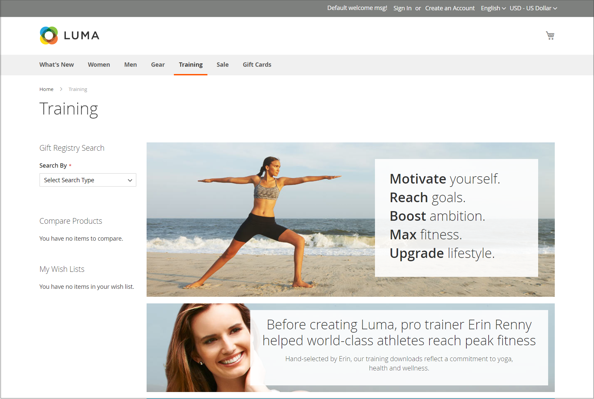

# Diseños de página

El diseño de cada página de la tienda consta de diferentes secciones, o contenedores, que definen el encabezado, el pie de página y las áreas de contenido de la página. Según el diseño, cada página puede tener una, dos, tres columnas o más. Puede considerar el diseño como el _plano de planta_ de la página y asignar un diseño específico para que se utilice como predeterminado en las páginas de CMS, producto y categoría.

En la página, los bloques de contenido flotan para llenar el espacio disponible, según la sección del [diseño de página](layout-updates.md) en la que estén asignados para aparecer. Tenga en cuenta que si cambia el diseño de tres columnas a dos, el contenido del área principal se amplía para rellenar el espacio disponible. Observe también que cualquier bloque asociado con la barra lateral no utilizada parece desaparecer. Sin embargo, si restaura el diseño de tres columnas, los bloques vuelven a aparecer. Este enfoque fluido, o _diseño líquido_, permite cambiar el diseño de la página sin tener que rediseñar el contenido. Si está acostumbrado a trabajar con páginas de HTML individuales, este enfoque modular de _bloque de creación_ requiere una forma diferente de pensar.

{width="700" zoomable="yes"}

## Configurar diseños predeterminados

1. En la barra lateral _Admin_, vaya a **[!UICONTROL Stores]** > _[!UICONTROL Settings]_>**[!UICONTROL Configuration]**.

1. En el panel izquierdo bajo _[!UICONTROL General]_, elija **[!UICONTROL Web]**.

1. Expanda  en la sección **[!UICONTROL Default Layouts]**.

   {width="600" zoomable="yes"}

1. Elija el(la) **[!UICONTROL Default Product Layout]** que desea usar para las páginas de productos.

   Esta configuración determina el diseño que se utiliza de forma predeterminada para las páginas de productos.

   - `No layout updates`: las actualizaciones de diseño no están disponibles para las páginas de productos.
   - `Empty`: utiliza un diseño en blanco para las páginas de productos.
   - `1 column`: utiliza un diseño de columna única para las páginas de productos.
   - `2 columns with left bar`: utiliza un diseño de dos columnas con la barra lateral a la izquierda para las páginas de productos.
   - `2 columns with right bar`: utiliza un diseño de dos columnas con la barra lateral a la derecha para las páginas de productos.
   - `3 columns`: utiliza un diseño de tres columnas con barras laterales a la izquierda y a la derecha para las páginas de productos.

   Cuando [Page Builder](../page-builder/introduction.md) está habilitado, hay opciones adicionales de ancho completo disponibles. A continuación, puede utilizar las herramientas de contenido de Page Builder para diseñar el diseño de las páginas de producto.

   - `Page -- Full Width`: utiliza el diseño _Página - Anchura completa_ para las páginas de productos.
   - `Category -- Full Width` - Utiliza el diseño _Categoría - Anchura completa_ para las páginas de productos.
   - `Product -- Full Width` - (Recomendado) Utiliza el diseño _Producto - Anchura completa_ para las páginas de productos.

1. Elija el(la) **[!UICONTROL Default Category Layout]** que desee usar para páginas de categoría.

   Esta configuración determina el diseño que se usa de forma predeterminada para las páginas de categorías.

   - `No layout updates`: las actualizaciones de diseño no están disponibles para las páginas de categoría.
   - `Empty`: utiliza un diseño en blanco para las páginas de categoría.
   - `1 column`: utiliza un diseño de columna única para las páginas de categoría.
   - `2 columns with left bar`: utiliza un diseño de dos columnas con la barra lateral a la izquierda para las páginas de categoría.
   - `2 columns with right bar`: utiliza un diseño de dos columnas con la barra lateral a la derecha para las páginas de categoría.
   - `3 columns`: utiliza un diseño de tres columnas con barras laterales a la izquierda y a la derecha para las páginas de categoría.

   Cuando [Page Builder](../page-builder/introduction.md) está habilitado, hay opciones adicionales de ancho completo disponibles. A continuación, puede utilizar las herramientas de contenido de Page Builder para diseñar el diseño de las páginas de categorías.

   - `Page -- Full Width`: utiliza el diseño _Página - Anchura completa_ para las páginas de categoría.
   - `Category -- Full Width` - (Recomendado) Utiliza el diseño _Categoría - Anchura completa_ para las páginas de categoría.
   - `Product -- Full Width`: utiliza el diseño _Producto - Anchura completa_ para las páginas de categoría.

1. Elija el(la) **[!UICONTROL Default Page Layout]** que desea usar para las páginas de CMS.

   Esta configuración determina el diseño que se utiliza de forma predeterminada para las páginas de CMS.

   - `No layout updates`: las actualizaciones de diseño no están disponibles para las páginas de CMS.
   - `Empty`: utiliza un diseño en blanco para las páginas de CMS.
   - `1 column`: utiliza un diseño de columna única para las páginas de CMS.
   - `2 columns with left bar`: utiliza un diseño de dos columnas con la barra lateral izquierda para las páginas de CMS.
   - `2 columns with right bar`: utiliza un diseño de dos columnas con la barra lateral a la derecha para las páginas de CMS.
   - `3 columns`: utiliza un diseño de tres columnas con barras laterales a la izquierda y a la derecha para las páginas de CMS.

   Cuando [Page Builder](../page-builder/introduction.md) está habilitado, hay opciones adicionales de ancho completo disponibles. A continuación, puede utilizar las herramientas de contenido de Page Builder para diseñar el diseño de las páginas de CMS.

   - `Page -- Full Width` - (Recomendado) Utiliza el diseño _Página - Anchura completa_ para las páginas de CMS.
   - `Category - Full Width`: utiliza el diseño _Categoría - Anchura completa_ para las páginas de CMS.
   - `Product - Full Width`: utiliza el diseño _Producto - Anchura completa_ para las páginas de CMS.

1. Una vez finalizado, haga clic en **[!UICONTROL Save Config]**.

## Diseños de página estándar

### Una columna

{zoomable="yes"}

El diseño _[!UICONTROL 1 Column]_&#x200B;se puede usar para crear una página principal dramática con una imagen grande o un punto focal. También es una buena opción para una página de aterrizaje o cualquier otra página que tenga una combinación de texto, imágenes y vídeo.

### Dos columnas con barra izquierda

{zoomable="yes"}

El diseño _[!UICONTROL 2 Columns with Left Bar]_&#x200B;se utiliza a menudo para páginas con navegación a la izquierda, como un catálogo o páginas de resultados de búsqueda con navegación por capas. También es una excelente opción para las páginas principales que necesitan navegación adicional o bloques de contenido de apoyo a la izquierda.

### Dos columnas con barra derecha

{zoomable="yes"}

Con un diseño de _[!UICONTROL 2 Columns with Right Bar]_, el área de contenido principal es lo suficientemente grande como para tener una imagen o un titular llamativos. Este diseño también se utiliza a menudo para páginas de productos con bloques de contenido de apoyo a la derecha.

### Tres columnas

{zoomable="yes"}

El diseño _[!UICONTROL 3 Column]_&#x200B;tiene una columna central lo suficientemente ancha como para incluir el texto principal de la página, con espacio a cada lado para la navegación adicional y bloques de contenido compatible.

### Empty

{zoomable="yes"}

El diseño _[!UICONTROL Empty]_&#x200B;se puede usar para definir diseños de página personalizados.
