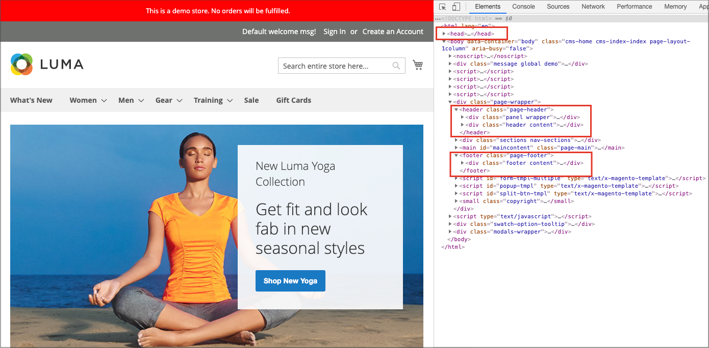

# Configuración de página

Las secciones principales de la página están controladas, en parte, por un conjunto de etiquetas de HTML estándar. Algunas de estas etiquetas se pueden utilizar para determinar la selección de fuentes, colores, tamaño, colores de fondo e imágenes que se utilizan en cada sección de la página. Otros elementos de página de control de configuración, como el logotipo del encabezado y el aviso de copyright del pie de página. Estas secciones corresponden a la estructura subyacente de la página HTML y muchas de las propiedades básicas se pueden establecer desde Admin.

- [Cabeza de HTML](#html-head)
- [Header](#header)
- [Pie](#footer)

{width="700" zoomable="yes"}

## Cabeza de HTML

La configuración de la sección Encabezado del HTML corresponde a la etiqueta `<head>` de una página del HTML y se puede configurar para cada vista de tienda. Además de los metadatos del título de página, la descripción y las palabras clave, la sección incluye un vínculo al icono de favoritos y varios scripts. Las instrucciones para los robots de motores de búsqueda y la visualización del aviso de demostración de la tienda también se configuran en esta sección.

### Configuración del encabezado del HTML

1. En la barra lateral _Admin_, vaya a **[!UICONTROL Content]** > _[!UICONTROL Design]_>**[!UICONTROL Configuration]**.

1. Busque la vista de tienda que desea configurar y haga clic en **[!UICONTROL Edit]** en la columna _[!UICONTROL Action]_.

1. En _Otra configuración_, expanda  en la sección **[!UICONTROL HTML Head]**.

   {width="500" zoomable="yes"}

1. Actualice [favicon](../getting-started/storefront-branding.md#add-a-favicon) si es necesario.

1. Actualice la configuración del título de página según sus necesidades:

   - **[!UICONTROL Default Page Title]**
   - **[!UICONTROL Page Title Prefix]**
   - **[!UICONTROL Page Title Suffix]**

   Puede utilizar un sufijo o un prefijo con el título predeterminado para crear un título de dos o tres partes. Puede agregar una barra vertical o dos puntos como separador entre el prefijo o sufijo y el título predeterminado.

1. Añada o modifique metadatos que admitan la optimización de los motores de búsqueda (SEO) y ayuden a dirigir a los clientes a su tienda desde los resultados de búsqueda:

   - **[!UICONTROL Default Meta Description]**
   - **[!UICONTROL Default Meta Keywords]**

1. Escriba cualquier **[!UICONTROL Scripts and Style Sheets]** según sea necesario.

1. Habilite o deshabilite el [aviso de almacén de demostración](../getting-started/storefront-branding.md#set-the-store-demo-notice) si es necesario.

1. Una vez finalizado, haga clic en **[!UICONTROL Save Configuration]**.

### Descripciones de los campos de Cabeza de HTML

| Campo | Ámbito | Descripción |
|--- |--- |--- |
| [!UICONTROL Favicon Icon] | Vista de tienda | Carga la imagen gráfica pequeña que aparece en la barra de direcciones y en la pestaña del explorador. Tipos de archivo permitidos: ICO, PNG, APNG, GIF y JPG (JPEG). No todos los exploradores admiten estos formatos. |
| [!UICONTROL Default Page Title] | Vista de tienda | Título que aparece en la barra de título de cada página cuando se ve en un explorador. El título predeterminado se utiliza para todas las páginas, a menos que se especifique otro título para páginas individuales. |
| [!UICONTROL Page Title Prefix] | Vista de tienda | Se puede agregar un prefijo antes del título para crear un título de dos o tres partes. Se puede utilizar una barra vertical o dos puntos como separador al final del prefijo para diferenciarlo del texto del título principal. |
| [!UICONTROL Page Title Suffix] | Vista de tienda | Se puede agregar un sufijo después del título para crear un título de dos o tres partes. Se puede utilizar una barra vertical o dos puntos como separador al final del prefijo para diferenciarlo del texto del título principal. |
| [!UICONTROL Default Meta Description] | Vista de tienda | La descripción proporciona un resumen del sitio para los anuncios de motores de búsqueda y no debe tener más de 160 caracteres de longitud. |
| [!UICONTROL Default Meta Keywords] | Vista de tienda | Una serie de palabras clave que describen el almacén, cada una separada por una coma. |
| [!UICONTROL Scripts and Style Sheets] | Vista de tienda | Contiene scripts que deben incluirse en el HTML antes de la etiqueta de cierre `<head>`. Por ejemplo, cualquier JavaScript de terceros que deba colocarse antes de la etiqueta `<body>` puede introducirse aquí. |
| [!UICONTROL Display Demo Store Notice] | Vista de tienda | Controla la visualización del aviso de almacén de demostración en la parte superior de la página. Opciones: `Yes` / `No` |

{style="table-layout:auto"}

## Header

La configuración del encabezado identifica la ruta al logotipo de la tienda y especifica el texto alternativo del logotipo y el mensaje de bienvenida.

{width="400" zoomable="yes"}

### Configuración del encabezado

1. En la barra lateral _Admin_, vaya a **[!UICONTROL Content]** > _[!UICONTROL Design]_>**[!UICONTROL Configuration]**.

1. Busque la vista de tienda que desea configurar y haga clic en **[!UICONTROL Edit]** en la columna _[!UICONTROL Action]_.

1. En _Otra configuración_, expanda  en la sección **[!UICONTROL Header]**.

1. Realice los cambios necesarios en la vista de la tienda:

   - Configuración de [logotipo](../getting-started/storefront-branding.md#upload-your-logo)
   - Configuración de [mensaje de bienvenida](../getting-started/storefront-branding.md#change-the-welcome-message)

1. Una vez finalizado, haga clic en **[!UICONTROL Save Configuration]**.

### Descripciones de campos de encabezado

| Campo | Ámbito | Descripción |
|--- |--- |--- |
| [!UICONTROL Logo Image] | Vista de tienda | Identifica la ruta al logotipo que aparece en el encabezado. Tipos de archivo admitidos: PNG, GIF, JPG de la (JPEG) |
| [!UICONTROL Logo Attribute Width] | Vista de tienda | Ancho de la imagen del logotipo en píxeles. |
| [!UICONTROL Logo Attribute Height] | Vista de tienda | Altura de la imagen del logotipo en píxeles. |
| [!UICONTROL Welcome Text] | Vista de tienda | El mensaje de bienvenida aparece en el encabezado de la página e incluye el nombre de los clientes que han iniciado sesión. |
| [!UICONTROL Logo Image Alt] | Vista de tienda | Texto alternativo asociado con el logotipo. |
| [!UICONTROL Translate Title] | Vista de tienda | Determina si `Page Title` o `Meta Title` deben traducirse. |

{style="table-layout:auto"}

## Pie

En la sección Configuración del pie de página puede actualizar el [aviso de copyright](../getting-started/storefront-branding.md#change-the-copyright-notice) que aparece en la parte inferior de la página e introducir scripts que deben colocarse antes de la etiqueta de cierre `<body>`.

{width="400" zoomable="yes"}

### Configuración del pie de página

1. En la barra lateral _Admin_, vaya a **[!UICONTROL Content]** > _[!UICONTROL Design]_>**[!UICONTROL Configuration]**.

1. Busque la vista de tienda que desea configurar y haga clic en **[!UICONTROL Edit]** en la columna _[!UICONTROL Action]_.

1. En _Otra configuración_, expanda  en la sección **[!UICONTROL Footer]**.

1. Realice los cambios necesarios en la configuración de **[!UICONTROL Copyright]** y **[!UICONTROL Miscellaneous HTML]**.

1. Una vez finalizado, haga clic en **[!UICONTROL Save Configuration]**.

## Descripciones de campos de pie

| Campo | Ámbito | Descripción |
|--- |--- |--- |
| [!UICONTROL Miscellaneous HTML] | Vista de tienda | Un cuadro de entrada donde puede cargar scripts varios en el servidor que deben colocarse justo antes de la etiqueta de cierre `<body>`. |
| [!UICONTROL Copyright] | Vista de tienda | Declaración de copyright que aparece en la parte inferior de cada página. Para incluir el símbolo de copyright, utilice la entidad de carácter HTML `\&copy;` como se muestra a continuación: `\&copy; 2021 Commerce Demo Store. All Rights Reserved.` Asegúrese de reemplazar el aviso de copyright de ejemplo por el suyo propio. |
| [!UICONTROL Display Report Bugs Link] | Vista de tienda | Determina si el vínculo del informe de errores (compatible con algunas temáticas) está habilitado o deshabilitado. |

{style="table-layout:auto"}
