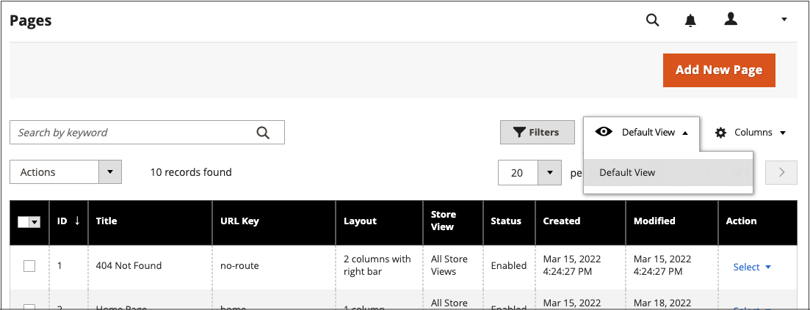

# Controles de Page Workspace

El espacio de trabajo de páginas incluye herramientas que le ayudarán a encontrar rápidamente las páginas que necesita, así como comandos para realizar tareas de mantenimiento rutinarias en páginas individuales o múltiples. También puede actualizar rápidamente las propiedades de la página desde la cuadrícula.

{width="700" zoomable="yes"}

## Actualizar rápidamente las propiedades de página

1. En la barra lateral _Admin_, vaya a **[!UICONTROL Content]** > _[!UICONTROL Elements]_>**[!UICONTROL Pages]**.
1. Haga clic en cualquier fila de la cuadrícula.

   {width="600" zoomable="yes"}

   Para seleccionar varios registros, active la casilla de verificación de cada fila que desee actualizar.

1. Actualice cualquiera de las siguientes propiedades:

   - **[!UICONTROL Title]**
   - **[!UICONTROL URL Key]**
   - **[!UICONTROL Status]**
   - **[!UICONTROL Layout]**

1. Una vez finalizado, haga clic en **[!UICONTROL Save]**.

## Controles de Workspace

| Control | Descripción |
|--- |--- |
| [!UICONTROL Add New Page] | Agrega una página. |
| [!UICONTROL Search] | Inicia una búsqueda en el catálogo basada en los filtros actuales. |
| [!UICONTROL Actions] | Muestra todas las acciones que se pueden aplicar a los elementos seleccionados de la lista. Para aplicar una acción a una página o a varias páginas, active la casilla de verificación de la primera columna de cada registro sujeto a la acción. Opciones: `Delete` / `Disable` / `Enable` / `Edit` |
| [!UICONTROL Select] | El control del encabezado de la primera columna se puede utilizar para seleccionar varios registros como destino de la acción. Seleccione la casilla de verificación de la primera columna de cada registro que desee seleccionar. Opciones: `Select All` / `Deselect All` |
| [!UICONTROL Save Edits] | Aplica la acción actual a los registros seleccionados. |
| [!UICONTROL Edit] | Abre el registro en modo de edición. Puede lograr lo mismo haciendo clic en cualquier lugar de la fila. |

{style="table-layout:auto"}

## Columnas

| Columna | Descripción |
|--- |--- |
| [!UICONTROL Select] | La casilla de verificación de la primera columna se utiliza para seleccionar varios registros. Opciones: `Select All` / `Deselect All` |
| [!UICONTROL ID] | El ID es un número incremental que se asigna a cada página. |
| [!UICONTROL Title] | Título que aparece en la parte superior de la página. |
| [!UICONTROL URL Key] | La clave URL es similar al nombre de un archivo e identifica la página en la dirección URL. |
| [!UICONTROL Layout] | Determina si la página aparece con barras laterales a la derecha o a la izquierda del área de contenido principal. Opciones: `1 column` / `2 columns with left bar` / `2 columns with right bar` / `3 columns` / `Empty` |
| [!UICONTROL Store View] | Se utiliza para asociar la página con una vista de tienda específica. |
| [!UICONTROL Status] | Indica si la página está en línea o sin conexión. Opciones: `Enabled` / `Disabled` |
| [!UICONTROL Created] | La fecha de creación de la página. |
| [!UICONTROL Modified] | Fecha de la última modificación de la página. |
| [!UICONTROL Action] | Las acciones que se pueden aplicar a un registro individual incluyen: **[!UICONTROL Edit]**- Abre la página en modo de edición. **[!UICONTROL Delete]** - Elimina la página. **[!UICONTROL View]**- Muestra la página en modo de vista previa. |

{style="table-layout:auto"}

## Otras columnas

| Columna | Descripción |
|--- |--- |
| [!UICONTROL Custom design from/to] | Especifica la fecha de inicio y finalización en que se aplica el diseño seleccionado a la página.  (solo Magento Open Source). |
| [!UICONTROL Custom Theme] | Aplica una temática personalizada a la página |
| [!UICONTROL Custom Layout] | Determina el diseño personalizado de la página |
| [!UICONTROL Meta Title] | Meta título de la página |
| [!UICONTROL Meta Keywords] | Las palabras clave meta para la página |
| [!UICONTROL Meta Description] | La metadescripción de la página |

{style="table-layout:auto"}

## Búsqueda de página

El cuadro Buscar de la parte superior izquierda de la cuadrícula _[!UICONTROL Pages]_se puede utilizar para buscar páginas específicas por palabra clave. Para una búsqueda más avanzada, puedes [filtrar](../getting-started/admin-grid-controls.md) la búsqueda por varios parámetros.

### Buscar por palabra clave

1. Introduzca un término de búsqueda en el cuadro de búsqueda de la página.

1. Para mostrar los resultados, haga clic en el icono Buscar ().

   Los resultados incluyen todas las páginas que contienen la palabra clave.

### Filtrado de los resultados de búsqueda

1. Si es necesario, haga clic en **[!UICONTROL Clear All]** para borrar los criterios de búsqueda anteriores.

1. Para mostrar la selección de filtros de búsqueda, haga clic en **[!UICONTROL Filters]** !Pestaña ([Icono de canal](../assets/icon-filter-search.png)).

1. Complete tantos filtros como sea necesario para describir las páginas que desea encontrar.

1. Haga clic en **[!UICONTROL Apply Filters]** para mostrar los resultados.

### Filtros de búsqueda

| Filtrar | Descripción |
|--- |--- |
| [!UICONTROL ID] | Filtre la búsqueda por ID de registro de página. |
| [!UICONTROL Title] | Filtre la búsqueda en función del título de la página. |
| [!UICONTROL URL Key] | Filtre la búsqueda por la clave URL. |
| [!UICONTROL Created] | Filtre la búsqueda por la fecha en que se creó la página. |
| [!UICONTROL Modified] | Filtre la búsqueda en función de la fecha en la que se modificó la página por última vez. |
| [!UICONTROL Store View] | Filtre la búsqueda según la vista de la tienda. Opciones: `All available` / `Store Views` |
| [!UICONTROL Layout] | Filtre la búsqueda según el diseño de la página. Opciones: `1 column` / `2 columns with left bar` / `2 columns with right bar` / `3 columns` / `Empty` |
| [!UICONTROL Status] | Filtre la búsqueda por el estado de la página. Opciones: `Disabled` / `Published` |
| [!UICONTROL Custom design from / to] | Filtre la búsqueda por la fecha de inicio y finalización cuando se aplique el diseño seleccionado a la página.  (solo Magento Open Source). |
| [!UICONTROL Asset] | Filtrar la búsqueda por los recursos de título de página |
| [!UICONTROL Custom Layout] | Filtre la búsqueda en función de un diseño personalizado. Opciones: `1 column` / `2 columns with left bar` / `2 columns with right bar` / `3 columns` / `Empty` / `Page -- Full Width` / `Category -- Full Width` / `Product -- Full Width` |
| [!UICONTROL Custom Theme] | Filtre la búsqueda en función de una temática personalizada. Opciones predeterminadas: `Magento Blank` / `Magento Luma` |
| [!UICONTROL Meta Keywords] | Filtre la búsqueda en función de las palabras clave meta de la página. |
| [!UICONTROL Meta Title] | Filtre la búsqueda en función del metatítulo de la página. |
| [!UICONTROL Meta Description] | Filtre la búsqueda en función de la metadescripción de la página. |

{style="table-layout:auto"}

### Herramientas de búsqueda

| Herramienta | Descripción |
|--- |--- |
| [!UICONTROL Apply Filters] | Aplica todos los filtros a los resultados de búsqueda. |
| [!UICONTROL Cancel] | Cancela la búsqueda actual. |
| [!UICONTROL Clear All] | Borra todos los filtros de búsqueda. |

{style="table-layout:auto"}

## Acciones de página

Las páginas se pueden editar, deshabilitar, habilitar y eliminar. Para aplicar una acción a una página individual, seleccione la casilla de verificación en la primera columna. Para seleccionar o anular la selección de todas las páginas, utilice el control de selección situado en la parte superior de la columna.

{width="400" zoomable="yes"}

### Acción única

Utilice la columna _[!UICONTROL Action]_en el extremo derecho para aplicar cualquiera de las siguientes acciones a la página individual:

- [!UICONTROL Edit] - abre la página en modo de edición
- [!UICONTROL Delete] - elimina la página (requiere confirmación)
- [!UICONTROL View] - abre una página directamente en la tienda

{width="600" zoomable="yes"}

### Acciones masivas

Aplique cualquiera de las siguientes acciones a varias páginas seleccionadas al mismo tiempo utilizando el selector _[!UICONTROL Action]_en la esquina superior izquierda:

- [!UICONTROL Delete] - elimina las páginas (requiere confirmación)
- [!UICONTROL Disable]: deshabilita las páginas de la tienda
- [!UICONTROL Enable] - habilita las páginas en la tienda
- [!UICONTROL Edit]: abre columnas en la cuadrícula en modo de edición (**[!UICONTROL Title]**, **[!UICONTROL URL Key]**, **[!UICONTROL Layout]** y **[!UICONTROL Status]**)

## Diseño de cuadrícula de página

La selección de columnas y su orden en la cuadrícula se pueden cambiar según sus preferencias. Para mantener la nueva disposición de columnas, puede guardarla como una vista.

### Cambiar la selección de columnas

En la esquina superior derecha, haga clic en el control _Columns_ () y haga lo siguiente:

- Seleccione la casilla de verificación de cualquier columna que desee agregar a la cuadrícula.

- Desactive la casilla de verificación de cualquier columna que desee quitar de la cuadrícula.

### Mover una columna

1. Haga clic en el encabezado de la columna y mantenga presionado.

1. Arrastre la columna a la nueva posición y suéltela.

### Guardar una vista

1. Haga clic en el control _Ver_ () y, a continuación, haga clic en **[!UICONTROL Save View As]**.

1. Introduzca un nombre para la vista.

1. Para guardar la vista, haga clic en la _flecha_ ().

   El nombre de la vista aparece ahora como la vista actual.

### Cambio de la vista

Haga clic en el control _Ver_ () y realice una de las siguientes acciones:

- Elija la vista que desee utilizar.

- Para cambiar el nombre de una vista, haga clic en el icono Editar () y actualice el nombre.

  {width="600" zoomable="yes"}

## Cambios programados

{{ee-feature}}

Los cambios de página se pueden aplicar según lo programado y agrupar con otros cambios de contenido. Puede crear una campaña basada en cambios programados realizados en una página o aplicar los cambios a una campaña existente. Para obtener más información, consulte [Ensayo de contenido](content-staging.md).

Al configurar programaciones para cambios de página y editar campañas, tenga en cuenta lo siguiente:

- Todas las actualizaciones programadas se aplican de forma consecutiva, lo que significa que cualquier entidad solo puede tener una actualización programada en un momento dado. Cualquier actualización programada se aplica a todas las vistas de la tienda dentro de su lapso de tiempo. Como resultado, una entidad no puede tener una actualización programada diferente para diferentes vistas de tienda al mismo tiempo. Todos los valores de atributo de entidad dentro de todas las vistas de tienda, que no se ven afectados por la actualización programada actual, se toman de los valores predeterminados y no de la actualización programada anterior.

- Si una campaña está vinculada a más de una página, la campaña solo se puede editar desde el [Panel de ensayo de contenido](content-staging-dashboard.md).

- Si inicialmente se crea una campaña activa sin una fecha de finalización, la campaña no se puede editar más adelante para incluir una fecha de finalización. En tal caso, es necesario crear una campaña duplicada e introducir la fecha de finalización que sea necesaria.

- La fecha de inicio y la fecha de finalización de la campaña deben definirse usando la zona horaria del administrador **_default_**, que se convierte a partir de la zona horaria local de cada sitio web. Pongamos un ejemplo en el que tiene varios sitios web en diferentes zonas horarias, pero quiere iniciar una campaña basada en una zona horaria de EE. UU. En este caso, debe programar una actualización independiente para cada zona horaria local y establecer **[!UICONTROL Start Date]** y **[!UICONTROL End Date]** en convertidas desde cada zona horaria de sitio web local a la zona horaria de administración predeterminada.

- Puede programar y previsualizar cambios para actualizaciones de productos. Para obtener más información, consulte [Programar una actualización](content-staging-scheduled-update.md).

>[!NOTE]
>
>La ficha [!UICONTROL Custom Design Update] se ha eliminado en  Adobe Commerce y no se puede modificar directamente en la página. Debe crear una actualización programada para estas activaciones.

{width="600" zoomable="yes"}

