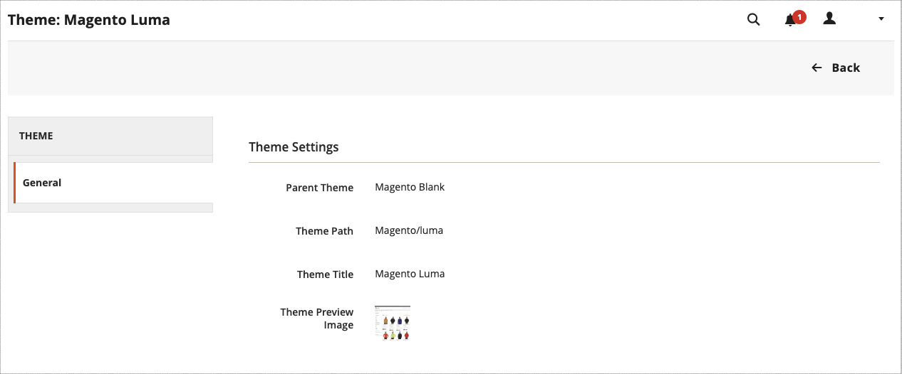

# Temas

Un tema es una colección de archivos que determina la presentación visual del almacén. Cuando instala [!DNL Commerce] por primera vez, los elementos de diseño de la tienda se basan en el tema _Default_. Además del tema predeterminado inicial que viene con la instalación de [!DNL Commerce], hay una amplia variedad de temas disponibles que puede usar _tal cual_ o modificar según sus necesidades.

Una temática adaptable ajusta el diseño de página para adaptarse al puerto de vista del dispositivo. El tema de ejemplo _Luma_ tiene un diseño flexible y adaptable que se puede ver desde el escritorio, la tableta o el dispositivo móvil.

Los temas de [!DNL Commerce] incluyen archivos de diseño, archivos de plantilla, archivos de traducción y máscaras. Una máscara es una colección de archivos CSS, imágenes y JavaScript compatibles que, juntos, crean la presentación visual y las interacciones que los clientes experimentan cuando visitan la tienda. Un desarrollador o profesional del diseño que entienda el diseño de temáticas de Commerce y que tenga acceso a su servidor puede modificar y personalizar temas y máscaras. Para obtener más información, consulte la [_Guía para desarrolladores de Frontend_](https://developer.adobe.com/commerce/frontend-core/guide/themes/).

{width="600" zoomable="yes"}

## La temática predeterminada

El tema adaptable `Magento Blank` procesa la visualización de la tienda para diferentes dispositivos e incorpora prácticas recomendadas para equipos de escritorio, tablas y dispositivos móviles. Algunas temáticas están diseñadas para utilizarse únicamente con dispositivos específicos. Cuando [!DNL Commerce] detecta un ID de explorador o agente de usuario específico, utiliza el tema configurado para el explorador específico. La cadena de búsqueda también puede incluir expresiones regulares compatibles con Perl (PCRE).

{width="700" zoomable="yes"}

### Filtrar la cuadrícula de temas

1. En la barra lateral _Admin_, vaya a **[!UICONTROL Content]** > _[!UICONTROL Design]_>**[!UICONTROL Themes]**.

1. Haga clic en **[!UICONTROL Filters]**.

1. Introduzca un rango de ID, un nombre de tema (o título), una ruta de carpeta o un tema principal.

1. Haga clic en **[!UICONTROL Apply Filters]** para actualizar la lista de temas.

## Ver la configuración del tema actual

1. En la barra lateral _Admin_, vaya a **[!UICONTROL Content]** > _[!UICONTROL Design]_>**[!UICONTROL Themes]**.

1. En la lista de temáticas instaladas, busque la temática que desee examinar y haga clic en la fila para mostrar la configuración.

1. Para ver una página de muestra, haga clic en **[!UICONTROL Theme Preview Image]**.

{width="600" zoomable="yes"}

## Aplicar una temática predeterminada

1. En la barra lateral _Admin_, vaya a **[!UICONTROL Content]** > _[!UICONTROL Design]_>**[!UICONTROL Configuration]**.

1. Busque la vista de tienda que desea configurar y haga clic en **[!UICONTROL Edit]** en la columna _[!UICONTROL Action]_.

1. En _[!UICONTROL Default Theme]_, establezca **[!UICONTROL Applied Theme]**en el que desee usar para la vista actual.

   {width="600" zoomable="yes"}

1. Una vez finalizado, haga clic en **[!UICONTROL Save Configuration]**.

## Agregar una regla de agente de usuario

1. En la barra lateral _Admin_, vaya a **[!UICONTROL Content]** > _[!UICONTROL Design]_>**[!UICONTROL Configuration]**.

1. En _[!UICONTROL Design Rule]_, haga clic en **[!UICONTROL Add New User Agent Rule]**.

   {width="600" zoomable="yes"}

1. Para **[!UICONTROL Search String]**, ingrese el identificador de explorador del dispositivo específico.

   Las cadenas de búsqueda coinciden en el orden en que se escriben. Por ejemplo, para Firefox escriba:

   `/^mozilla/i`

1. Para introducir dispositivos adicionales, repita el proceso.

1. Una vez finalizado, haga clic en **[!UICONTROL Save Configuration]**.
