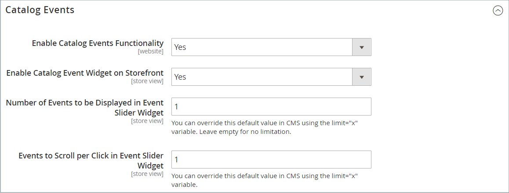

# Widget del carrusel de eventos de catálogo

{{ee-feature}}

Un widget de carrusel de eventos de catálogo muestra un control deslizante de los próximos eventos con un marcador de cuenta atrás para cada evento. Puede elegir las páginas y el área del diseño de página donde desea que aparezca el carrusel, así como controlar el ancho y el número de eventos que aparecen al mismo tiempo. El resultado obtenido depende de la temática, de dónde se coloque para que aparezca en la página y de las opciones que elija.

{width="700" zoomable="yes"}

## Paso 1: Habilitar el widget de carrusel de catálogo

Antes de empezar, sigue las [instrucciones](../merchandising-promotions/event-configure.md) para configurar el widget _Evento de catálogo_ de modo que esté habilitado para la tienda.

{width="500" zoomable="yes"}

## Paso 2: Crear el widget

1. En la barra lateral _Admin_, vaya a **[!UICONTROL Content]** > _[!UICONTROL Elements]_>**[!UICONTROL Widgets]**.

1. En la esquina superior derecha, haga clic en **[!UICONTROL Add Widget]**.

1. En la sección _[!UICONTROL Settings]_, haga lo siguiente:

   - Establezca **[!UICONTROL Type]** en `Catalog Events Carousel`.

   - Elija el **[!UICONTROL Design Theme]** que usa la tienda.

1. Haga clic en **[!UICONTROL Continue]**.

   {width="500" zoomable="yes"}

1. En la sección _[!UICONTROL Storefront Properties]_, haga lo siguiente:

   - Para **[!UICONTROL Widget Title]**, escriba un título descriptivo para el widget.

     Este título solo está visible desde _Admin_.

   - Para **[!UICONTROL Assign to Store Views]**, seleccione las vistas de la tienda donde desee que el widget sea visible.

     Puede seleccionar una vista de tienda específica o `All Store Views`. Para seleccionar varias vistas, mantenga pulsada la tecla Ctrl (PC) o la tecla Comando (Mac) y haga clic en cada opción.

   - (Opcional) Para **[!UICONTROL Sort Order]**, escriba un número para determinar el orden en que aparece este elemento con otros en la misma parte de la página. (`0` = primero, `1` = segundo, `3` = tercero, etc.)

     {width="600" zoomable="yes"}

## Paso 3: Elija la ubicación

1. En la sección _Actualizaciones de diseño_, haga clic en **[!UICONTROL Add Layout Update]**.

1. Establezca **[!UICONTROL Display On]** en `Specified Page`.

1. Establezca **[!UICONTROL Page]** en `CMS Home Page`.

1. Establezca **[!UICONTROL Container]** una de las siguientes opciones:

   - `Main Content Area`
   - `Sidebar Additional`
   - `Sidebar Main`

   >[!NOTE]
   >
   >Los resultados varían según la temática y el diseño de la página. También debe especificar _[!UICONTROL Catalog Events Carousel Default Template]_en la configuración de categoría.

1. Si desea que el carrusel de eventos aparezca en otra ubicación de la tienda, haga clic en **[!UICONTROL Add Layout Update]** y repita estos pasos para esa ubicación.

   {width="600" zoomable="yes"}

1. Haga clic en **[!UICONTROL Save and Continue Edit]**.

   Por ahora, puede ignorar el mensaje para actualizar la caché.

## Paso 4: Configurar las opciones

1. En el panel izquierdo, elija **[!UICONTROL Widget Options]**.

1. Para **[!UICONTROL Frame Size]**, escriba el número de eventos que desea enumerar en el control deslizante al mismo tiempo.

   Para ver solo un evento a la vez, ingrese `1`.

1. Para **[!UICONTROL Scroll]**, escriba el número de listados de eventos que desea desplazar por clic.

   Para desplazarse al siguiente evento, escriba `1`.

1. Para una anchura personalizada, escriba el número de píxeles de **[!UICONTROL Block Custom Width]**.

   En la siguiente página de ejemplo, la anchura personalizada se establece en 250 píxeles.

   {width="400" zoomable="yes"}

1. Una vez finalizado, haga clic en **[!UICONTROL Save]**.

1. Cuando se le pida que actualice la caché, haga clic en el vínculo del mensaje en la parte superior de la página y siga las instrucciones.
