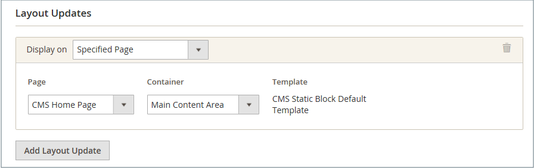

# Uso de un widget para colocar un bloque

El _bloque estático de CMS_ [widget](widgets.md) te permite colocar un [bloque de contenido](blocks.md) existente en casi cualquier lugar de tu tienda.

{width="700" zoomable="yes"}

## Paso 1: Elija el tipo de widget

1. En la barra lateral _Admin_, vaya a **[!UICONTROL Content]** > _[!UICONTROL Elements]_>**[!UICONTROL Widgets]**.

1. En la esquina superior derecha, haga clic en **[!UICONTROL Add Widget]**.

1. En la sección _Configuración_, establezca **[!UICONTROL Type]** en `CMS Static Block` y haga clic en **[!UICONTROL Continue]**.

1. Compruebe que **[!UICONTROL Design Theme]** está establecido en el tema actual y haga clic en **[!UICONTROL Continue]**.

   {width="600" zoomable="yes"}

1. En la sección _[!UICONTROL Storefront Properties]_, haga lo siguiente:

   - Para **[!UICONTROL Widget Title]**, escriba un título descriptivo para el widget.

     Este título solo está visible desde _Admin_.

   - Para **[!UICONTROL Assign to Store Views]**, seleccione las vistas de la tienda donde el widget sea visible.

     Puede seleccionar una vista de tienda específica o `All Store Views`. Para seleccionar varias vistas, mantenga pulsada la tecla Ctrl (PC) o la tecla Comando (Mac) y haga clic en cada opción.

   - (Opcional) Para **[!UICONTROL Sort Order]**, escriba un número para determinar el orden en que aparece este elemento con otros en la misma parte de la página. (`0` = primero, `1` = segundo, `3` = tercero, etc.)

     {width="600" zoomable="yes"}

## Paso 2: Completar las actualizaciones del diseño del widget

1. En la sección _[!UICONTROL Layout Updates]_, haga clic en **[!UICONTROL Add Layout Update]**.

1. Establezca **[!UICONTROL Display On]** en la categoría, el producto o la página donde desea que aparezca el bloque.

1. Para colocar el bloque en una página específica, haga lo siguiente:

   - Elija el **[!UICONTROL Page]** en el que desea que aparezca el bloque.

   - Elija el **[!UICONTROL Block Reference]** que identifica el lugar donde se muestra el bloque en la página.

   - Acepte la configuración predeterminada de **[!UICONTROL Template]**, que está establecida en `CMS Static Block Default Template`.

     {width="600" zoomable="yes"}

### Opciones de actualización de diseño

| Campo | Descripción |
|--- |--- |
| **_[!UICONTROL Categories]_** |  |
| [!UICONTROL Anchor Categories] | Muestra el widget en la página de categoría de anclaje. **[!UICONTROL Categories]**- Categorías en las que se muestra el anclaje. Opciones: `All` /`Specific Categories` **[!UICONTROL Container]**: establezca el contenedor en la parte del diseño de página donde desea mostrar el widget. **[!UICONTROL Template]**- Determina la temática del diseño. |
| [!UICONTROL Non-Anchor Categories] | Muestra el widget en la página de categoría que no es de anclaje. **[!UICONTROL Categories]**- Categorías en las que se muestra el anclaje. Opciones: `All` /`Specific Categories` **[!UICONTROL Container]**: establezca el contenedor en la parte del diseño de página donde desea mostrar el widget. **[!UICONTROL Template]**- Determina la temática del diseño. |
| **_[!UICONTROL Products]_** |  |
| Todos los tipos de productos | Muestra el widget en una página de producto específica o en todas las páginas de producto.  **[!UICONTROL Products]**- Productos para los que se muestra el widget. Opciones: `All` /` Specific Products` **[!UICONTROL Container]** - Establezca el contenedor en la parte del diseño de página donde desea mostrar el widget. **[!UICONTROL Template]**- Determina la temática del diseño. |
| **_[!UICONTROL Generic Pages]_** |  |
| [!UICONTROL All Pages] | Muestra el widget en todas las páginas.  **[!UICONTROL Container]**: establezca el contenedor en la parte del diseño de página donde desea mostrar el widget. **[!UICONTROL Template]** - Determina la temática del diseño. |
| [!UICONTROL Specified Page] | Muestra el widget en una página específica. Opciones:  **[!UICONTROL Page]**- Páginas para las que se muestra el widget. **[!UICONTROL Container]** : configure el contenedor en la parte del diseño de página donde desee mostrar el widget. **Plantilla**: determina el tema del diseño. |
| [!UICONTROL Page Layouts] | Muestra el widget en páginas con un diseño determinado.  **[!UICONTROL Page]**- Páginas para las cuales se muestra el widget. **[!UICONTROL Container]** - Establezca el contenedor en la parte del diseño de página donde desea mostrar el widget. **[!UICONTROL Template]**- Determina la temática del diseño. |

{style="table-layout:auto"}

## Paso 3: Colocar el bloque

1. En el panel izquierdo, seleccione **[!UICONTROL Widget Options]**.

1. Haga clic en **[!UICONTROL Select Block…]** y elija el bloque que desee colocar en la lista.

1. Una vez finalizado, haga clic en **[!UICONTROL Save]**.

   La aplicación ahora aparece en la lista.

1. Cuando se le solicite, siga las instrucciones en la parte superior de la página para actualizar el índice y la caché de la página.

1. Vuelve a tu tienda para verificar que el bloque aparece en la ubicación correcta.

   Para mover el bloque, puede volver a abrir el widget o probar con una página o referencia de bloque diferente.
