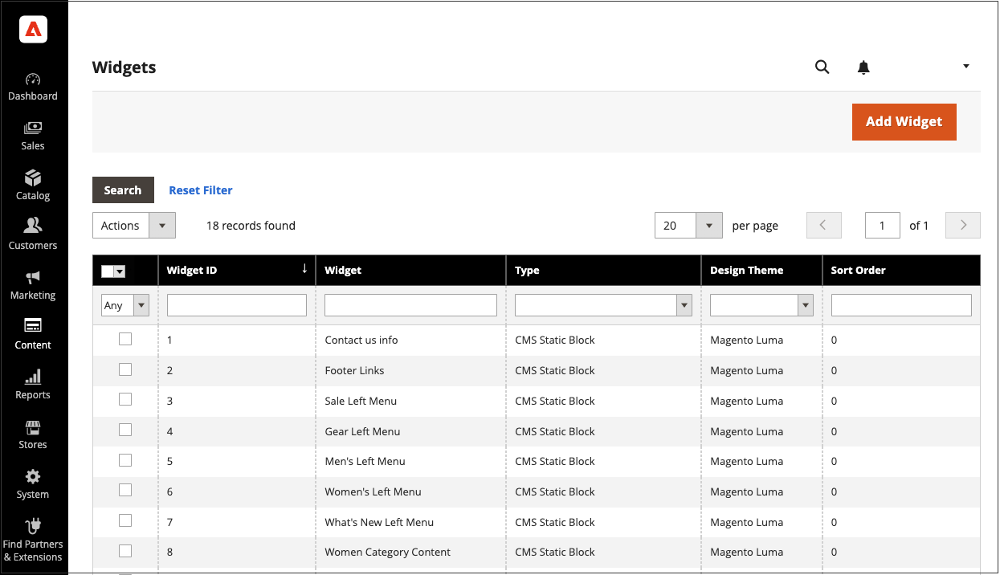

# Widgets

Un widget es un fragmento de código que permite mostrar una amplia gama de contenido y colocarlo en referencias de bloque específicas en su tienda. Muchos widgets muestran datos dinámicos en tiempo real y crean oportunidades para que sus clientes interactúen con su tienda. La herramienta Widget facilita la colocación de un widget dentro del contenido existente, como bloques con imágenes y texto y elementos interactivos casi en cualquier lugar de la tienda.

Puede utilizar widgets para crear páginas de aterrizaje para campañas de marketing y para mostrar contenido promocional en ubicaciones específicas de la tienda. Los widgets también se pueden utilizar para agregar elementos interactivos y bloques de acción para sistemas de revisión externos, chats de vídeo, votaciones y formularios de suscripción, o para proporcionar elementos de navegación para nubes de etiquetas y reguladores de imagen.

{{$include /help/_includes/directives-caution.md}}

{width="700" zoomable="yes"}

## Tipos de widget

Cuando [crea un widget](widget-create.md), debe establecer el tipo. Este tipo determina cómo funciona el widget.

| Tipo | Descripción |
|--- |--- |
| [!UICONTROL CMS Hierarchy Node Link] | Utilice esta opción para mostrar un vínculo a un nodo específico en la jerarquía de páginas que se puede incorporar a otro contenido. |
| [!UICONTROL CMS Page Link] | Utilice esta opción para especificar texto personalizado y un título que se vincule a una página de CMS específica. Cuando se completa el vínculo, puede utilizarse en páginas de contenido y bloques. |
| [!UICONTROL CMS Static Block] | Utilice esta opción para mostrar un bloque de contenido en una ubicación específica de una página. |
| [!UICONTROL Catalog Category Link] | Utilice esta opción para mostrar un vínculo en línea o de estilo de bloque a una categoría de catálogo seleccionada. Cuando se completa el vínculo, puede utilizarse en páginas de contenido y bloques. |
| [!UICONTROL Catalog Events Carousel] | Utilice esta opción para mostrar una lista de los próximos eventos de catálogo. |
| [!UICONTROL Catalog New Products List] | Utilice esta opción para mostrar un bloque de productos que se han designado como nuevos durante el tiempo especificado en el registro del producto. |
| [!UICONTROL Catalog Product Link] | Utilice esta opción para mostrar un vínculo en línea o de estilo de bloque al producto de catálogo seleccionado. Cuando se completa el vínculo, puede utilizarse en páginas de contenido y bloques. |
| [!UICONTROL Catalog Products List] | Utilice esta opción para mostrar una lista de productos del catálogo. |
| [!UICONTROL Dynamic Blocks Rotator] | Utilice esta opción para mostrar un solo bloque dinámico o una serie de bloques dinámicos en serie, orden aleatorio o agrupados. El bloque dinámico se puede activar mediante una regla de precios y colocarse en una página y una ubicación específicas, o configurarse para que aparezca en todas las páginas. |
| [!UICONTROL Gift Registry Search] | Utilice esta opción para que los compradores puedan buscar registros públicos de regalos por nombre o ID de registro. |
| [!UICONTROL Order by SKU] | El pedido por SKU se puede mostrar en la tienda para mayor comodidad de todos los compradores o solo está disponible para grupos específicos de clientes. Los compradores pueden introducir la información de SKU y cantidad directamente en el bloque Ordenar por SKU o cargar un archivo CSV desde su cuenta de cliente. |
| [!UICONTROL Orders and Returns] | Utilice esta opción para que los invitados puedan comprobar el estado de sus pedidos y enviar solicitudes para devolver la mercancía. El widget solo aparece para invitados y clientes que no han iniciado sesión en sus cuentas. |
| [!UICONTROL Recently Compared Products] | Muestra el bloque de productos comparados recientemente. Puede especificar el número de productos incluidos y aplicarles formato de lista o cuadrícula de productos. |
| [!UICONTROL Recently Viewed Products] | Utilice esta opción para mostrar el bloque de productos visualizados recientemente. Puede especificar el número de productos incluidos y aplicarles formato de lista o cuadrícula de productos. El widget puede no mostrar actualizaciones de precios en tiempo real. El comprador debe hacer clic en un producto para ver los precios actuales en su página de productos. |
| [!UICONTROL Wish List Search] | Utilice esta opción para dar a un cliente la capacidad de buscar listas de deseos disponibles públicamente por el nombre o la dirección de correo electrónico del propietario de la lista de deseos. Los clientes de tienda pueden encontrar listas de deseos que pertenecen a otros clientes, verlas y solicitar productos de ellos o agregar los productos a sus propias listas de deseos. |

{style="table-layout:auto"}

<!-- Last updated from includes: 2022-08-30 15:36:09 -->
