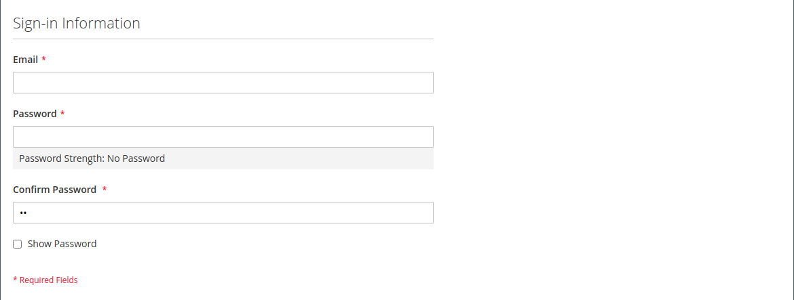
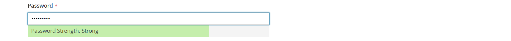

# Crear una cuenta de cliente individual

Los visitantes de la tienda pueden abrir una cuenta para administrar sus compras y actividades. Los clientes suelen crear sus propias cuentas a partir de su tienda. Sin embargo, también puede crear cuentas de cliente directamente desde el administrador, lo que resulta útil para ayudar a los clientes por teléfono.

Las siguientes instrucciones representan la configuración predeterminada de la cuenta del cliente. Para cambiar la selección y el comportamiento de algunos de los campos del formulario, consulte [Configuración de cuentas de cliente](../customers/customer-account-scope.md).

Como administrador de tienda, también puede establecer la variable [nuevas opciones de cuenta](../customers/account-options-new.md) para enviar un correo electrónico de confirmación a los nuevos clientes registrados, lo que ayuda a garantizar que las cuentas registradas sean válidas.

>[!NOTE]
>
>A partir de la versión 2.4.7, los clientes deben volver a introducir su correo electrónico y contraseña para iniciar sesión en su cuenta después de la confirmación del correo electrónico, independientemente del explorador.

## Crear cuenta desde la tienda

Un cliente de una tienda crea una cuenta en la tienda.

1. Desde la tienda, haga clic en **[!UICONTROL Create an Account]** en la esquina superior derecha del encabezado.

   {width="700" zoomable="yes"}

1. En **[!UICONTROL Personal Information]**, introduce su **[!UICONTROL First Name]** y **[!UICONTROL Last Name]**.

   {width="600" zoomable="yes"}

1. Si desea agregar su nombre y dirección de correo electrónico a la lista de suscriptores del boletín informativo, el cliente selecciona el **[!UICONTROL Sign Up for Newsletter]** casilla de verificación

   >[!INFO]
   >
   > Esta opción aparece aunque la tienda no publique una newsletter.

1. Si quieren que el personal de soporte de la tienda [ver lo que ven](../customers/login-as-customer.md) y proporcionar asistencia remota, el cliente selecciona el **[!UICONTROL Allow remote shopping assistance]** casilla de verificación

1. En **[!UICONTROL Sign-in Information]**, introduce su **[!UICONTROL Email]** dirección.

   >[!INFO]
   >
   > Esta dirección de correo electrónico forma parte de sus credenciales de inicio de sesión y no se puede asociar con ninguna otra cuenta de cliente.

   {width="600" zoomable="yes"}

1. Introduce un **[!UICONTROL Password]** que incluye tres de los siguientes tipos de información:

   - Caracteres en minúsculas
   - Caracteres en mayúsculas
   - Números
   - Caracteres especiales

   Después de que presionen **[!UICONTROL Enter]**, la seguridad de la contraseña se evalúa y aparece debajo del campo. Si la contraseña se considera _Débil_, pruebe con otro hasta que se evalúe como _Fuerte_.

   {width="600" zoomable="yes"}

1. A continuación, el cliente lo introduce de nuevo en **[!UICONTROL Confirm Password]**.

1. Si es necesario, haga clic en **[!UICONTROL Show Password]** para ver la contraseña introducida.

1. Cuando termine, haga clic en **Crear una cuenta**.

El cliente puede utilizar su dirección de correo electrónico y contraseña para [iniciar sesión](../customers/customer-sign-in.md) a su cuenta y complete la información de dirección.

## Cree una cuenta desde el administrador

Como comerciante, puede crear una cuenta de cliente desde el Administrador.

1. En el _Administrador_ barra lateral, vaya a **[!UICONTROL Customers]** > **[!UICONTROL All Customers]**.

1. Clic **[!UICONTROL Add New Customer]**.

### Paso 1: Completar la información de la cuenta

{width="700" zoomable="yes"}

1. En el **[!UICONTROL Account Information]** , haga lo siguiente:

   - Para una instalación multisitio, establezca **[!UICONTROL Associate to Website]** al sitio web donde se aplica la cuenta de cliente.
   - Si procede, asigne el cliente a otro **[!UICONTROL Customer Group]**.
   - Si está utilizando [Validación de ID de IVA](../stores-purchase/vat.md) y desea **[!UICONTROL Disable Automatic Group Change Based on VAT ID]**, seleccione la casilla de verificación.

1. Rellene los campos obligatorios:

   - **[!UICONTROL First Name]**
   - **[!UICONTROL Last Name]**
   - **[!UICONTROL Email]**

1. Rellene los campos opcionales según sea necesario:

   - **[!UICONTROL Name Prefix]**
   - **[!UICONTROL Middle Name/Initial]**
   - **[!UICONTROL Name Suffix]**
   - **[!UICONTROL Date of Birth]**
   - **[!UICONTROL Tax/VAT Number]**
   - **[!UICONTROL Gender]**

   >[!WARNING]
   >
   >De acuerdo con las prácticas recomendadas actuales de seguridad y privacidad, tenga en cuenta cualquier posible riesgo legal y de seguridad asociado con el almacenamiento de la fecha de nacimiento completa de los clientes (mes, día, año) con otros identificadores personales. Se recomienda limitar el almacenamiento de las fechas de nacimiento completas de los clientes y sugerir que utilice el año de nacimiento del cliente como alternativa.

1. Establecer **[!UICONTROL Send Welcome Email From]** a la vista de la tienda desde la que el _Bienvenido_ correo electrónico que se va a enviar.

   >[!INFO]
   >
   > Si la tienda tiene vistas para diferentes [idiomas](../stores-purchase/store-localize.md), esta configuración determina el idioma del correo electrónico de bienvenida.

1. Clic **[!UICONTROL Save and Continue Edit]** en la parte superior de la página.

   >[!INFO]
   >
   >Una vez guardada la cuenta del cliente, aparece el conjunto completo de opciones en el panel izquierdo y en el menú situado en la parte superior de la página. El _[!UICONTROL Customer View]_La pestaña muestra un resumen de la cuenta.

   {width="600" zoomable="yes"}

### Paso 2: Completar la información de dirección

1. En el panel izquierdo, elija **[!UICONTROL Addresses]** y haga clic en **[!UICONTROL Add New Addresses]**.

1. Si se utiliza la misma dirección tanto para la facturación como para el envío, alterne ambas opciones.

   - **[!UICONTROL Default Billing Address]**
   - **[!UICONTROL Default Shipping Address]**

   {width="600" zoomable="yes"}

1. Desplácese hacia abajo y rellene los campos de dirección requeridos en la segunda columna.

   - **[!UICONTROL Street Address]**
   - **[!UICONTROL City]**
   - **[!UICONTROL Country]**
   - **[!UICONTROL State/Province]**
   - **[!UICONTROL ZIP/Postal Code]**

1. Introduzca el **[!UICONTROL Phone Number]** para esta dirección.

1. Si procede, introduzca la variable **[!UICONTROL VAT Number]** asociado con el cliente.

1. Si esta dirección es la única necesaria para la cuenta, haga clic en **[!UICONTROL Save]**.

   De lo contrario, haga clic en **[!UICONTROL Save and Continue Edit]** y repita los pasos anteriores para agregar direcciones adicionales.

   La nueva dirección se muestra en la [!UICONTROL Addresses] página con el seleccionado _[!UICONTROL Default Billing]_y_[!UICONTROL Default Shipping]_ direcciones encima de la lista completa.

   {width="600" zoomable="yes"}

### Paso 3: Restablecer la contraseña

Las cuentas de cliente creadas desde Admin no tienen asignadas inicialmente contraseñas.

1. Busque la nueva cuenta de cliente en la cuadrícula.

1. Clic **[!UICONTROL Edit]** en el _[!UICONTROL Action]_columna.

1. En la barra de menús de la parte superior de la página, haga clic en **[!UICONTROL Reset Password]**.

1. La notificación se envía al propietario de la cuenta, con instrucciones para configurar la contraseña.

## Barra de botones

Hay botones adicionales disponibles cuando el perfil se guarda por primera vez. Para obtener más información, consulte [Actualización de un perfil de cliente](../customers/update-account.md).

| Botón | Descripción |
|--- |--- |
| **[!UICONTROL Back]** | Vuelve a la _[!UICONTROL Customers]_página sin guardar los cambios. |
| **[!UICONTROL Delete Customer]** | Elimina el cliente actual. Los pedidos completados asociados con el cliente no se eliminan. |
| **[!UICONTROL Reset]** | Restablece los cambios no guardados en el formulario del cliente a sus valores anteriores. |
| **[!UICONTROL Create Order]** | Crea un pedido para el cliente. |
| **[!UICONTROL Reset Password]** | Envía un [restablecer contraseña](../customers/password-reset.md) vínculo al cliente por correo electrónico. |
| **[!UICONTROL Force Sign-in]** | Revoca los tokens de acceso de OAuth asociados a la cuenta del cliente. Esta función solo se puede utilizar con cuentas de cliente a las que se hayan asignado tokens de OAuth como parte de una API web [integración](../systems/integrations.md). Para obtener más información, consulte [Autenticación basada en OAuth](https://developer.adobe.com/commerce/webapi/get-started/authentication/gs-authentication-oauth/) en la documentación para desarrolladores. |
| **[!UICONTROL Manage Shopping Cart]** | Permite al administrador administrar el carro de compras del cliente. |
| **[!UICONTROL Save and Continue Edit]** | Guarda los cambios y mantiene abierto el perfil del cliente. |
| **[!UICONTROL Save Customer]** | Guarda los cambios y cierra el perfil del cliente. |

{style="table-layout:auto"}

## Descripciones de campos

### [!UICONTROL Account Information]

| Campo | Descripción |
|--- |--- |
| **[!UICONTROL Associate to Website]** | Identifica el sitio web asociado a la cuenta del cliente. |
| **[!UICONTROL Group]** | Identifica el [grupo de clientes](../customers/customer-groups.md) donde el cliente es un miembro. Si procede, marque la casilla de verificación para desactivar el cambio automático de grupo según IVA. |
| **[!UICONTROL Name Prefix]** | Si se utiliza, el prefijo asociado al nombre del cliente (como Sr., Sra. o Dr.). Los valores del prefijo están determinados por el [configuración](../configuration-reference/customers/customer-configuration.md). Según la configuración, el control de entrada puede ser un campo de texto o una lista de opciones. |
| **[!UICONTROL First Name]** | El nombre del cliente. |
| **[!UICONTROL Middle Name / Initial]** | El segundo nombre o la inicial del cliente. Este campo solo se incluye si se especifica en la variable [configuración](../configuration-reference/customers/customer-configuration.md) tema. |
| **[!UICONTROL Last Name]** | El apellido del cliente. |
| **[!UICONTROL Name Suffix]** | Si se utiliza, el sufijo asociado al nombre del cliente (como Jr., Sr. o III). Los valores del sufijo están determinados por el [configuración](../configuration-reference/customers/customer-configuration.md). Según la configuración, el control de entrada puede ser un campo de texto o una lista desplegable de opciones. |
| **[!UICONTROL Email]** | La dirección de correo electrónico del cliente. |
| **[!UICONTROL Date of Birth]** | La fecha de nacimiento del cliente. La fecha de nacimiento se incluye si se especifica en la variable [configuración](../configuration-reference/customers/customer-configuration.md) tema.   De acuerdo con las prácticas recomendadas actuales de seguridad y privacidad, tenga en cuenta cualquier posible riesgo legal y de seguridad asociado con el almacenamiento de la fecha de nacimiento completa de los clientes (mes, día, año) con otros identificadores personales. Se recomienda limitar el almacenamiento de las fechas de nacimiento completas de los clientes y sugerir el uso del año de nacimiento del cliente como alternativa. |
| **[!UICONTROL Tax / VAT Number]** | Número de impuesto o de impuesto sobre el valor añadido del cliente, si corresponde. |
| **[!UICONTROL Gender]** | Identifica el sexo del cliente. El sexo se incluye si se especifica en la variable [configuración](../configuration-reference/customers/customer-configuration.md). Opciones: `Male` / `Female` / `Not Specified` |
| **[!UICONTROL Send Welcome Email From]** | Si tiene varias vistas de tienda, esta configuración identifica la vista de tienda desde la que se envía el mensaje de bienvenida. Si las vistas de tienda se utilizan en distintos idiomas, esta configuración determina el idioma del correo electrónico de bienvenida. |

### [!UICONTROL Addresses]

| Campo | Descripción |
|--- |--- |
| **[!UICONTROL New Addresses]** | Identifica el tipo de nueva dirección. Opciones: `Default Billing Address` / `Default Shipping Address` |
| **[!UICONTROL Add New Addresses]** | Muestra otra sección Dirección nueva para identificar el tipo de dirección que se va a escribir. |
| **[!UICONTROL Company]** | El nombre de la empresa, si corresponde a esta dirección. |
| **[!UICONTROL Street Address]** | La dirección postal del cliente. Hay disponible una segunda línea de la dirección si se especifica en la variable [configuración](../configuration-reference/customers/customer-configuration.md) tema. |
| **[!UICONTROL City]** | La ciudad donde se encuentra la dirección del cliente. |
| **[!UICONTROL Country]** | El país donde se encuentra la dirección del cliente. |
| **[!UICONTROL State/Province]** | Estado o provincia donde se encuentra la dirección del cliente. |
| **[!UICONTROL Zip/Postal Code]** | El código postal donde se encuentra la dirección del cliente. |
| **[!UICONTROL Phone Number]** | Número de teléfono del cliente asociado a la dirección. |
| **[!UICONTROL VAT Number]** | Si procede, el número de impuesto sobre el valor añadido que se aplica al cliente en esta dirección. |
