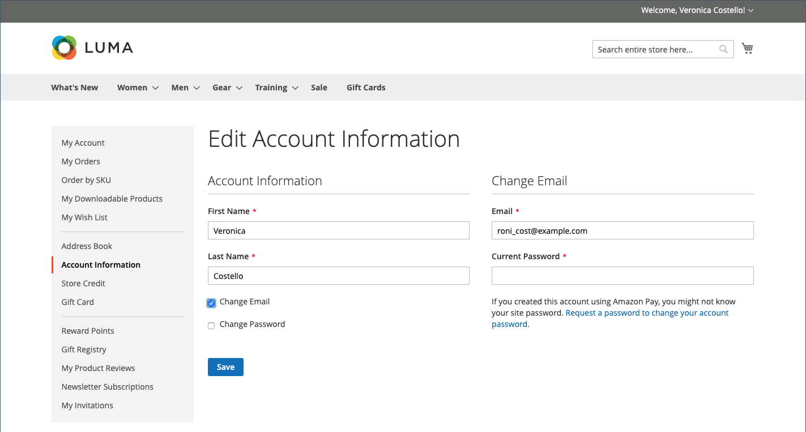
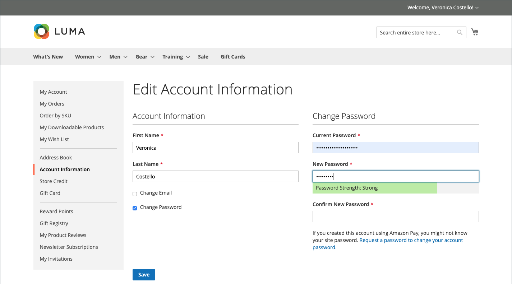

# Información de cuenta del cliente

La información básica de la cuenta del cliente incluye su nombre, dirección de correo electrónico y contraseña, y se puede mantener desde el panel de la cuenta del cliente en la tienda.

{width="700" zoomable="yes"}

En la barra lateral de la cuenta, el cliente puede elegir **[!UICONTROL Account Information]** y realizar cualquiera de las siguientes acciones para actualizar la información de su cuenta.

## Actualizar el nombre de la cuenta

Para actualizar el nombre de la cuenta, el cliente cambia los valores de los campos **[!UICONTROL First Name]** y **[!UICONTROL Last Name]** según sea necesario.

>[!INFO]
>
>Los campos adicionales aparecen como parte del nombre si la [configuración del cliente](../configuration-reference/customers/customer-configuration.md) incluye un prefijo, una inicial media y un sufijo.

## Cambiar dirección de correo electrónico

1. El cliente selecciona la casilla de verificación **[!UICONTROL Change Email]**.

1. Escribe su nueva dirección **[!UICONTROL Email]**.

1. Escribe su **[!UICONTROL Current Password]**.

   {width="700" zoomable="yes"}

1. Clics **[!UICONTROL Save]**.

## Cambiar contraseña

1. El cliente selecciona la casilla de verificación **[!UICONTROL Change Password]**.

1. Escribe su **[!UICONTROL Current Password]**.

1. Escribe su **[!UICONTROL New Password]**.

   >[!INFO]
   >
   >La contraseña debe tener al menos ocho caracteres y puede incluir una combinación de letras mayúsculas y minúsculas, números y símbolos. El indicador de seguridad de contraseña ayuda al cliente a elegir la mejor contraseña.

   {width="700" zoomable="yes"}

1. Vuelve a introducirlo para confirmar.
