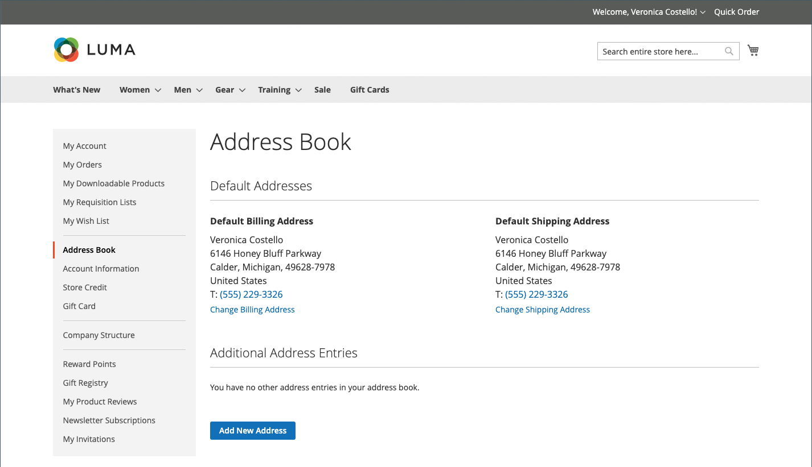
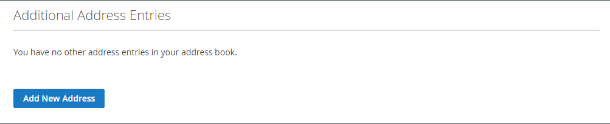

# La libreta de direcciones del cliente

Los clientes que mantienen sus libretas de direcciones actualizadas pueden acelerar el proceso de cierre de compra. La libreta de direcciones contiene las direcciones de facturación y envío predeterminadas del cliente, así como las direcciones adicionales que utilice con frecuencia. Las entradas de direcciones adicionales son fáciles de acceder y mantener desde la cuadrícula. Cada libreta de direcciones de clientes puede administrar más de 3000 entradas de libreta de direcciones sin afectar al rendimiento.

{width="700" zoomable="yes"}

## Añadir una dirección

1. En el panel de navegación izquierdo de su cuenta de cliente, el cliente elige **[!UICONTROL Address Book]**.

1. En la página _[!UICONTROL Address Book]_&#x200B;en_ Entradas de dirección adicionales _, hace clic en **[!UICONTROL Add New Address]**.

   {width="600" zoomable="yes"}

1. Define el nuevo elemento de dirección.

1. Completa la información de contacto y dirección.

   >[!INFO]
   >
   >De forma predeterminada, el nombre y los apellidos del cliente aparecen inicialmente en el formulario.

1. Selecciona las siguientes casillas de verificación para indicar cómo se va a utilizar la dirección.

   Selecciona ambas casillas de verificación si se utiliza la misma dirección tanto para la facturación como para el envío.

   * [!UICONTROL Use as my default billing address]
   * [!UICONTROL Use as my default shipping address]

1. Una vez finalizado, hace clic en **[!UICONTROL Save Address]**.

   >[!INFO]
   >
   >La nueva dirección se enumera en [!UICONTROL Additional Address Entries].

   {width="700" zoomable="yes"}

## Editar una dirección

1. En el panel de navegación izquierdo de su cuenta de cliente, el cliente selecciona **[!UICONTROL Address Book]**.

1. Busca la entrada de dirección que se va a editar.

1. Clics **[!UICONTROL Edit]**.

1. Realice los cambios necesarios.

   >[!INFO]
   >
   >El cliente puede establecer esta dirección como la dirección **[!UICONTROL Shipping or Billing]** predeterminada al seleccionar las casillas de verificación _Usar como mi dirección de facturación predeterminada_.

1. Cuando se completen los cambios, haga clic en **[!UICONTROL Save Address]**.

## Cambiar la dirección predeterminada

1. En el panel de navegación izquierdo de su cuenta de cliente, el cliente selecciona **[!UICONTROL Address Book]**.

1. Elige uno de los métodos de edición:

   * Hace clic en **[!UICONTROL Change Billing/Shipping Address]** en la sección _[!UICONTROL Default Addresses]_.

   * Hace clic en **[!UICONTROL Edit]** en la cuadrícula _[!UICONTROL Additional Address Entries]_.

1. Realiza los cambios necesarios y hace clic en **[!UICONTROL Save Address]**.

## Eliminar una dirección

1. En el panel de navegación izquierdo de su cuenta de cliente, el cliente selecciona **[!UICONTROL Address Book]**.

1. Busca la entrada de dirección que se va a eliminar.

1. Hace clic en **[!UICONTROL Delete]** en la cuadrícula _[!UICONTROL Additional Address Entries]_.

1. Para confirmar la acción, haga clic en **[!UICONTROL OK]**.

   >[!IMPORTANT]
   >
   >No se pueden eliminar las direcciones de facturación y envío predeterminadas.
