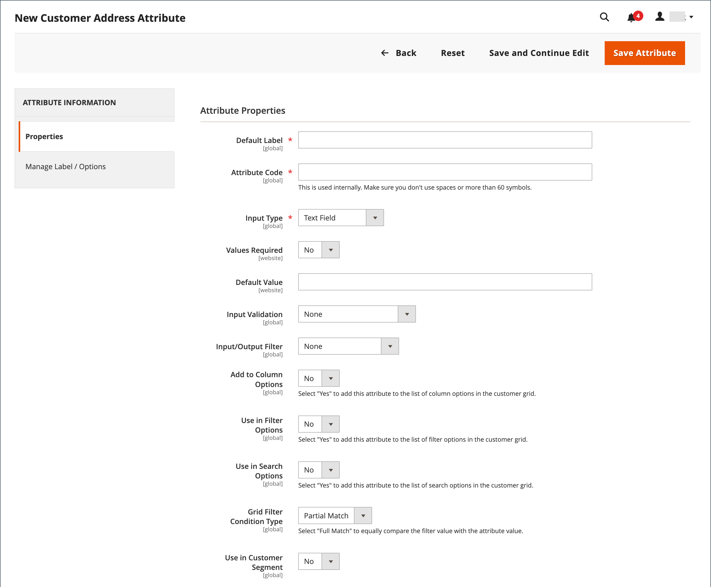

# Atributos de dirección del cliente

{{ee-feature}}

El conjunto de atributos Dirección del cliente determina las propiedades de las direcciones que se escriben en la [libreta de direcciones](account-dashboard-address-book.md) desde la cuenta del cliente o durante el [cierre de compra](../stores-purchase/checkout-process.md).

Se pueden configurar atributos de dirección personalizados para proporcionar información adicional, como una dirección de correo electrónico opcional, una cuenta de Skype, un número de teléfono alternativo, un edificio o un condado. El atributo personalizado se puede incorporar a la [plantilla de dirección](address-templates.md) que se usa para producir documentos de ventas. El proceso para crear un atributo de dirección personalizado es casi igual que crear un [atributo de cliente](attribute-properties.md).

Los atributos de dirección del cliente se utilizan en los siguientes formularios:

- [Registro de dirección del cliente](account-create.md)
- [Dirección de cuenta del cliente](account-dashboard-address-book.md)

{width="700" zoomable="yes"}

## Paso 1: Completar las propiedades del atributo

1. En la barra lateral _Admin_, vaya a **[!UICONTROL Stores]** > _[!UICONTROL Attributes]_>**[!UICONTROL Customer Address]**.

1. En la esquina superior derecha, haga clic en **[!UICONTROL Add New Attribute]**.

   {width="600" zoomable="yes"}

1. En la sección **[!UICONTROL Attribute Properties]**, haga lo siguiente:

   - Escriba un(a) **[!UICONTROL Default Label]** que identifique el atributo durante la entrada de datos.

   - Escriba un **[!UICONTROL Attribute Code]** que identifique el atributo en el sistema.

     El código de atributo debe comenzar por una letra y puede incluir cualquier combinación de letras minúsculas (a-z) y números (0-9). El código debe tener menos de 30 caracteres de longitud y no puede incluir caracteres especiales ni espacios. El carácter de guion bajo (_) se puede utilizar para indicar un espacio.

     >[!TIP]
     >
     >**_Acceso directo:_** Para completar solo los campos requeridos, desplácese hacia abajo hasta [!UICONTROL Storefront Properties], escriba [!UICONTROL Sort Order] y guarde.

1. Para determinar el tipo de control de entrada que se usa para la entrada de datos, establezca **[!UICONTROL Input Type]** en uno de los siguientes:

   - `Text Field`: campo de texto de una sola línea.
   - `Text Area`: área de texto multilínea.
   - `Multiple Line`: crea varias líneas de texto para el atributo, de forma similar a una dirección de calle de varias líneas. El número de líneas de entrada de datos independientes puede estar entre 2 y 20. Use `Default Value` para especificar el valor inicial del campo.
   - `Date` - Muestra un campo de fecha con un calendario emergente. Propiedades adicionales: utilice `Default Value` para especificar el valor inicial del campo.  Use `Minimal Value` para especificar la fecha más temprana que se puede ingresar.  Use `Maximum Value` para especificar la última fecha que se puede ingresar.
   - `Dropdown`: lista desplegable que solo acepta un valor para seleccionar.
   - `Multiple Select`: lista desplegable que acepta que se seleccionen varios valores.
   - `Yes/No` - Campo que ofrece solamente una opción de `Yes` o `No` valores.
   - `File (attachment)`: campo que permite cargar un archivo y asociarlo al atributo del cliente como archivo adjunto.
   - `Image File`: campo que permite cargar una imagen en la galería y asociarla al atributo del cliente.

1. Si el cliente debe escribir un valor en el campo, establezca **[!UICONTROL Values Required]** en `Yes`.

1. Para asignar un valor inicial al campo, escriba un **[!UICONTROL Default Value]**.

1. Para comprobar la precisión de los datos especificados en el campo antes de guardar el registro, establezca **[!UICONTROL Input Validation]** en el tipo de datos que se permitirá en el campo. Los valores disponibles dependen del _[!UICONTROL Input Type]_&#x200B;especificado.

   - `None`: el campo no tiene validación de entrada durante la entrada de datos.
   - `Alphanumeric` - Acepta cualquier combinación de números (0-9) y caracteres alfabéticos (a-z, A-Z) durante la entrada de datos. Para incluir caracteres especiales, vea [!UICONTROL Escape HTML Entities] en el paso siguiente.
   - `Alphanumeric with Space`: acepta cualquier combinación de números (0-9), caracteres alfabéticos (a-z, A-Z) y espacios durante la entrada de datos.
   - `Numeric Only` - Acepta solamente números (0-9) durante la entrada de datos.
   - `Alpha Only` - Acepta solamente caracteres alfabéticos (a-z, A-Z) durante la entrada de datos.
   - `URL` - Acepta solamente una dirección URL durante la entrada de datos.
   - `Email` - Acepta solamente una dirección de correo electrónico durante la entrada de datos.
   - `Length Only` - Valida la entrada en función de la longitud de los datos introducidos en el campo.

1. Para aplicar un filtro de preprocesamiento a los valores especificados en un campo de texto, área de texto o tipo de entrada de varias líneas, establezca **[!UICONTROL Input/Output Filter]** en uno de los siguientes:

   - `None`: no aplica ningún filtro al texto introducido en el campo.
   - `Strip HTML Tags`: quita las etiquetas de HTML del texto. Este filtro puede ayudar a limpiar los datos que se pegan en un campo de otra fuente que incluye etiquetas de HTML.
   - `Escape  HTML Entities`: convierte los caracteres especiales encontrados en el texto en una secuencia de escape de HTML válida, como `&;`. Las secuencias de escape se encierran entre un signo &amp; y un punto y coma, y se utilizan con frecuencia para las comillas tipográficas, los derechos de autor y los símbolos de marca comercial. Las secuencias de escape también se utilizan para identificar caracteres como los símbolos menor que (`<`) y mayor que (`>`), y el carácter ampersand que también se utilizan en el código. Este filtro puede ayudar a limpiar los caracteres especiales que a veces se pegan en los campos de base de datos desde procesadores de texto.

1. Complete las propiedades de la cuadrícula del cliente y del segmento:

   - Para poder incluir la columna en la cuadrícula Clientes, establezca **[!UICONTROL Add to Column Options]** en `Yes`.

   - Para filtrar la cuadrícula Clientes por este atributo, establezca **[!UICONTROL Use in Filter Options]** en `Yes`.

   - Para filtrar la cuadrícula Clientes por atributo de texto con diferentes condiciones de coincidencia de filtro, establezca **[!UICONTROL Grid Filter Condition Type]** en `Partial Match`, `Prefix Match` o `Full Match`. No afecta el campo _Buscar por palabra clave_ de la cuadrícula.

   - Para buscar en la cuadrícula Customers por este atributo, establezca **[!UICONTROL Use in Search Options]** en `Yes`.

   - Para que este atributo esté disponible para [segmentos del cliente](customer-segments.md), establezca **[!UICONTROL Use in Customer Segment]** en `Yes`.

## Paso 2: Completar las propiedades de la tienda

1. Vaya a la sección **[!UICONTROL Storefront Properties]**.

   {width="600" zoomable="yes"}

1. Para que el atributo sea visible para los clientes, establezca **[!UICONTROL Show on Storefront]** en `Yes`.

1. Escriba un número en el campo **[!UICONTROL Sort Order]**, que determina el orden de aparición cuando se enumera con otros atributos.

1. Establezca **[!UICONTROL Forms to Use]** en cada formulario que vaya a incluir el atributo.

   Para elegir ambas opciones, mantenga presionada la tecla Ctrl (PC) o la tecla Comando (Mac) mientras hace clic en cada formulario.

   - [Registro de dirección del cliente](account-create.md)
   - [Dirección de cuenta del cliente](account-dashboard-address-book.md)

## Paso 3: Completar la etiqueta y guardar

1. En el panel de la izquierda, elija **[!UICONTROL Manage Labels/Options]**.

1. En **[!UICONTROL Manage Titles]**, escriba una etiqueta para identificar el atributo de cada [vista de tienda](../getting-started/websites-stores-views.md).

1. Una vez finalizado, haga clic en **[!UICONTROL Save Attribute]**.

   {width="600" zoomable="yes"}

## Descripciones de campos

### [!UICONTROL Attribute Properties]

| Campo | Descripción |
|--- |--- |
| [!UICONTROL Default Label] | La etiqueta predeterminada que identifica el atributo en la administración y en la tienda. |
| [!UICONTROL Attribute Code] | Código único que identifica el atributo dentro del sistema. El código puede tener hasta 21 caracteres de longitud y no puede incluir espacios ni caracteres especiales. Se puede utilizar el símbolo de guion bajo en lugar de un espacio. |
| [!UICONTROL Input Type] | Determina el [control de entrada](../catalog/attributes-input-types.md) que se usa para la entrada de datos. Opciones:  **`Text Field`**- Campo de texto de una sola línea. **`Text Area`**: área de texto multilínea.  **`Multiple Line`**: crea varias líneas de texto para el atributo, de forma similar a una dirección de calle de varias líneas. El número de líneas de entrada de datos independientes puede estar entre 2 y 20. **`Date`** - Muestra un campo de fecha con un calendario emergente. **`Dropdown`**: lista desplegable que solo acepta un valor para seleccionar. **`Multiple Select`**: lista desplegable que acepta que se seleccionen varios valores.  **`Yes/No`**- Campo que ofrece solamente una opción de `Yes` o `No` valores. **`File (attachment)`**: campo que permite cargar un archivo y asociarlo al atributo del cliente como archivo adjunto.  **`Image File`**: campo que permite cargar una imagen en la galería y asociarla al atributo del cliente. |
| [!UICONTROL Values Required] | Determina si se debe introducir un valor en el campo. Opciones: `Yes` / `No` |
| [!UICONTROL Default Value] | Especifica el valor inicial del atributo. |
| [!UICONTROL Input Validation] | La selección de opciones viene determinada por el tipo de entrada. Opciones:  **`None`**- El campo no tiene validación de entrada durante la entrada de datos. **`Alphanumeric`** - Acepta cualquier combinación de números (0-9) y caracteres alfabéticos (a-z, A-Z) durante la entrada de datos.  **`Alphanumeric with Space`**: permite que los espacios de la dirección de la calle cumplan los requisitos de longitud máxima del operador. Durante el cierre de compra, el cliente puede introducir cualquier combinación de números (0-9), caracteres alfabéticos (a-z, A-Z) y espacios en la dirección de la calle del destinatario y del remitente. Los espacios adicionales se recortan cuando se guarda la dirección. **`Numeric Only`** - Acepta solamente números (0-9) durante la entrada de datos.  **`Alpha Only`**- Acepta solamente caracteres alfabéticos (a-z, A-Z) durante la entrada de datos. **&#x200B; URL &#x200B;**: solo acepta una URL durante la entrada de datos. **`Email`** - Acepta solamente una dirección de correo electrónico durante la entrada de datos.  **`Length Only`**- Valida la entrada en función de la longitud de los datos introducidos en el campo. |
| [!UICONTROL Input/Output Filter] | Aplica un filtro de preprocesamiento a los valores introducidos en un campo de texto, área de texto o tipo de entrada de varias líneas antes de guardar el registro. Opciones:  **`None`**: no aplica ningún filtro al texto introducido en el campo. **`Strip HTML Tags`**: quita las etiquetas de HTML del texto. Este filtro puede ayudar a limpiar los datos que se pegan en un campo de otra fuente que incluye etiquetas de HTML.  **`Escape HTML Entities`**: convierte los caracteres especiales encontrados en el texto en una secuencia de escape de HTML válida, como `amp;`. Las secuencias de escape se encierran entre un signo &amp; y un punto y coma, y se utilizan frecuentemente para comillas tipográficas, símbolos de copyright y símbolos de marca comercial. Las secuencias de escape también se utilizan para identificar caracteres como los símbolos menor que (`<`) y mayor que (`>`), y el carácter ampersand que también se utilizan en el código. Este filtro puede ayudar a limpiar los caracteres especiales que a veces se pegan en los campos de base de datos desde procesadores de texto. |
| [!UICONTROL Add to Column Options] | Especifica si el atributo se incluye como una columna en la cuadrícula [Clientes](./customers-all.md). Opciones: `Yes` / `No` |
| Uso en opciones de filtro | Especifica si el atributo se puede utilizar como filtro para operaciones de búsqueda desde la cuadrícula. Opciones: `Yes` / `No` |
| [!UICONTROL Grid Filter Condition Type] | Especifica las condiciones de coincidencia de filtros para los atributos en operaciones de búsqueda desde la cuadrícula. No afecta al campo _[!UICONTROL Search by keyword]_&#x200B;de la cuadrícula. Opciones: `Partial Match` / `Prefix Match` / `Full Match` |
| [!UICONTROL Use in Search Options] | Especifica si el valor del atributo se puede utilizar como palabra clave en las operaciones de búsqueda. Opciones: `Yes` / `No` |
| [!UICONTROL Use in Customer Segment] | Determina si el atributo se incluye en [condiciones del segmento del cliente](./customer-segments.md). Opciones: `Yes` / `No` |

### [!UICONTROL Storefront Properties]

| Campo | Descripción |
|--- |--- |
| [!UICONTROL Show on Storefront] | Determina si el atributo aparece como un campo en la información del cliente de la tienda. Opciones: `Yes` / `No` |
| [!UICONTROL Sort Order] | Especifica el orden de este atributo en relación con otros atributos del cliente. El criterio de ordenación determina la secuencia en la que los campos reciben el foco durante la entrada de datos al utilizar la navegación mediante el teclado. |
| [!UICONTROL Forms to Use in] | Determina las páginas con formularios de entrada de datos donde aparece el atributo. Opciones:  [`Customer Address Registration`](account-create.md)  [`Customer Account Address`](account-dashboard-address-book.md) |
