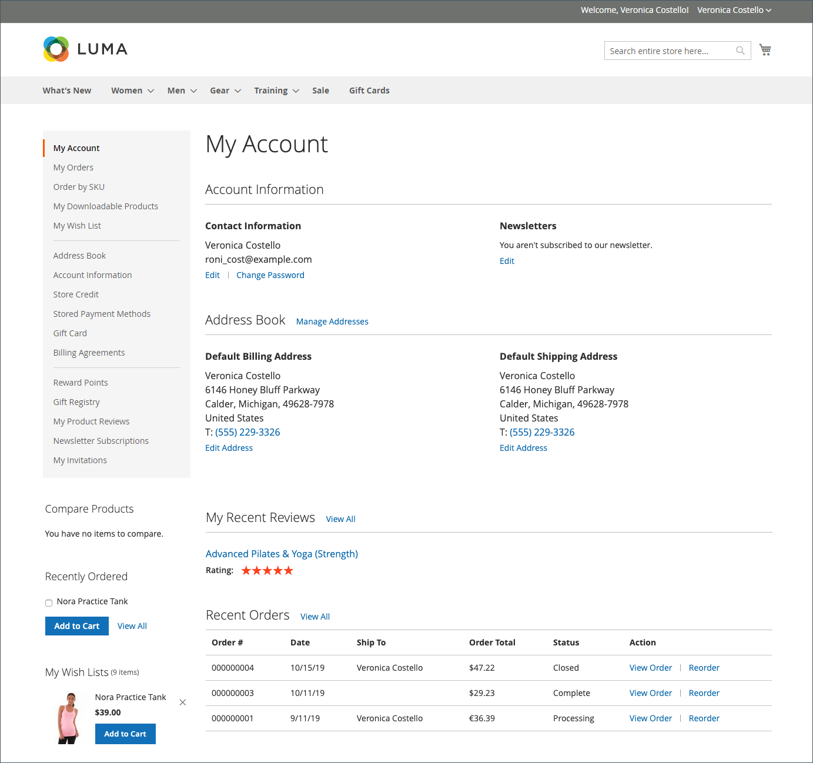

# Ámbito de cuenta de cliente

El encabezado de cada página de la tienda extiende una invitación a los compradores para que _Iniciar sesión o registrarse_ para obtener una cuenta en su tienda. Los clientes que abren una cuenta de disfrutan de una serie de ventajas, entre las que se incluyen:

* **Crear cuenta de cliente** - Los visitantes pueden crear una cuenta de cliente para que puedan usar la tienda como cliente registrado.
* **Crear una cuenta de empresa** Según la configuración, un visitante de la tienda puede elegir crear una cuenta de empresa. Para obtener más información, consulte [Adobe Commerce B2B](../b2b/introduction.md).
* **Cierre más rápido** — Los clientes registrados pasan el proceso de cierre de compra más rápido porque gran parte de la información ya está en sus cuentas.
* **Autoservicio** — Los clientes registrados pueden actualizar su información, comprobar el estado de los pedidos e incluso reordenar desde sus cuentas.

Los clientes pueden acceder a su cuenta haciendo clic en **[!UICONTROL My Account]** en el encabezado de la tienda. Desde su cuenta, los clientes pueden ver y modificar información, como direcciones actuales y pasadas, preferencias de facturación y envío, suscripciones a boletines informativos, listas de deseos y mucho más.

{width="600" zoomable="yes"}

## Establecer el ámbito de las cuentas de cliente

El ámbito de las cuentas de cliente puede limitarse al sitio web en el que se creó la cuenta o compartirse con todos los sitios web y tiendas de la jerarquía de tiendas.

>[!NOTE]
>
>Si el sitio web se excluye del grupo de clientes, el cliente no puede iniciar sesión en el sitio web cuando el ámbito de las cuentas de cliente se limita al sitio web o se comparte con todos los sitios web. Consulte [Crear un grupo de clientes](customer-groups.md#create-a-customer-group) para obtener más información sobre cómo excluir sitios web de grupos.

1. En el _Administrador_ barra lateral, vaya a **[!UICONTROL Stores]** > [!UICONTROL _[!UICONTROL Settings]_] > **[!UICONTROL Configuration]**.

1. En el panel izquierdo, expanda **[!UICONTROL Customers]** y elija **[!UICONTROL Customer Configuration]**.

1. Expanda el **[!UICONTROL Account Sharing Options]** sección.

   {width="600" zoomable="yes"}

1. Establecer **[!UICONTROL Share Customer Accounts]** a uno de los siguientes:

   | Opción | Descripción |
   | --- | --- |
   | `Global` | Comparte la información de la cuenta del cliente con cada sitio web y almacén de la instalación. |
   | `Per Website` | Limita la información de la cuenta del cliente al sitio web donde se creó la cuenta. |

   {style="table-layout:auto"}

   >[!INFO]
   >
   > Si es necesario, borre la **[!UICONTROL User system value]** para realizar el cambio.

1. Cuando termine, haga clic en **[!UICONTROL Save Config]**.

   >[!NOTE]
   >
   >Cuándo `Global` se selecciona en la información del cliente en **Mi cuenta** (direcciones e información de la cuenta, como datos de contacto) se comparte.
