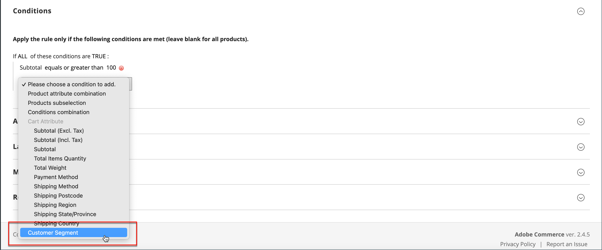

# Segmentos de cliente en reglas de precios

{{ee-feature}}

Un segmento de cliente se puede usar para promociones segmentadas asociándolo con una [regla de precio del carro de compras](../merchandising-promotions/price-rules-cart.md).

{width="700" zoomable="yes"}

_**Para asociar un segmento con una regla de precios del carro de compras:**_

1. En la barra lateral de _Administración_, vaya a **[!UICONTROL Marketing]** > _Promociones_ > **[!UICONTROL Cart Price Rules]**.

1. Abra una regla nueva o existente:

   * Para usar una regla nueva, haga clic en **[!UICONTROL Add New Rule]** en la esquina superior derecha.
   * Para utilizar una regla existente, haga clic en la regla de la lista para abrirla en modo de edición.

1. Desplácese hacia abajo y expanda la sección **[!UICONTROL Conditions]**.

1. Añada la condición.

   * Haga clic en el icono _Agregar_ (), que muestra la lista de condiciones. A continuación, elija **[!UICONTROL Customer Segment]**.

   {width="600" zoomable="yes"}

   De forma predeterminada, la condición está configurada para encontrar una condición que coincida. Si es necesario, haga clic en el vínculo **[!UICONTROL matches]** y cambie el operador a uno de los siguientes:

   * `does not match`
   * `is one of`
   * `is not one of`

   {width="600" zoomable="yes"}

1. Para dirigirse a un segmento específico, haga clic en el vínculo Más **...** para mostrar opciones adicionales. A continuación, haga clic en el icono _Selector_ () para mostrar la lista de segmentos del cliente.

1. En la lista, seleccione la casilla de verificación de cada segmento al que desee destinar la condición.

   {width="600" zoomable="yes"}

1. Haga clic en **[!UICONTROL Select]** para colocar los segmentos de cliente seleccionados en la condición.

1. Complete el resto de la regla de precios según sea necesario.

1. Una vez finalizado, haga clic en **[!UICONTROL Save]**.
