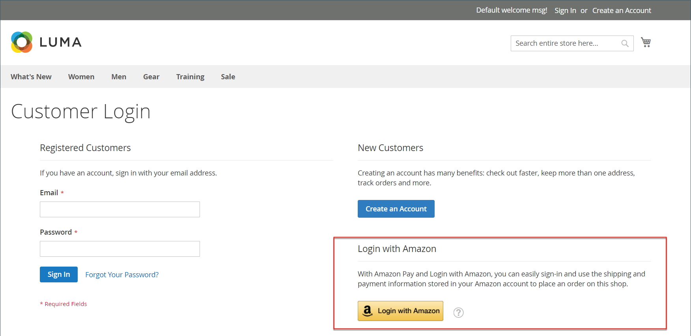

# Inicio de sesión del cliente

Los clientes tienen fácil acceso a sus cuentas desde todas las páginas de su tienda. Según la [configuración](../customers/account-options-new.md), los clientes pueden ser redirigidos a su panel de cuentas o seguir comprando después de iniciar sesión en sus cuentas.

Si [CAPTCHA](../systems/security-captcha.md) está habilitado en la configuración, la persona debe completar correctamente una prueba que verifique que es humana antes de obtener acceso a sus cuentas.

Cuando los clientes olvidan sus contraseñas, se envía un vínculo de restablecimiento a la dirección de correo electrónico asociada a la cuenta. La configuración de [Opciones de contraseña](../customers/password-options.md) controla la experiencia del cliente en los intentos de inicio de sesión:

- El número de veces que un cliente puede intentar introducir una contraseña
- El número de minutos entre intentos
- Número total de intentos antes de bloquear la cuenta
- La duración del bloqueo

{width="700" zoomable="yes"}

## Iniciar sesión en una cuenta de cliente

1. En el encabezado de la tienda, el cliente hace clic en **[!UICONTROL Sign in]**.

   {width="700" zoomable="yes"}

1. Escribe su dirección **[!UICONTROL Email]** y **[!UICONTROL Password]**.

1. Clics **[!UICONTROL Sign in]**.

   >[!IMPORTANT]
   >
   >Si no puede recordar su contraseña, el cliente puede hacer clic en **[!UICONTROL Forgot Your Password?]** y seguir las [instrucciones](../customers/password-reset.md) para restablecer la contraseña.

## Establezca el redireccionamiento al tablero de cuentas después del inicio de sesión del cliente

Puede configurar la tienda para redirigir a los clientes a su panel de cuentas después de que inicien sesión o para que puedan seguir comprando.

1. En la barra lateral _Admin_, vaya a **[!UICONTROL Stores]** > _[!UICONTROL Settings]_>**[!UICONTROL Configuration]**.

1. En el panel izquierdo, expanda **[!UICONTROL Customers]** y elija **[!UICONTROL Customer Configuration]**.

1. Expanda la sección **[!UICONTROL Login Options]**.

1. Establezca **[!UICONTROL Redirect Customer to Account Dashboard after Logging in]** en una de las siguientes opciones:

   - `Yes`: el tablero de cuentas aparece cuando los clientes inician sesión en sus cuentas.
   - `No`: los clientes pueden seguir comprando después de iniciar sesión en sus cuentas.

1. Una vez finalizado, haga clic en **[!UICONTROL Save Config]**.

## Iniciar sesión con Amazon

En las tiendas con una integración configurada de [!DNL Amazon Pay] y [!DNL Login with Amazon], los clientes pueden iniciar sesión en su cuenta de comprador de Amazon.

1. En el encabezado de la tienda, el cliente hace clic en **[!UICONTROL Sign in]**.

1. Clics **[!UICONTROL Login with Amazon]**.

   {width="700" zoomable="yes"}

1. Cuando se le pide que inicie sesión, el cliente introduce **[!UICONTROL email address]** y **[!UICONTROL password]** para su cuenta de comprador de Amazon.

   {width="700" zoomable="yes"}

1. Para conceder permiso a Amazon para compartir la siguiente información de su cuenta con la tienda al procesar las compras, haz clic en **Aceptar**.

   - Nombre
   - Correo electrónico
   - Direcciones de envío

   {width="700" zoomable="yes"}

## Cerrar sesión en una cuenta de cliente

1. En la esquina superior derecha junto a _[!UICONTROL Welcome, Customer Name!]_, el cliente hace clic en el selector de menú&#x200B;**[!UICONTROL v]**.

1. Elija **[!UICONTROL Sign Out]**.

Después de cerrar la sesión, se redirige al cliente a la página principal.
