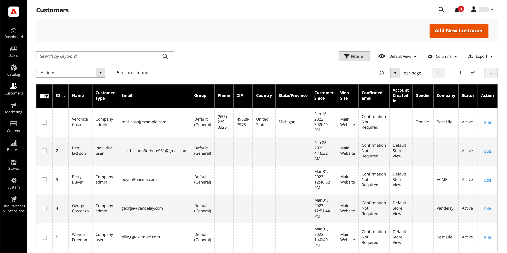

# Lista de clientes

En el Administrador, la cuadrícula [!UICONTROL Customers] muestra todos los clientes que se han registrado para obtener una cuenta en su tienda o que el administrador ha agregado. Use los [controles de cuadrícula](../getting-started/admin-grid-controls.md) estándar para filtrar la lista y ajustar el diseño de la columna. Para obtener más información, consulte [Administrar cuentas de cliente](../customers/manage-account.md).

{width="700" zoomable="yes"}

## Actualizar información del cliente

1. En la barra lateral _Admin_, vaya a **[!UICONTROL Customers]** > **[!UICONTROL All Customers]**.

1. Busque el registro de cliente y haga clic en [!UICONTROL **Editar**] en la columna _[!UICONTROL Action]_.

1. En el panel izquierdo, elija la información que desea editar y realice los cambios necesarios.

   >[!NOTE]
   >
   >Para obtener más información, consulte [Actualizar cuentas de cliente](../customers/update-account.md).

1. Una vez finalizado, haga clic en **[!UICONTROL Save Customer]**.

## Controles de Workspace

| Control | Descripción |
| --- | --- |
| **[!UICONTROL Add New Customer]** | Crea una cuenta de cliente. |
| **[!UICONTROL Search]** | Inicia una búsqueda de clientes basada en los filtros actuales. |
| **[!UICONTROL Filters]** | Define un conjunto de parámetros de búsqueda usados para filtrar los registros que aparecen en la [cuadrícula](../getting-started/admin-grid-controls.md). |
| **[!UICONTROL Default View]** | Determina la columna predeterminada [diseño](../getting-started/admin-grid-controls.md) de la cuadrícula. |
| **[!UICONTROL Columns]** | Determina la selección de [columnas](../getting-started/admin-grid-controls.md) y sus cuentas en la cuadrícula. El diseño de la columna se puede cambiar y guardar como _vista_. De forma predeterminada, solo algunas de las columnas se incluyen en la cuadrícula. |
| **[!UICONTROL Export]** | Exporta los registros seleccionados como un archivo CSV o XML de Excel. |

{style="table-layout:auto"}

## Columnas

| Columna | Descripción |
| --- | --- |
| **[!UICONTROL Select]** | Administra las selecciones de casilla de verificación de los registros del cliente para aplicar una acción. También puede utilizar el control de selección del encabezado de columna para seleccionar o deseleccionar todo. |
| **[!UICONTROL ID]** | Identificador numérico único que se asigna al crear la cuenta del cliente. |
| **[!UICONTROL Name]** | El nombre y los apellidos del cliente. |
| **[!UICONTROL Email]** | La dirección de correo electrónico del cliente. |
| **[!UICONTROL Group]** | El grupo de clientes al que está asignado el cliente. |
| **[!UICONTROL Phone]** | Número de teléfono del cliente. |
| **[!UICONTROL ZIP]** | El código postal del cliente. |
| **[!UICONTROL Country]** | El país donde se encuentra el cliente. |
| **[!UICONTROL State/Province]** | Estado o provincia donde se encuentra el cliente. |
| **[!UICONTROL Customer Since]** | La fecha y la hora de creación de la cuenta del cliente. |
| **[!UICONTROL Web Site]** | El sitio web en la jerarquía de almacén al que está asociada la cuenta de cliente. |
| **[!UICONTROL Confirmed Email]** | Indica si se requiere un correo electrónico de confirmación. |
| **[!UICONTROL Account Created In]** | Indica la vista de tienda desde la que se creó la cuenta de cliente. |
| **[!UICONTROL Date of Birth]** | La fecha de nacimiento del cliente.   **_Importante:_** De acuerdo con las prácticas recomendadas actuales de seguridad y privacidad, tenga en cuenta cualquier posible riesgo legal y de seguridad asociado con el almacenamiento de la fecha de nacimiento completa de los clientes (mes, día, año) con otros identificadores personales. Se recomienda limitar el almacenamiento de las fechas de nacimiento completas de los clientes y sugerir que utilice el año de nacimiento del cliente como alternativa. |
| **[!UICONTROL Tax / VAT Number]** | Si corresponde, el número de impuesto o el número de [impuesto al valor agregado](../stores-purchase/vat.md) que se ha asignado al cliente.   Este campo no es el mismo que el número de IVA. |
| **[!UICONTROL Gender]** | El sexo del cliente. |
| **[!UICONTROL Action]** | Editar: abre la cuenta de la empresa en modo de edición. |

{style="table-layout:auto"}

### Columnas adicionales

Estas columnas están disponibles al cambiar el [diseño de columna](../getting-started/admin-grid-controls.md) de la cuadrícula.

| Columna | Descripción |
| --- | --- |
| **[!UICONTROL Company]** | El nombre de empresa del cliente. |
| **[!UICONTROL Street Address]** | La dirección postal del cliente. |
| **[!UICONTROL City]** | La ciudad donde se encuentra el cliente. |
| **[!UICONTROL Fax]** | El número de fax del cliente, si corresponde. |
| **[!UICONTROL Billing Firstname]** | El nombre en la dirección de facturación del cliente. |
| **[!UICONTROL Billing Lastname]** | El apellido en la dirección de facturación del cliente. |
| **[!UICONTROL Billing Address]** | La dirección a la que se enviará la información de facturación. |
| **[!UICONTROL Shipping Address]** | La dirección a la que se enviarán los pedidos. |
| **[!UICONTROL VAT Number]** | El número de impuesto al valor agregado asociado con la dirección del cliente. Para [bienes digitales](../stores-purchase/taxes.md) vendidos en la UE, el IVA se basa en la dirección de facturación del cliente.   Este campo no es el mismo que el número de IVA/impuesto. |
| **[!UICONTROL Account Lock]** | Indica el estado de la cuenta. Como medida de seguridad, las cuentas de cliente pueden [bloquearse](../customers/password-options.md) después de demasiados intentos de inicio de sesión. Valores: `Locked` / `Unlocked` |

{style="table-layout:auto"}
