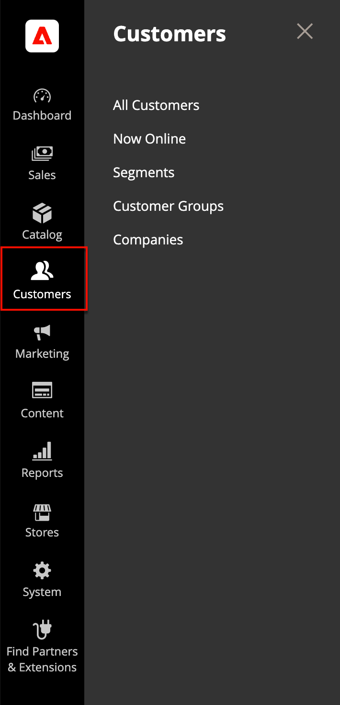
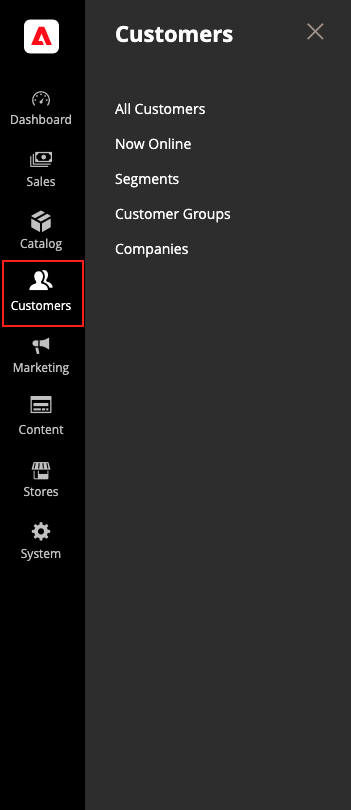

# Introducción a la administración de clientes

El menú _[!UICONTROL Customers]_proporciona acceso a las herramientas de administración de cuentas de clientes y permite ver quién está conectado en la tienda.

>[!BEGINTABS]

>[!TAB Adobe Commerce]

[!BADGE Solo PaaS]{type=Informative url="https://experienceleague.adobe.com/en/docs/commerce/user-guides/product-solutions" tooltip="Se aplica solo a proyectos de Adobe Commerce en la nube (infraestructura PaaS administrada por Adobe) y a proyectos locales."}

{width="300" zoomable="yes"}

>[!TAB Adobe Commerce as a Cloud Service]

[!BADGE Solo SaaS]{type=Positive url="https://experienceleague.adobe.com/en/docs/commerce/user-guides/product-solutions" tooltip="Solo se aplica a los proyectos de Adobe Commerce as a Cloud Service y Adobe Commerce Optimizer (infraestructura de SaaS administrada por Adobe)."}

{width="300" zoomable="yes"}

>[!ENDTABS]

## Mostrar el menú [!UICONTROL Customers]

En la barra lateral _Admin_, haga clic en [!UICONTROL Customers] para mostrar las opciones de menú:

| Campo | Descripción |
|---|---|
| [!UICONTROL All Customers] | Enumera a todos [los clientes](../customers/customers-all.md) que se han registrado para obtener una cuenta en su tienda o que el administrador agregó. |
| [!UICONTROL Now Online] | Enumera todos los clientes y visitantes que están [en línea](../customers/now-online.md) actualmente en su tienda. |
| [!UICONTROL Segments] | Enumera los [segmentos de clientes](../customers/customer-segments.md) que se usan para mostrar contenido y promociones de manera dinámica a clientes específicos según diversas propiedades. |
| [!UICONTROL Customer Groups] | Los [grupos de clientes](../customers/customer-groups.md) determinan qué descuentos están disponibles para los compradores y la clase de impuestos de la compra. |
| [!UICONTROL Companies] | (Requiere Adobe Commerce B2B) Enumera todas las [cuentas de compañía](../b2b/account-companies.md) activas y las solicitudes pendientes, independientemente de la configuración de estado, y proporciona las herramientas utilizadas para crear y [administrar](../b2b/account-company-manage.md) cuentas de compañía. |

{style="table-layout:auto"}
