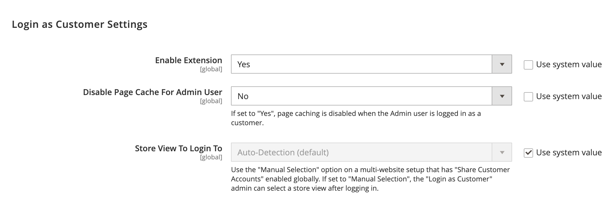
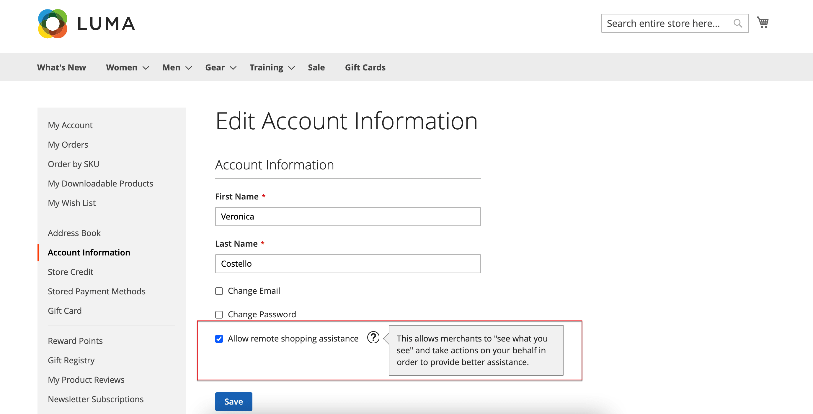
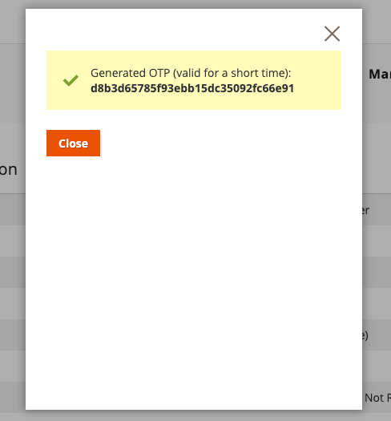

# Proporcionar asistencia al comprador

A veces, los clientes necesitan ayuda con su pedido. Los administradores de la tienda pueden usar _Iniciar sesión como cliente_, lo cual les permite ver lo que ve el cliente y hacer actualizaciones para ayudarles.

Cualquier acción realizada mientras se inició sesión como cliente se aplica a la cuenta del cliente real.

>[!BEGINTABS]

>[!TAB Adobe Commerce]

[!BADGE Solo PaaS]{type=Informative url="https://experienceleague.adobe.com/en/docs/commerce/user-guides/product-solutions" tooltip="Se aplica solo a proyectos de Adobe Commerce en la nube (infraestructura PaaS administrada por Adobe) y a proyectos locales."}

Cuando está habilitado para un usuario de _Admin_, el botón _[!UICONTROL Login as Customer]_aparece en varias páginas:

* [Página Editar cliente](../customers/update-account.md)
* [Página Vista de pedidos](../stores-purchase/order-processing.md)
* [Página Vista de Facturas](../stores-purchase/invoices.md)
* [Página Vista de Envío](../stores-purchase/shipments.md)
* [Página de visualización de nota de abono](../stores-purchase/credit-memo-create.md)

{width="600" zoomable="yes"}

>[!TAB Adobe Commerce as a Cloud Service]

[!BADGE Solo SaaS]{type=Positive url="https://experienceleague.adobe.com/en/docs/commerce/user-guides/product-solutions" tooltip="Solo se aplica a los proyectos de Adobe Commerce as a Cloud Service y Adobe Commerce Optimizer (infraestructura de SaaS administrada por Adobe)."}

En Adobe Commerce as a Cloud Service, la función Iniciar sesión como cliente usa un flujo de trabajo de **código único (OTC)** en lugar de un inicio de sesión directo. Los administradores generan un código de un solo uso de corta duración para un cliente. Este código se puede intercambiar por un token de acceso de cliente a través de GraphQL, lo que permite un inicio de sesión sin contraseña como flujos de trabajo de cliente para escenarios de compras asistidas por el vendedor.

La función consta de los siguientes componentes:

* **IU de administración**: en la página de edición de clientes, los administradores pueden solicitar un código único (OTC) en lugar de iniciar sesión directamente como clientes.
* **[API de REST](https://developer.adobe.com/commerce/webapi/rest/saas-integrations/login-as-customer/)**: un extremo programático para la generación de OTC, útil para scripts de administración e integraciones de terceros.
* **API de GraphQL**: mutaciones que intercambian un OTC por un token de acceso de cliente para flujos de comercio sin encabezado o de tienda.

>[!ENDTABS]

## Habilitar inicio de sesión como cliente

Para habilitar _Iniciar sesión como cliente_, es necesario que habilite la característica en la instancia de Commerce y, a continuación, habilite el acceso para los usuarios administradores en los permisos de funciones de usuario.

### Habilitar la función

1. En la barra lateral de Administración, vaya a **[!UICONTROL Stores]** > _[!UICONTROL Settings]_>**[!UICONTROL Configuration]**.

1. En el panel izquierdo, expanda **[!UICONTROL Customers]** y elija **[!UICONTROL Login as Customer]**.

   {width="600" zoomable="yes"}

1. Establezca **[!UICONTROL Enable Login as Customer]** en `Yes`.

1. _(Opcional)_ Establezca **[!UICONTROL Disable Page Cache for Admin User]** en `No` para habilitar la caché de la página cuando el usuario administrador inicie sesión como cliente.

   >[!WARNING]
   >
   > Al deshabilitar la caché de la página (`Yes` - predeterminado) se garantiza que el usuario que inicia sesión como cliente obtenga datos nuevos y sin almacenar en caché.

1. _(Opcional)_ Establezca **[!UICONTROL Store View to Log in]** en `Manual Selection` si tiene una configuración de varios sitios o tiendas y desea que el usuario administrador seleccione la vista de la tienda al iniciar sesión como cliente.

1. Una vez finalizado, haga clic en **[!UICONTROL Save Config]**.

### Habilitar acceso para usuarios administradores

1. En la barra lateral _Admin_, vaya a **[!UICONTROL System]** > _Permisos_ > **[!UICONTROL User Roles]**.

1. Haga clic en el rol de la lista.

1. En el panel izquierdo de [!UICONTROL _Información de la función_], haga clic en **[!UICONTROL Role Resources]**.

1. Cambiar **[!UICONTROL Role Resources]** en la página a `Custom`.

   >[!INFO]
   >
   > Con esta opción seleccionada, la jerarquía de recursos se muestra en la página.

1. Desplácese hasta el elemento principal **[!UICONTROL Customers]** y el elemento **[!UICONTROL Login as Customer]** inferior. A continuación, seleccione los recursos que desea habilitar para la función:

   * **[!UICONTROL Allow Login as Customer]**: permite al usuario administrador usar la función _Iniciar sesión como cliente_.
   * **[!UICONTROL View Login as Customer Log]** - Permite al usuario administrador ver el registro de _Iniciar sesión como cliente_.

   {width="400" zoomable="yes"}

1. Haga clic en **[!UICONTROL Save Role]**.

## Permiso de cuenta de cliente para asistencia de compra remota

Para habilitar el acceso a la cuenta para el personal de asistencia técnica de la tienda desde el administrador, los clientes deben habilitar la siguiente función para su cuenta:

>[!BEGINTABS]

>[!TAB Adobe Commerce]

[!BADGE Solo PaaS]{type=Informative url="https://experienceleague.adobe.com/en/docs/commerce/user-guides/product-solutions" tooltip="Se aplica solo a proyectos de Adobe Commerce en la nube (infraestructura PaaS administrada por Adobe) y a proyectos locales."}

1. El cliente va a la página **[!UICONTROL Account Information]**.

1. Selecciona la casilla de verificación **[!UICONTROL Allow remote shopping assistance]**.

1. El cliente hace clic en **[!UICONTROL Save]**.

{width="700" zoomable="yes"}

>[!TAB Adobe Commerce as a Cloud Service]

[!BADGE Solo SaaS]{type=Positive url="https://experienceleague.adobe.com/en/docs/commerce/user-guides/product-solutions" tooltip="Solo se aplica a los proyectos de Adobe Commerce as a Cloud Service y Adobe Commerce Optimizer (infraestructura de SaaS administrada por Adobe)."}

El cliente debe tener la extensión `login_as_customer_assistance_allowed` establecida en **2**. Esto se puede configurar en la página **Editar cliente** del Administrador o a través de GraphQL cuando se crea o edita un cliente.

>[!WARNING]
>
>Sin este permiso, un usuario administrador no puede iniciar sesión como este cliente.

{width="600" zoomable="yes"}

Para establecer este permiso con GraphQL para una cuenta de cliente existente, establezca la entrada de `allow_remote_shopping_assistance` en `true` con las mutaciones [`updateCustomerV2`](https://developer.adobe.com/commerce/webapi/graphql/schema/customer/mutations/update-v2/) o [`createCustomerV2`](https://developer.adobe.com/commerce/webapi/graphql/schema/customer/mutations/create-v2/).

>[!ENDTABS]

## Inicie sesión como cliente desde el administrador

>[!BEGINTABS]

>[!TAB Adobe Commerce]

[!BADGE Solo PaaS]{type=Informative url="https://experienceleague.adobe.com/en/docs/commerce/user-guides/product-solutions" tooltip="Se aplica solo a proyectos de Adobe Commerce en la nube (infraestructura PaaS administrada por Adobe) y a proyectos locales."}

1. En la barra lateral de _Administración_, vaya a **[!UICONTROL Customers]** > [!UICONTROL _Todos los clientes_].

1. Abra un usuario en modo de edición.

1. En el panel **[!UICONTROL Customer Information]**, elija la sección **[!UICONTROL Account Information]**.

1. Establezca **[!UICONTROL Allow remote shopping assistance]** en `Yes`.

   >[!INFO]
   >
   >El administrador ahora puede iniciar sesión como un usuario sin su permiso de la tienda.

>[!TAB Adobe Commerce as a Cloud Service]

[!BADGE Solo SaaS]{type=Positive url="https://experienceleague.adobe.com/en/docs/commerce/user-guides/product-solutions" tooltip="Solo se aplica a los proyectos de Adobe Commerce as a Cloud Service y Adobe Commerce Optimizer (infraestructura de SaaS administrada por Adobe)."}

>[!NOTE]
>
>Para obtener instrucciones sobre cómo implementar esta característica mediante REST, consulte la documentación de la API de REST [Iniciar sesión como cliente](https://developer.adobe.com/commerce/webapi/rest/saas-integrations/login-as-customer/).

### Solicite un código único (OTC) al administrador

1. Vaya a **[!UICONTROL Customers]** y seleccione un cliente para abrir la página de edición.

1. En la página Editar cliente, haga clic en **[!UICONTROL Get Customer Login OTC]**.

   {width="600" zoomable="yes"}

1. Escriba un **[!UICONTROL Reason]** (obligatorio) y haga clic en **[!UICONTROL Request]**.

   {width="600" zoomable="yes"}

   >[!NOTE]
   >
   >El campo **Motivo** es obligatorio. Se pasa al flujo de generación OTP y está reservado para su uso en próximas funciones de auditoría y registro de eventos.

1. El OTC generado se muestra en el modal. Use este código con la mutación de GraphQL `generateCustomerToken` o `exchangeOtpForCustomerToken` para la autorización de clientes.

   {width="300" zoomable="yes"}

>[!IMPORTANT]
>
>El código de tiempo único OTC generado es válido durante 30 segundos de forma predeterminada y se invalida después de un solo uso. El TTL se puede configurar enviando un [ticket de soporte](https://experienceleague.adobe.com/home?support-tab=home#support).

Una vez generado el código de una sola vez, puede utilizarlo si navega hasta la tienda e inicia sesión con las siguientes credenciales:

* **Correo electrónico**: La dirección de correo electrónico del cliente
* **Contraseña**: El código único (OTC) generado

>[!ENDTABS]

## Usar Iniciar sesión como cliente

>[!INFO]
>
>Para usar _Iniciar sesión como cliente_, asegúrese de que su administrador esté configurado tal como se describió anteriormente.

_Iniciar sesión como cliente_ le permite ver el sitio del mismo modo que lo hace el cliente, así como solucionar problemas y llevar a cabo otras acciones para el cliente. Si tiene una función de usuario asignada con los permisos necesarios:

1. Puede hacer clic en **[!UICONTROL Login as Customer]** en las páginas que aparecen en la sección anterior.
1. Las acciones Iniciar sesión como cliente están disponibles en el informe Acciones.

>[!WARNING]
>
>Cualquier acción realizada mientras se inició sesión [!UICONTROL _como cliente_] (como agregar o quitar productos) se aplica al pedido real del cliente. En la tienda, se mostrará un banner cuando usted sea `logged in as customer_name` para proporcionar un recordatorio del estado especial.

## Iniciar sesión como registro de cliente

{{ee-feature}}

Adobe Commerce proporciona un registro para las acciones _Iniciar sesión como cliente_. Enumera todas las sesiones en las que un usuario administrador accede a la función. Para acceder a las acciones registradas, vaya a [Informe de acciones de administración](../systems/action-log-report.md).

Puede filtrar la configuración del informe **[!UICONTROL Action Group]** a `Login As Customer` en la parte superior de la página y hacer clic en **[!UICONTROL Search]**.

{width="700" zoomable="yes"}
