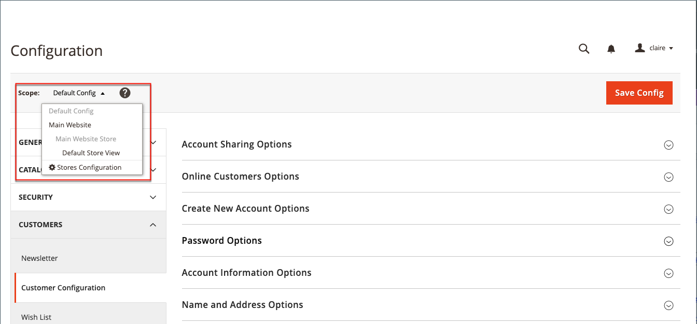

# Opciones de nombre y dirección del cliente

El _Opciones de nombre y dirección_ determinar qué campos se incluyen en los formularios de nombre y dirección cuando los clientes crean un [account](../customers/account-create.md) con tu tienda.

{width="500" zoomable="yes"}

Los pasos para configurar las opciones de nombre y dirección son diferentes para Adobe Commerce y Magento Open Source.

## Configuración de las opciones de nombre y dirección de Adobe Commerce

Puede configurar las opciones de nombre y dirección que se presentan a los clientes en la tienda cuando crean su cuenta.

### Paso 1: establecer el ámbito de la configuración

1. En el _Administrador_ barra lateral, vaya a **[!UICONTROL Stores]** > _[!UICONTROL Settings]_>**[!UICONTROL Configuration]**.

1. En el panel izquierdo, expanda **[!UICONTROL Customers]** y elija **[!UICONTROL Customer Configuration]**.

1. Expanda el **[!UICONTROL Name and Address Options]** sección.

   >[!INFO]
   >
   >Observe que el ámbito de las opciones de nombre y dirección se aplica al `website` nivel.

1. Desplácese hasta la parte superior de la página y establezca el ámbito de la configuración en una de las siguientes opciones:

   - `Default Config`
   - `Main Website` (o sitio específico para instalaciones de varios sitios)

   >[!INFO]
   >
   >El _[!UICONTROL Name and Address Options]_no aparece cuando el ámbito está establecido en `Default Store View`.

   {width="700" zoomable="yes"}

### Paso 2: Configurar las opciones de nombre y dirección

1. Vuelva a la [!UICONTROL _Opciones de nombre y dirección_] de la página Configuración del cliente.

   >[!INFO]
   >
   > Si no utiliza el `Default config` configuración de ámbito, debe borrar la variable `Use Default` para cada campo antes de cambiar el valor.

   {width="600" zoomable="yes"}

1. Para **[!UICONTROL Prefix Dropdown Options]**, introduzca cada prefijo que desee que aparezca en la lista, separado por un punto y coma.

   >[!IMPORTANT]
   >
   >Coloque un punto y coma antes del primer valor para mostrar un valor en blanco en la parte superior de la lista.

1. Para **[!UICONTROL Suffix Dropdown Options]**, introduzca cada sufijo que desee que aparezca en la lista, separado por un punto y coma.

1. Para incluir los siguientes campos en los formularios de cliente, establezca el valor de cada uno en `Optional` o `Required`, según sea necesario.

   - **[!UICONTROL Show Telephone]**
   - **[!UICONTROL Show Company]**
   - **[!UICONTROL Show Fax]**

### Paso 3: Guardar y actualizar

1. Cuando termine, haga clic en **[!UICONTROL Save Config]**.

1. En el mensaje que aparece en la parte superior de la página, haga clic en **[!UICONTROL Cache Management]** y [actualizar](../systems/cache-management.md) cada caché no válida.

## Configuración de las opciones de nombre y dirección del Magento Open Source

Configure las opciones de nombre y dirección que se presentan a los clientes en la tienda cuando crean su cuenta.

{width="500" zoomable="yes"}

### Paso 1: establecer el ámbito de la configuración

1. En el _Administrador_ barra lateral, vaya a **[!UICONTROL Stores]** > _[!UICONTROL Settings]_>**[!UICONTROL Configuration]**.

1. En el panel izquierdo, expanda **[!UICONTROL Customers]** y elija **[!UICONTROL Customer Configuration]**.

1. Expanda el **[!UICONTROL Name and Address Options]** sección.

   >[!IMPORTANT]
   >
   > Observe que el ámbito de las opciones de nombre y dirección se aplica al `website` nivel.

   {width="600" zoomable="yes"}

1. Desplácese hacia arriba hasta la parte superior de la página y establezca el ámbito de la configuración en una de las siguientes opciones:

   - `Default Config`
   - `Main Website` (o sitio específico para instalaciones de varios sitios)

   >[!NOTE]
   >
   >El _Opciones de nombre y dirección_ no aparece cuando el ámbito está establecido en `Default Store View`.

   {width="600" zoomable="yes"}

### Paso 2: Configurar las opciones de nombre y dirección

1. Vuelva a la [!UICONTROL _Opciones de nombre y dirección_] de la página Configuración del cliente.

   >[!INFO]
   >
   >Si no utiliza el `Default config` configuración de ámbito, debe borrar la variable `Use Default` para cada campo antes de cambiar el valor.

1. Para **Número de líneas de una dirección**, introduzca un número del 1 al 4.

   >[!WARNING]
   >
   >De forma predeterminada, la dirección de la calle es de tres líneas.

1. Para incluir un prefijo (como Sr. o Sra.) como parte del nombre, establezca **Mostrar prefijo** hasta `Yes`.

   {width="600" zoomable="yes"}

   >[!INFO]
   >
   >Para **Opciones desplegables de prefijo**, introduzca cada prefijo que desee que aparezca en la lista, separado por un punto y coma. Puede colocar un punto y coma antes del primer valor para mostrar un valor en blanco en la parte superior de la lista.

1. Para incluir un campo opcional para el segundo nombre o la inicial del cliente, establezca **[!UICONTROL Show Middle Name (initial)]** hasta `Yes`.

1. Para incluir un sufijo (como Jr. o Sr.) después del nombre del cliente, establezca **[!UICONTROL Show Suffix]** a uno de los siguientes:

   - `Optional`
   - `Required`

   >[!INFO]
   >
   >Para **Opciones desplegables de sufijo**, introduzca cada sufijo que desee que aparezca en la lista, separado por un punto y coma. Puede colocar un punto y coma antes del primer valor para mostrar un valor en blanco en la parte superior de la lista.

1. Para incluir la fecha de nacimiento, establezca **[!UICONTROL Show Date of Birth]** a uno de los siguientes:

   - `Optional`
   - `Required`

   >[!INFO]
   >
   >De acuerdo con las prácticas recomendadas actuales de seguridad y privacidad, tenga en cuenta cualquier posible riesgo legal y de seguridad asociado con el almacenamiento de la fecha de nacimiento completa de los clientes (mes, día, año) con otros identificadores personales. Se recomienda limitar el almacenamiento de las fechas de nacimiento completas de los clientes y sugerir el uso del año de nacimiento del cliente como alternativa.

   Los clientes pueden utilizar el icono de Calendario después del campo para elegir la fecha de nacimiento de un calendario emergente.

   {width="600" zoomable="yes"}

1. Para permitir que los clientes introduzcan sus impuestos o [IVA](../stores-purchase/vat.md) número, establecer **[!UICONTROL Show Tax/VAT Number]** a uno de los siguientes:

   - `Optional`
   - `Required`

1. Para incluir un campo para el sexo en el formulario de cliente, establezca **[!UICONTROL Show Gender]** a uno de los siguientes:

   - `Optional`
   - `Required`

   {width="600" zoomable="yes"}

1. Para incluir los siguientes campos en los formularios de cliente, establezca el valor de cada uno en `Optional` o `Required`, según sea necesario.

   - **[!UICONTROL Show Telephone]**
   - **[!UICONTROL Show Company]**
   - **[!UICONTROL Show Fax]**

### Paso 3: Guardar y actualizar

1. Cuando termine, haga clic en **[!UICONTROL Save Config]**.

1. En el mensaje que aparece en la parte superior de la página, haga clic en **[!UICONTROL Cache Management]** y [actualizar](../systems/cache-management.md) cada caché no válida.
