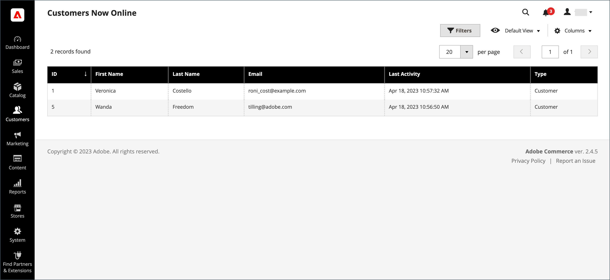

# Los clientes ahora en línea

La opción **[!UICONTROL Now Online]** del menú [!DNL Customers] enumera todos los clientes y visitantes que están en línea actualmente en su tienda. El intervalo de tiempo que los clientes se muestran como actualmente en línea se establece en la configuración y determina cuánto tiempo se puede ver la actividad [!DNL Customer's] desde el administrador. De forma predeterminada, el intervalo es de 15 minutos. La sesión finaliza si el teclado no se utiliza durante este tiempo y los clientes deben volver a iniciar sesión en sus cuentas para seguir comprando. Es importante tener en cuenta que el contenido de los carros de compras se guarda para su acceso posterior.

{width="700" zoomable="yes"}

El estado en línea de los clientes solo se actualiza tras el inicio de sesión del cliente, el registro o cualquier otro evento de cambio de estado. Incluye eventos relacionados con el carro de compras, como añadir, eliminar y modificar productos.

>[!NOTE]
>
>Las visitas a la página por sí solas no actualizan el estado en línea del cliente. Para recopilar esa información, se recomienda [configurar Google Analytics](../merchandising-promotions/google-analytics.md) (solo o con [Google Tag Manager](../merchandising-promotions/google-tag-manager.md)) o usar otro software de análisis con Adobe Commerce.

## Ver todos los clientes actualmente en línea

En la barra lateral _Admin_, vaya a **[!UICONTROL Customers]** > **[!UICONTROL Online Now]**.

>[!TIP]
>
>Para obtener información sobre cómo ayudar a un cliente en línea a completar una compra, consulte [Asistencia para compras](../stores-purchase/introduction.md#shopping-assistance).

## Configuración del intervalo de tiempo

1. En la barra lateral _Admin_, vaya a **[!UICONTROL Stores]** > _[!UICONTROL Settings]_>**[!UICONTROL Configuration]**.

1. En el panel izquierdo, expanda **[!UICONTROL Customers]** y elija **[!UICONTROL Customer Configuration]**.

1. Expanda la sección **[!UICONTROL Online Customers Options]** y haga lo siguiente:

   {width="600" zoomable="yes"}

   - Para **[!UICONTROL Online Minutes Interval]**, ingrese el número de minutos para que la sesión del cliente sea visible desde el administrador. Deje el campo vacío para aceptar el intervalo predeterminado de 15 minutos.

   - Para **[!UICONTROL Customer Data Lifetime]**, ingrese el número de minutos antes de que expiren los datos sin guardar ingresados por el cliente.

1. Una vez finalizado, haga clic en **[!UICONTROL Save Config]**.

## Descripciones de columna

| Columna | Descripción |
| --- | --- |
| **[!UICONTROL ID]** | El ID de cliente de un cliente registrado. |
| **[!UICONTROL First Name]** | El nombre de un cliente registrado. |
| **[!UICONTROL Last Name]** | El apellido de un cliente registrado. |
| **[!UICONTROL Email]** | La dirección de correo electrónico de un cliente registrado. |
| **[!UICONTROL Last Activity]** | La fecha y la hora de la última actividad del cliente en su tienda. |
| **[!UICONTROL Type]** | Opciones: `Customer` / `Visitor` |
| **[!UICONTROL Last URL]** | La última URL que visitó el cliente. |
| **[!UICONTROL Company]** | El nombre de la compañía a la que pertenece el usuario. |

{style="table-layout:auto"}
