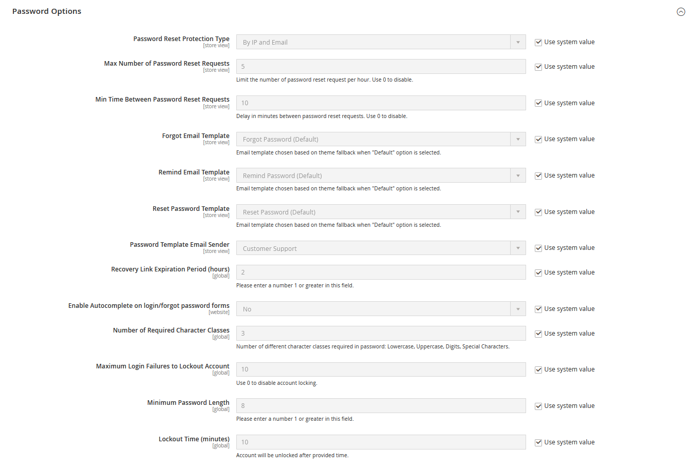

# Opciones de contraseña de cliente

Las opciones de contraseña de cliente determinan el nivel de seguridad que se usa para las solicitudes de restablecimiento de contraseña, las plantillas de correo electrónico que se usan para las notificaciones de clientes y la duración del vínculo de recuperación de contraseña. Puede permitir que los clientes cambien sus propias contraseñas o exigir que solo los administradores de tienda puedan hacerlo.

## Configurar las opciones de contraseña de cliente

1. En la barra lateral _Admin_, vaya a **[!UICONTROL Stores]** > _[!UICONTROL Settings]_>**[!UICONTROL Configuration]**.

1. En el panel izquierdo, expanda **[!UICONTROL Customers]** y elija **[!UICONTROL Customer Configuration]**.

1. Expanda la sección **[!UICONTROL Password Options]**.

   {width="600" zoomable="yes"}

1. Establezca **[!UICONTROL Password Reset Protection Type]** en el método que desee utilizar para comprobar las solicitudes de restablecimiento de contraseña:

   - `By IP and Email`: compruebe si ha habido intentos anteriores de restablecer la contraseña de un correo electrónico o una IP específicos.
   - `By IP`: compruebe si ha habido intentos anteriores de restablecer la contraseña desde una IP específica.
   - `By Email`: compruebe si ha habido intentos anteriores de restablecer la contraseña de un correo electrónico específico.
   - `None` - Protección deshabilitada (sin límites para restablecer la contraseña).

   **[!UICONTROL Max Number of Password Reset Requests]** y **[!UICONTROL Min Time Between Password Reset Requests]** se calculan según esta configuración.

1. Para limitar el número de solicitudes de restablecimiento de contraseña enviadas por hora, haga lo siguiente:

   - Para **[!UICONTROL Max Number of Password Reset Requests]**, escriba el número máximo de solicitudes de restablecimiento de contraseña que se pueden enviar por hora.

   - Para **[!UICONTROL Min Time Between Password Reset Requests]**, indique el número mínimo de minutos que deben transcurrir entre solicitudes.

1. Para configurar la notificación de correo electrónico de restablecimiento de contraseña, haga lo siguiente:

   - Establezca **[!UICONTROL Forgot Email Template]** en la plantilla que se usa para el correo electrónico enviado a los clientes que han olvidado sus contraseñas.

   - Establezca **[!UICONTROL Remind Email Template]** en la plantilla que se usa cuando un usuario administrador restablece una contraseña de cliente.

   - Establezca **[!UICONTROL Reset Password Template]** en la plantilla que se usa cuando los clientes cambian sus contraseñas.

   - Establece **[!UICONTROL Password Template Email Sender]** en el [contacto de tienda](../getting-started/store-details.md) que aparece como remitente de las notificaciones relacionadas con contraseñas.

1. Complete las siguientes opciones de seguridad para restablecer la contraseña:

   - Para **[!UICONTROL Recovery Link Expiration Period (hours)]**, escriba el número de horas antes de que caduque el vínculo de recuperación de contraseña.

   - Si desea que los campos de los formularios de inicio de sesión del cliente y de contraseña olvidada se rellenen automáticamente a partir de las entradas anteriores, establezca **[!UICONTROL Enable Autocomplete on login/forgot password forms]** en `Yes`.

   - Para **[!UICONTROL Number of Required Character Classes]**, escriba el número de tipos de caracteres diferentes que deben incluirse en una contraseña según las siguientes clases de caracteres:

      - `Lowercase`
      - `Uppercase`
      - `Numeric`
      - `Special Characters`

   - Para **[!UICONTROL Maximum Login Failures to Lockout Account]**, introduzca el número de intentos de inicio de sesión erróneos hasta que se bloquee la cuenta del cliente. Para intentos ilimitados, escriba cero (`0`).

   - Para **[!UICONTROL Minimum Password Length]**, escriba el número mínimo de caracteres que se pueden usar en una contraseña. El número debe ser mayor que cero.

   - Para **[!UICONTROL Lockout Time (minutes)]**, ingrese el número de minutos que una cuenta de cliente está bloqueada después de demasiados intentos fallidos de iniciar sesión.

1. Una vez finalizado, haga clic en **[!UICONTROL Save Config]**.
