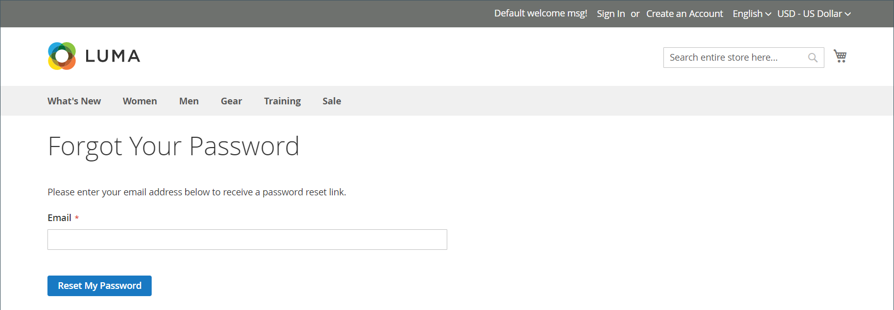

# Restablecer contraseñas de cliente

Los clientes suelen restablecer sus contraseñas desde la tienda haciendo clic en _[!UICONTROL Forgot Your Password?]_. Sin embargo, el administrador del almacén puede iniciar un restablecimiento de contraseña o un inicio de sesión forzado desde el administrador.

| Función | Descripción |
| --- | --- |
| Restablecer contraseña | Se envía un correo electrónico de restablecimiento de contraseña directamente a la cuenta de correo electrónico del cliente. El administrador del almacén no puede obtener acceso a la contraseña del cliente. |
| Forzar inicio de sesión | Revoca los tokens de acceso de OAuth asociados a la cuenta del cliente. Esto solo se puede utilizar con cuentas de cliente a las que se hayan asignado tokens de OAuth, como parte de una API web [integración](../systems/integrations.md). Para obtener más información, consulte [Autenticación basada en OAuth](https://developer.adobe.com/commerce/webapi/get-started/authentication/gs-authentication-oauth/) en la documentación para desarrolladores.   Las cuentas de cliente estándar creadas desde la tienda o desde el administrador no tienen tokens de OAuth. |

{style="table-layout:auto"}

## Restablecer una contraseña desde la tienda

1. En la página de inicio de sesión, el cliente hace clic en **[!UICONTROL Forgot Your Password?]**.

1. Cuando se le solicite, introduzca la variable **[!UICONTROL Email Address]** que está asociado con su cuenta y hace clic en **[!UICONTROL Reset My Password]**.

   {width="600" zoomable="yes"}

   >[!INFO]
   >
   >Si la dirección de correo electrónico introducida coincide con la asociada a la cuenta, el cliente recibe un correo electrónico de confirmación de restablecimiento de contraseña con un vínculo para restablecer su contraseña.

1. Cuando llega el correo electrónico, el cliente hace clic en _restablecer contraseña_ vínculo e introduce su **[!UICONTROL New Password]** cuando se le solicite.

1. Lo vuelve a introducir para confirmar y hace clic en **[!UICONTROL Reset Password]**.

   >[!IMPORTANT]
   >
   >La nueva contraseña debe tener seis o más caracteres de longitud sin espacios. Cuando reciban la confirmación de que la contraseña se ha actualizado, podrán utilizar la nueva contraseña para iniciar sesión en su cuenta. De forma predeterminada, la variable _restablecer contraseña_ El vínculo es válido durante 24 horas.

## Restablecer una contraseña desde el administrador

1. En el _Administrador_ barra lateral, vaya a **[!UICONTROL Customers]** > **[!UICONTROL All Customers]**.

1. Busque la cuenta del cliente en la cuadrícula y haga clic en **[!UICONTROL Edit]** en el _Acción_ columna.

1. En el conjunto de opciones de la parte superior de la página, haga clic en **[!UICONTROL Reset Password]**.

   El número de solicitudes de restablecimiento de contraseña permitidas en una hora se establece en la variable [configuración](../configuration-reference/customers/customer-configuration.md) tema.

## Revocar tokens de OAuth de un cliente

>[!IMPORTANT]
>
>No continúe a menos que tenga una comprensión completa de la autenticación de API.

1. En el _Administrador_ barra lateral, vaya a **[!UICONTROL Customers]** > **[!UICONTROL All Customers]**.

1. Busque la cuenta del cliente en la cuadrícula y haga clic en **[!UICONTROL Edit]** en el _Acción_ columna.

1. En el conjunto de opciones de la parte superior de la página, haga clic en **[!UICONTROL Force Sign In]**.

1. Cuando se le pida que confirme, haga clic en **OK**.
