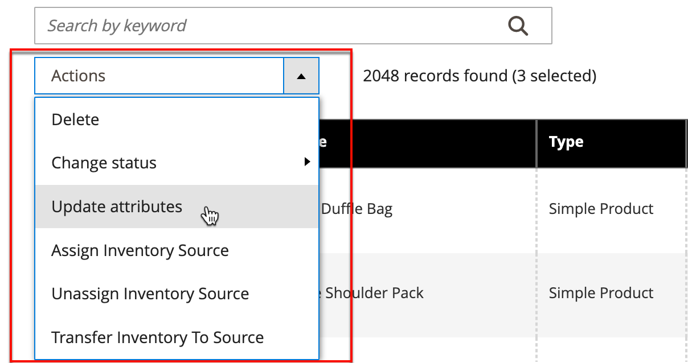

# Control de acciones

Al trabajar con una colección de registros en la cuadrícula, puede utilizar el control Actions para aplicar una operación a uno o varios registros. El control Actions enumera cada operación que está disponible para el tipo específico de datos. Por ejemplo, puede utilizar el control Actions para actualizar los atributos de los productos seleccionados, cambiar el estado de `Disabled` a `Enabled` o eliminar registros de la base de datos.

Puede realizar tantos cambios como sea necesario y, a continuación, actualizar los registros en un solo paso. Es mucho más eficiente que cambiar la configuración individualmente para cada producto. La aplicación de ediciones a un lote de registros es una operación asincrónica, que se ejecuta en segundo plano para que pueda seguir trabajando en el administrador sin esperar a que finalice la operación. El sistema muestra un mensaje cuando se completa la tarea.

La selección de las acciones disponibles varía según la lista y podrían aparecer opciones adicionales, según la acción seleccionada. Por ejemplo, al cambiar el estado de un grupo de registros, aparece un cuadro _[!UICONTROL Status]_&#x200B;junto al control Actions con opciones adicionales.

## Paso 1: Selección de registros

La casilla de verificación de la primera columna de la lista identifica cada registro que es un objetivo para la acción. Los [controles de filtro](admin-grid-controls.md) se pueden usar para reducir la lista a los registros a los que desea destinar la acción.

1. Si es necesario, establezca los filtros en la parte superior de cada columna para mostrar solo los registros que desee incluir.

1. Seleccione la casilla de verificación de cada registro que sea un destino para la acción o utilice el selector de columnas para elegir una selección masiva.

{width="500"}

## Paso 2: Aplicar una acción a los registros seleccionados

1. Establezca el control **[!UICONTROL Actions]** en la operación que desee aplicar.

   **_Ejemplo:_** Actualizar atributos

   - En la lista, seleccione la casilla de verificación de cada registro que desea actualizar.

   - Establezca el control **[!UICONTROL Actions]** en `Update Attributes`.

     {width="450"}

   - Haga clic en **[!UICONTROL Submit]**.

     La página Actualizar atributos enumera todos los atributos disponibles, organizados por grupo, en el panel de la izquierda.

     {width="700" zoomable="yes"}

   - Seleccione la casilla de verificación **[!UICONTROL Change]** junto a cada atributo y realice los cambios necesarios.

   - Haga clic en **[!UICONTROL Save]** para actualizar los atributos del grupo de registros seleccionados.

1. Una vez finalizado, haga clic en **[!UICONTROL Submit]**.

## Acciones de casilla de verificación

| Acción | Descripción |
|--- |--- |
| [!UICONTROL Select All] | Selecciona la casilla de verificación de todos los registros de la lista. |
| [!UICONTROL Unselect All] | Borra la casilla de verificación de todos los registros de la lista. |
| [!UICONTROL Select All on This Page] | Selecciona la casilla de verificación de los registros mostrados en la página actual. |
| [!UICONTROL Deselect All on This Page] | Borra la casilla de verificación de los registros mostrados en la página actual. |

{style="table-layout:auto"}
