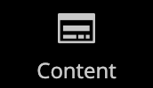
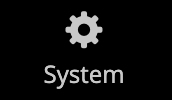

# Barra lateral de administración

La barra lateral de la izquierda es el menú principal de la tienda _Admin_ y está diseñada tanto para equipos de escritorio como para dispositivos móviles. El menú flotante proporciona acceso a todas las herramientas que utiliza para administrar su tienda diariamente.

| Icono de menú | Vínculo | Descripción |
| --------- | ---- | ----------- |
|  | **[Página de inicio de administración](../configuration-reference/advanced/admin.md)** | Muestra la página de inicio Administración, que es el panel de forma predeterminada. |
|  | **[[!UICONTROL Dashboard]](admin-dashboard.md)** | El panel de control de Campaign proporciona información general rápida sobre las ventas y la actividad de los clientes en su tienda y suele ser la primera página que aparece al iniciar sesión en el administrador. |
|  | **[[!UICONTROL Sales]](../stores-purchase/sales-menu.md)** | En el menú [!UICONTROL Sales] encontrará todo lo relacionado con las operaciones de procesamiento de pedidos, facturas, envíos, notas de abono y transacciones. |
|  | **[[!UICONTROL Catalog]](../catalog/catalog-menu.md)** | El menú [!UICONTROL Catalog] se usa para crear productos y definir categorías. |
|  | **[[!UICONTROL Customers]](../customers/customers-introduction.md)** | El menú [!UICONTROL Customers] es donde puede administrar las cuentas de cliente y ver qué clientes están en línea en este momento. |
|  | **[[!UICONTROL Marketing]](../merchandising-promotions/marketing-menu.md)** | En el menú [!UICONTROL Marketing] se configuran las reglas de precios y los cupones del catálogo y del carro de compras. Las reglas de precios establecen acciones de déclencheur cuando se cumple un conjunto de condiciones específicas. |
|  | **[[!UICONTROL Content]](../content-design/content-menu.md)** | En el menú [!UICONTROL Content] se administran los elementos de contenido y el diseño de la tienda. Aprenda a crear páginas, bloques y aplicaciones de front-end y a administrar la presentación de su tienda. |
|  | **[[!UICONTROL Reports]](reports-menu.md)** | [!BADGE Solo PaaS]{type=Informative url="https://experienceleague.adobe.com/es/docs/commerce/user-guides/product-solutions" tooltip="Se aplica solo a proyectos de Adobe Commerce en la nube (infraestructura PaaS administrada por Adobe) y a proyectos locales."} El menú [!UICONTROL Reports] proporciona una amplia selección de informes que le proporcionan insight en todos los aspectos de su tienda, incluyendo ventas, carro de compras, productos, clientes, etiquetas, comentarios, términos de búsqueda y supervisión del rendimiento en tiempo real las 24 horas del día, los 7 días de la semana, así como recomendaciones de la [Herramienta de análisis en todo el sitio](https://experienceleague.adobe.com/es/docs/commerce-operations/tools/site-wide-analysis-tool/intro). |
|  | **[[!UICONTROL Stores]](../stores-purchase/stores-menu.md)** | El menú [!UICONTROL Stores] incluye herramientas para configurar y mantener todos los aspectos de la tienda, incluidas las opciones de instalación de varios sitios, los impuestos, la moneda, los atributos de productos y los grupos de clientes. |
|  | **[[!UICONTROL System]](../systems/system-menu.md)** | El menú [!UICONTROL System] incluye herramientas para administrar las operaciones del sistema, instalar extensiones y administrar servicios web para la integración con otras aplicaciones. |
|  | **[[!UICONTROL Find Partners & Extensions]](commerce-marketplace.md)** | [!BADGE Solo PaaS]{type=Informative url="https://experienceleague.adobe.com/es/docs/commerce/user-guides/product-solutions" tooltip="Se aplica solo a proyectos de Adobe Commerce en la nube (infraestructura PaaS administrada por Adobe) y a proyectos locales."} En [!DNL Commerce Marketplace] encontrará soluciones de Adobe Commerce y Magento Open Source para su tienda. |

{style="table-layout:auto"}
