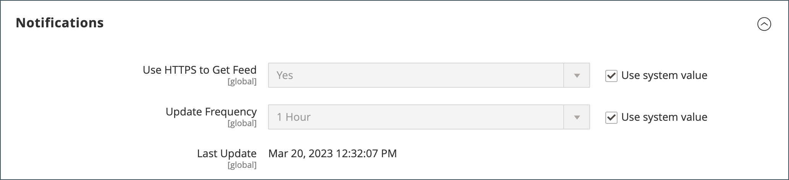

# Bandeja de entrada de mensaje del administrador

Su tienda recibe mensajes del Adobe con regularidad. Los mensajes se clasifican por importancia y pueden hacer referencia a actualizaciones del sistema, parches, nuevas versiones, mantenimiento programado o eventos próximos. El icono de campana del encabezado indica la cantidad de mensajes no leídos en la bandeja de entrada.

{width="700" zoomable="yes"}

La página _[!UICONTROL Notifications]_enumera todos los mensajes clasificados por fecha. Los comandos_[!UICONTROL Action]_ se pueden usar para marcar mensajes individuales como leídos, ver información más detallada o quitar el mensaje de la bandeja de entrada.

La configuración determina la frecuencia con la que se actualiza la bandeja de entrada y cómo se envían los mensajes. Si el administrador de la tienda tiene una URL segura, las notificaciones deben enviarse a través de HTTPS.

## Ver nuevos mensajes entrantes

1. Haga clic en el icono **[!UICONTROL Notification]** en el encabezado y lea el resumen.

1. Realice una de las siguientes acciones:

   - Si es necesario, haga clic en el mensaje para mostrar el texto completo.
   - Para eliminar el mensaje, haga clic en el icono Eliminar a la derecha del mensaje.
   - Para mostrar la lista de notificaciones completa, haga clic en **[!UICONTROL See All]**.

## Abordar un mensaje esencial

Para un mensaje de importancia crítica, realice una de las siguientes acciones:

- Haga clic en **[!UICONTROL Read Details]**.
- Para cerrar el cuadro de alerta y mantener el mensaje activo, haga clic en **[!UICONTROL Close]**.

## Administración de las notificaciones

1. Realice una de las siguientes acciones para abrir la página Notificaciones:

   - Haga clic en el icono **[!UICONTROL Notification]** del encabezado. Si se muestran uno o más mensajes nuevos, haga clic en **[!UICONTROL See All]**.

   - En la barra lateral _Admin_, vaya a **[!UICONTROL System]** > _[!UICONTROL Other Settings]_>**[!UICONTROL Notifications]**.

1. En la columna **[!UICONTROL Action]**, realice una de las acciones siguientes:

   - Para obtener más información, haga clic en **[!UICONTROL Read Details]** para abrir la página vinculada en una nueva ventana.

   - Para mantener el mensaje en la bandeja de entrada, haga clic en **[!UICONTROL Mark As Read]**.

     {width="700" zoomable="yes"}

   - Para eliminar el mensaje, haga clic en **[!UICONTROL Remove]**.

1. Para aplicar una acción a varios mensajes, realice una de las siguientes acciones:

   - Seleccione la casilla de verificación de la primera columna para cada mensaje que desea administrar.
   - Para seleccionar varios mensajes, establezca el control **[!UICONTROL Mass Actions]** según sea necesario.

1. Establezca el control **[!UICONTROL Actions]** en uno de los siguientes:

   - `Mark as Read`
   - `Remove`

1. Haga clic en **[!UICONTROL Submit]** para completar el proceso.

## Configuración de notificaciones

1. En la barra lateral _Admin_, vaya a **[!UICONTROL Stores]** > _[!UICONTROL Settings]_>**[!UICONTROL Configuration]**.

1. En el panel de navegación izquierdo, expanda **[!UICONTROL Advanced]** y elija **[!UICONTROL System]**.

1. Expanda la sección **[!UICONTROL Notifications]**.

   {width="600"}

1. Si el administrador de su tienda usa [una URL segura](../stores-purchase/store-urls.md), establezca **[!UICONTROL Use HTTPS to Get Feed]** en `Yes`.

1. Establezca **[!UICONTROL Update Frequency]** para determinar la frecuencia con la que se actualiza la bandeja de entrada.

   El intervalo puede ser de una a 24 horas.

1. Una vez finalizado, haga clic en **[!UICONTROL Save Config]**.

Para obtener más información acerca de las opciones de configuración de [!UICONTROL System], consulte la [_Guía de referencia de configuración_](../configuration-reference/advanced/system.md).
