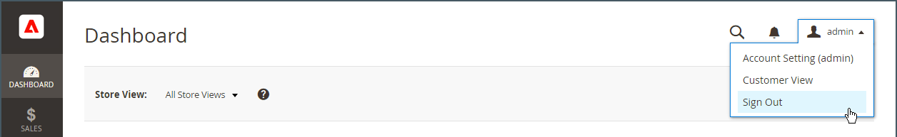
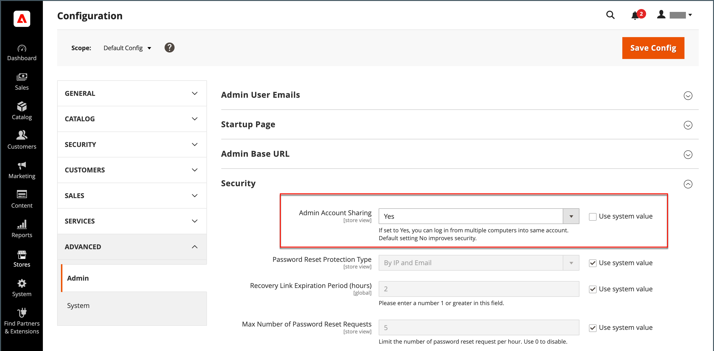

# Su cuenta de administrador

La cuenta de administrador principal se configuró inicialmente durante la instalación y puede contener información inicial de marcador de posición o información de datos de ejemplo. El propietario designado de esta cuenta puede personalizar el nombre de usuario y la contraseña y actualizar el nombre, los apellidos y la dirección de correo electrónico en cualquier momento. Esta cuenta, un _superusuario_ con todos los permisos de forma predeterminada, generalmente crea las cuentas de usuario de administrador necesarias para la empresa.

- Consulte [Crear un usuario](../systems/permissions-users-all.md#create-a-user) para obtener información sobre cómo agregar o editar usuarios.

- Consulte [Permisos](../systems/permissions.md) y [Funciones del usuario](../systems/permissions-user-roles.md) para obtener información sobre los roles de administrador y usuario.

{{ims-admin-note}}

## Inicio de sesión de administrador

El [!DNL Commerce] _Administrador_ está protegido por múltiples niveles de medidas de seguridad para evitar el acceso no autorizado a su tienda, pedidos y datos de clientes. La primera vez que inicie sesión en _Administrador_, debe introducir su nombre de usuario y contraseña y configurar [autenticación de doble factor](../systems/security-two-factor-authentication.md) (2FA).

Según la configuración de su tienda, puede haber un [CAPTCHA](../systems/security-google-recaptcha.md) un desafío que resolver, como escribir una serie de caracteres del teclado, resolver un rompecabezas o hacer clic en una serie de imágenes con un tema común. Estas pruebas están diseñadas para identificarle como humano, en lugar de como un bot automatizado.

Para obtener seguridad adicional, puede determinar qué partes del _Administrador_ cada usuario tiene [permiso](../systems/permissions.md) para acceder a, y también limitar el número de [intentos de inicio](../configuration-reference/advanced/admin.md). De forma predeterminada, después de seis intentos, la cuenta se bloquea y el usuario debe esperar unos minutos antes de intentarlo de nuevo. [Cuentas bloqueadas](../systems/permissions-users-all.md#locked-users) también se puede restablecer desde el _Administrador_.

>[!NOTE]
>
>La primera vez que inicie sesión en _Administrador_, se le pedirá que _Permitir recopilación de datos de uso de administrador_. Consulte [Recopilación de datos de uso](admin.md#usage-data-collection) para obtener más información.

{width="400"}

### Paso 1: Configurar la autenticación de doble factor

Antes de iniciar sesión en _Administrador_ de su tienda, debe tener una solución de autenticación de doble factor configurada y lista para usar. Para obtener más información sobre el proceso de autenticación utilizado por cada solución, consulte [Uso de la autenticación de doble factor](../systems/security-two-factor-authentication-use.md). De forma predeterminada, [!DNL Commerce] admite [Google Authenticator][1].

Pregunte a su [!DNL Commerce] administrador del sistema que admite soluciones 2FA para la tienda. A continuación, complete la configuración de su solución 2FA preferida según las instrucciones del proveedor.

### Paso 2: Inicio de sesión en el administrador

1. Introduzca el _Administrador_ URL que se especificó durante la [!DNL Commerce] instalación.

   El valor predeterminado _Administrador_ La URL tiene el siguiente aspecto `https://www.yourdomain.com/your-custom-admin-domain`.

   >[!NOTE]
   >
   >Aunque esta documentación utiliza `admin` como dirección URL base en la mayoría de los ejemplos, se recomienda elegir una dirección URL única y difícil de adivinar [URL personalizada](../stores-purchase/store-urls.md) para el _Administrador_ de su tienda.

   Puede agregar un marcador para la página o guardar un acceso directo en el escritorio para facilitar el acceso.

1. Introduzca su _Administrador_ **[!UICONTROL Username]** y **[!UICONTROL Password]**.

1. (Opcional) Si un CAPTCHA está habilitado para su tienda, siga las instrucciones que aparecen en pantalla para resolver el desafío.

   Para obtener más información, consulte [CAPTCHA](../systems/security-captcha.md) y [reCAPTCHA](../systems/security-google-recaptcha.md).

1. Haga clic **[!UICONTROL Sign in]**.

   Si es la primera vez que inicia sesión en el _Administrador_ desde la cuenta, debería recibir un correo electrónico con un vínculo a las instrucciones de configuración.

### Paso 3: Completar la configuración de 2FA

El siguiente ejemplo muestra cómo emparejar su _Administrador_ cuenta con Google Authenticator.

1. Cuando aparezca el código QR, utilice uno de los siguientes métodos para capturar el código y emparejar Google Authenticator con su _Administrador_ cuenta.

   {width="400"}

   - Captura de código QR con un smartphone

     En el smartphone, inicie Google Authenticator. Pulse el botón _signo más_ (+) en la esquina superior derecha de la aplicación. A continuación, en la parte inferior de la pantalla, pulse **[!UICONTROL Scan Barcode]** y tomar una foto del código QR.

   - Capturar código QR desde el explorador

     Si Google Authenticator está instalado como extensión en el explorador, haga clic en el botón **Autenticador** en la barra de herramientas y capture la página.

   - Introducir código QR manualmente

     Copie la cadena de texto debajo del código QR. Inicie Google Authenticator con el teléfono inteligente o el explorador y haga clic en el signo más (+). A continuación, elija **[!UICONTROL Manual Entry]**. En **[!UICONTROL Account]**, introduzca la dirección de correo electrónico asociada a su _Administrador_ y pegue la cadena de código QR en la cuenta de **[!UICONTROL Key]** field.

1. Para iniciar sesión en _Administrador_ con la autenticación de doble factor, introduzca el código de seis dígitos generado por Google Authenticator en el **[!UICONTROL Authenticator code]** y haga clic en **[!UICONTROL Confirm]**.

   {width="400"}

## Restablecer la contraseña

No se permite la reutilización de las cuatro últimas contraseñas asignadas a la cuenta.

1. Introduzca el **[!UICONTROL Email Address]** que está asociado con el _Administrador_ cuenta.

   {width="400"}

1. Haga clic **[!UICONTROL Retrieve Password]**.

   Si una cuenta está asociada con la dirección de correo electrónico, se envía un correo electrónico para restablecer la contraseña.

   >[!NOTE]
   >
   >Un _Administrador_ la contraseña debe tener siete caracteres o más e incluir letras y números. Consulte [Configuración _Administrador_ Seguridad](../systems/security-admin.md) para obtener información sobre las opciones de contraseña.

## Cerrar sesión del administrador

1. En la esquina superior derecha, haga clic _Cuenta_ () icono.

1. Haga clic **[!UICONTROL Sign Out]**.

   {width="700" zoomable="yes"}

El _[!UICONTROL Sign In]_La página muestra un mensaje que indica que ha cerrado la sesión. Cerrar sesión en_ Administrador _cuando deje el equipo desatendido.

## Editar información de la cuenta

1. Haga clic en _Cuenta_ () icono.

1. Haga clic **[!UICONTROL Account Setting]**.

   {width="700" zoomable="yes"}

1. Realice los cambios necesarios en la información de su cuenta.

   Si cambia sus credenciales de inicio de sesión, asegúrese de almacenarlas en una ubicación segura.

1. Escriba la contraseña de la cuenta actual.

1. Haga clic **[!UICONTROL Save Account]**.

## Permitir varios inicios de sesión de administrador

El administrador proporciona acceso para administrar las funciones de pedidos, clientes, productos, envíos y pagos. La configuración predeterminada está establecida para no permitir varios inicios de sesión en una cuenta de usuario de administrador como práctica recomendada de seguridad. Sin embargo, puede cambiar esta configuración para permitir que los usuarios administradores inicien sesión desde varios dispositivos y así dar cabida a los flujos de trabajo empresariales.

1. En el _Administrador_ barra lateral, vaya a **[!UICONTROL Stores]** > _[!UICONTROL Settings]_>**[!UICONTROL Configuration]**.

1. En el panel de navegación izquierdo, expanda **[!UICONTROL Advanced]** y elija **[!UICONTROL Admin]**.

1. Expandir  el **[!UICONTROL Security]** sección.

1. Para **Uso compartido de cuentas de administrador**, seleccione `Yes`.

   {width="700" zoomable="yes"}

1. Haga clic **[!UICONTROL Save Config]**.

## Definir nombres de inicio de sesión de usuario de administrador con distinción de mayúsculas y minúsculas

1. En el _Administrador_ barra lateral, vaya a **[!UICONTROL Stores]** > _[!UICONTROL Settings]_>**[!UICONTROL Configuration]**.

1. En el panel de navegación izquierdo, expanda **[!UICONTROL Advanced]** y elija **[!UICONTROL Admin]**.

1. Expandir  el **[!UICONTROL Security]** sección.

1. Configure las variables **[!UICONTROL Login is Case Sensitive]** field a `Yes`.

1. Haga clic **[!UICONTROL Save Config]**.

[1]: https://play.google.com/store/apps/details?id=com.google.android.apps.authenticator2&amp;hl=en_US
