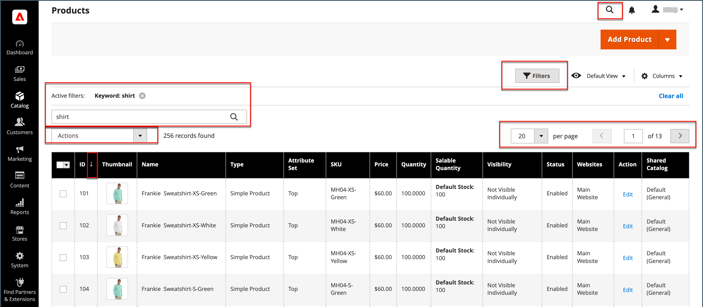

# Las herramientas de administración y el espacio de trabajo

El espacio de trabajo de administración proporciona acceso a todas las herramientas, datos y contenido utilizados para ejecutar la tienda. La página de inicio predeterminada se puede establecer en la configuración. Muchas páginas de Administración tienen una cuadrícula que enumera los datos de la sección, con un conjunto de herramientas para buscar, ordenar, filtrar, seleccionar y aplicar acciones. De manera predeterminada, [Dashboard](admin-dashboard.md) es la página de inicio del administrador. Sin embargo, puede elegir que aparezca cualquier otra página como página de inicio cuando inicie sesión. Puede hacer clic en el logotipo de en la barra lateral de Administración para volver a la página de inicio de Administración.

{zoomable="yes"}

## Controles de Workspace

| Control | Descripción |
|--- |--- |
| [!UICONTROL Global Search] | El icono de búsqueda de la parte superior derecha se puede utilizar para encontrar cualquier valor en la base de datos, incluidos los registros de productos, clientes y pedidos. |
| [!UICONTROL Grid Search] | El cuadro de búsqueda situado encima de la cuadrícula se puede utilizar para filtrar rápidamente la visualización de la cuadrícula en función de las palabras clave encontradas en los registros. |
| [!UICONTROL Sort] | El encabezado de cada columna se puede utilizar para ordenar la lista en orden ascendente o descendente. |
| [!UICONTROL Filters] | Define un conjunto de parámetros de búsqueda que determina los registros que aparecen en la cuadrícula. Además, los filtros del encabezado de algunas columnas se pueden utilizar para limitar la lista a valores específicos. Algunos filtros tienen opciones adicionales que se pueden seleccionar desde un cuadro de lista. |
| [!UICONTROL Default View] | Determina el diseño de columna predeterminado de la cuadrícula. |
| [!UICONTROL Columns] | Determina la selección de [columnas](admin-grid-controls.md) y su orden en la cuadrícula. El diseño de la columna se puede cambiar y guardar como _vista_. De forma predeterminada, solo algunas de las columnas se incluyen en la cuadrícula. |
| [!UICONTROL Paginate] | Los controles de paginación se utilizan para ver las páginas de resultados adicionales. |
| [!UICONTROL Actions] | El control Actions aplica una operación a todos los registros seleccionados. |
| [!UICONTROL Select] | El control Select se utiliza para seleccionar varios registros que van a ser el objetivo de la acción. Opciones: `Select All` / `Deselect All` |

{style="table-layout:auto"}

## Búsqueda de Workspace

Para encontrar cualquier registro en la base de datos, usa el icono de lupa del encabezado de _Admin_. Los resultados pueden incluir clientes, productos, pedidos o cualquier atributo relacionado. Por ejemplo, si introduce un nombre de cliente, los resultados pueden incluir el registro de cliente y cualquier pedido asociado a dicho nombre.

{width="700" zoomable="yes"}

1. En el encabezado, haga clic en el icono _Buscar_ () para abrir el cuadro de búsqueda.

1. Realice una de las siguientes acciones:

   - Para encontrar una coincidencia aproximada, escriba las primeras letras de lo que desee encontrar.
   - Para buscar una coincidencia exacta, escriba la palabra o palabras que desee buscar.

1. En los resultados de búsqueda mostrados, haga clic en cualquier elemento para abrir el registro.

## Cambiar la página de inicio de Administración

El [tablero](admin-workspace.md#the-dashboard) es la página de inicio predeterminada para el administrador, aunque puede configurar una página de inicio diferente.

1. En la barra lateral _Admin_, vaya a **[!UICONTROL Stores]** > _[!UICONTROL Settings]_>**[!UICONTROL Configuration]**.

1. En el panel de navegación izquierdo bajo **[!UICONTROL Advanced]**, elija **[!UICONTROL Admin]**.

1. Expanda  en la sección **[!UICONTROL Startup Page]**.

   {width="600"}

1. Establezca **[!UICONTROL Startup Page]** en la página que desea que aparezca primero después de iniciar sesión en el Administrador.

   Para obtener una lista detallada de todas las opciones de administración, consulte [Administración](../configuration-reference/advanced/admin.md) en la _Referencia de configuración_.

1. Una vez finalizado, haga clic en **[!UICONTROL Save Config]**.
