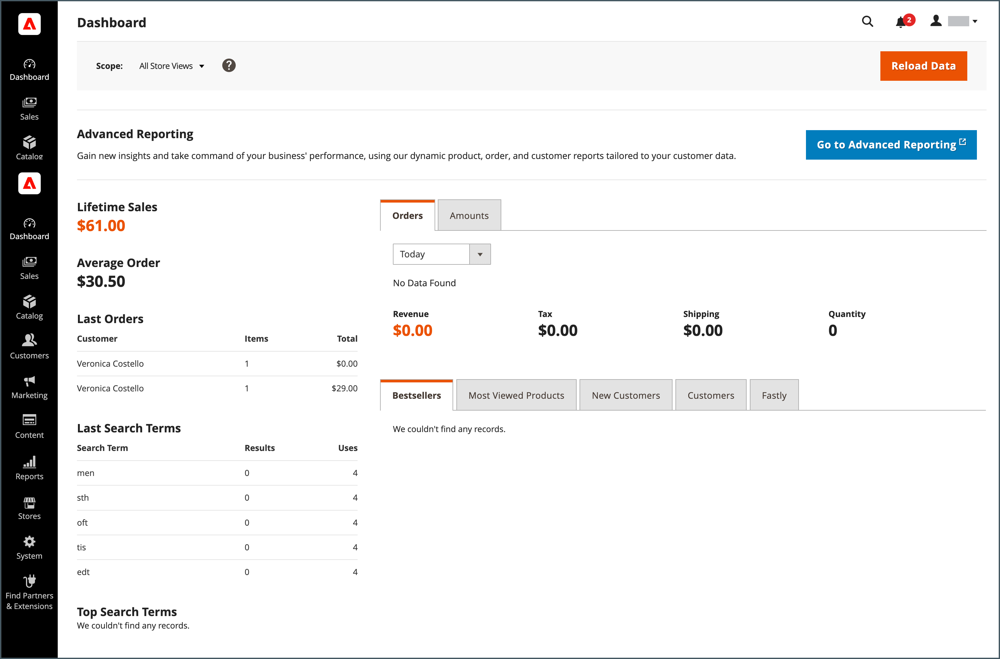

# ¿Qué es el administrador?

Su tienda _Admin_ es el back office protegido por contraseña donde usted, como comerciante, configura productos y promociones, administra pedidos y realiza otras tareas administrativas. Todas las tareas de configuración básicas y las operaciones de administración de tiendas se realizan desde _Admin_.

Para mayor seguridad, el inicio de sesión de _Admin_ está protegido por [autenticación de doble factor](../systems/security-two-factor-authentication.md) y se puede configurar para requerir un [CAPTCHA](../systems/security-captcha.md). Para obtener más información, ve a [Configuración de Admin Security](../systems/security-admin.md).

{width="700" zoomable="yes"}

Las credenciales iniciales de [inicio de sesión](admin-signin.md) se configuraron durante la instalación de Adobe Commerce o Magento Open Source. Si olvida su contraseña, se puede enviar una contraseña temporal a la dirección de correo electrónico asociada a la cuenta. Para aumentar la seguridad, configure el almacén de modo que requiera un nombre de usuario que distinga mayúsculas de minúsculas y una contraseña segura.

Además de la cuenta de usuario Administrador predeterminada, su empresa puede crear [cuentas adicionales](../systems/permissions-users-all.md) que necesite para administrar las cuentas de cliente de tienda y soporte técnico. Cada cuenta puede asociarse con una [función](../systems/permissions-user-roles.md) y un nivel de acceso específicos, según lo que _necesite saber_ de la empresa. La dirección de correo electrónico asociada con cada cuenta de usuario de administrador debe ser única.

{{ims-admin-note}}

## Recopilación de datos de uso

La primera vez que inicie sesión en _Admin_, se le pedirá que conceda permiso a Adobe para recopilar datos de uso de todos los usuarios administradores. Al permitir que los administradores recopilen los datos de uso, Adobe puede mejorar la experiencia de uso del administrador de Adobe Commerce y de los productos y servicios relacionados.

{width="600"}

Los usuarios individuales no se identifican en los datos de uso. Su configuración de recopilación de datos se puede cambiar en cualquier momento desde la configuración de [Uso de administración](../configuration-reference/advanced/admin.md#admin-usage).

Para Adobe Commerce, permitir la recopilación de datos también habilita la _Guía interna del producto_, que está diseñada para ofrecer contenido interactivo al _administrador_. Proporciona ayuda, información sobre herramientas, guías de introducción, información de incorporación, anuncios de funcionalidades, etc.
