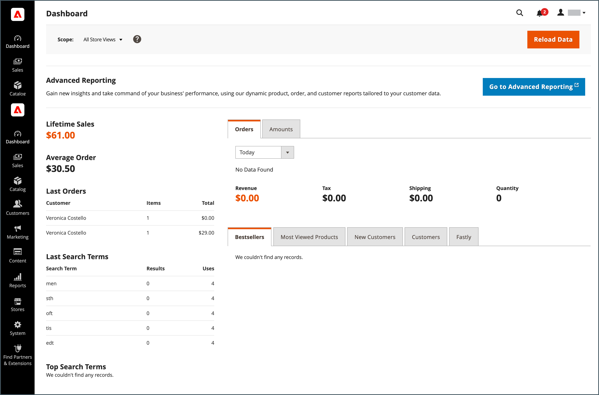

# ¿Qué es el administrador?

Su tienda _Administrador_ es el back office protegido por contraseña donde usted, como comerciante, configura productos y promociones, administra pedidos y realiza otras tareas administrativas. Todas las tareas de configuración básicas y las operaciones de administración de tiendas se realizan desde el _Administrador_.

Para obtener seguridad adicional, la variable _Administrador_ el inicio de sesión está protegido por [autenticación de doble factor](../systems/security-two-factor-authentication.md)y se pueden configurar para que requieran un [CAPTCHA](../systems/security-captcha.md). Para obtener más información, vaya a [Configuración de Admin Security](../systems/security-admin.md).

{width="700" zoomable="yes"}

Su inicial [inicio de sesión](admin-signin.md) Las credenciales de se configuraron durante la instalación de Adobe Commerce o Magento Open Source. Si olvida su contraseña, se puede enviar una contraseña temporal a la dirección de correo electrónico asociada a la cuenta. Para aumentar la seguridad, configure el almacén de modo que requiera un nombre de usuario que distinga mayúsculas de minúsculas y una contraseña segura.

Además de la cuenta de usuario de administrador predeterminada, su empresa puede crear tantas [cuentas adicionales](../systems/permissions-users-all.md) que necesita para administrar las cuentas de cliente de tienda y asistencia. Cada cuenta se puede asociar con una cuenta específica [función](../systems/permissions-user-roles.md) y nivel de acceso, según la empresa _necesita saber_. La dirección de correo electrónico asociada con cada cuenta de usuario de administrador debe ser única.

{{ims-admin-note}}

## Recopilación de datos de uso

La primera vez que inicie sesión en _Administrador_, se le pedirá que conceda permiso de Adobe para recopilar datos de uso de todos los usuarios administradores. Al permitir que los administradores recopilen los datos de uso, ayudará a los Adobes a mejorar la experiencia de uso del administrador de Adobe Commerce, así como los productos y servicios relacionados.

{width="600"}

Los usuarios individuales no se identifican en los datos de uso. Su configuración de recopilación de datos se puede cambiar en cualquier momento desde el [Uso de administrador](../configuration-reference/advanced/admin.md#admin-usage) configuración.

Para Adobe Commerce, permitir la recopilación de datos también habilita _Guía interna del producto_, que está diseñado para llevar contenido interactivo al _Administrador_. Proporciona ayuda, información sobre herramientas, guías de introducción, información de incorporación, anuncios de funcionalidades, etc.
