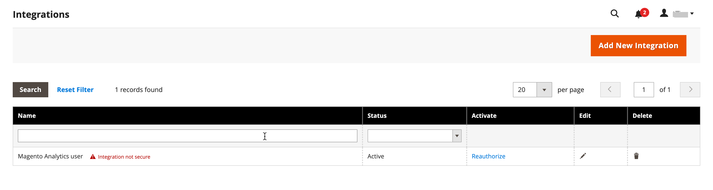

# [!DNL Commerce Intelligence] herramientas

Utilice las herramientas de Commerce Intelligence para obtener el insight que se utiliza para tomar decisiones empresariales sólidas.

## Cuenta de [!DNL Commerce Intelligence]

Cuando activa una cuenta de [!DNL Commerce Intelligence] a través de Adobe, obtiene acceso a cinco paneles con aproximadamente 70 informes. Estos informes están diseñados para proporcionar perspectivas sobre sus datos y responder a preguntas como &quot;¿Cómo crecen mis pedidos mes tras mes?&quot;, &quot;¿Quiénes son mis clientes más fieles?&quot; y &quot;¿Funciona mi estrategia de cupones?&quot; Para obtener información detallada sobre este conjunto de herramientas, consulte la [Guía del usuario de Commerce Intelligence][1].

## [!DNL Advanced Reporting]

[!DNL Advanced Reporting] se incluye con Adobe Commerce y Magento Open Source. Esta función le permite acceder a un conjunto de informes dinámicos basados en los datos de sus productos, pedidos y clientes, con un tablero personalizado adaptado a sus necesidades comerciales. Aunque [!DNL Advanced Reporting] usa [!DNL Commerce Intelligence] para análisis, no necesita tener una cuenta de Commerce Intelligence para usar [!DNL Advanced Reporting].

Para obtener información técnica, consulte el tema [[!DNL Advanced Reporting]][2]{:target="_blank"} en la documentación para desarrolladores.

>[!NOTE]
>
>Debido a problemas de compatibilidad con [!DNL Adobe Commerce Intelligence], Commerce no puede admitir temporalmente la creación de informes avanzados mediante AWS S3 Bucket como medio para el archivo de datos de origen en [!DNL Commerce Intelligence].

{width="700"}

### Requisitos

* El sitio web debe ejecutarse en un servidor web público.

* El dominio debe tener un certificado de seguridad (SSL) válido.

* [!DNL Commerce] debe haberse instalado o actualizado correctamente sin errores.

* En la configuración de [!DNL Commerce] para [direcciones URL del almacén](../stores-purchase/store-urls.md), la configuración de **[!UICONTROL Base URL (Secure)]** para la vista del almacén debe apuntar a la dirección URL segura. Por ejemplo: `https://yourdomain.com`.

* En la configuración de [!DNL Commerce] para las direcciones URL del almacén, **[!UICONTROL Use Secure URLs on Storefront]** y **[!UICONTROL Use Secure URLs in Admin]** deben establecerse en `Yes`.

* [[!DNL Commerce] crontab][3] se ha creado y los trabajos cron se están ejecutando en el servidor instalado.

>[!NOTE]
>
>[!DNL Advanced Reporting] solo se puede usar con [!DNL Commerce] instalaciones que hayan usado continuamente una sola [moneda base](../stores-purchase/currency-configuration.md).


### Paso 1: Habilitar [!DNL Advanced Reporting]

En la configuración de [!DNL Commerce], [[!DNL Advanced Reporting]](../configuration-reference/general/advanced-reporting.md) está habilitado de forma predeterminada y se inicia automáticamente si cron está [configurado](../configuration-reference/advanced/system.md) y en ejecución. Se inicia un intento de establecer la suscripción al principio de cada hora durante las siguientes 24 horas hasta que se realice correctamente. El estado de la suscripción es &quot;pendiente&quot; hasta que la suscripción se haya establecido correctamente.

1. En la barra lateral _Admin_, vaya a **[!UICONTROL Stores]** > _[!UICONTROL Settings]_>**[!UICONTROL Configuration]**.

1. En el panel de navegación izquierdo donde **[!UICONTROL General]** está expandido, elija **[!UICONTROL Advanced Reporting]** y haga lo siguiente:

   * Compruebe que **[!UICONTROL Advanced Reporting Service]** está establecido en `Enable` (la configuración predeterminada).

   * Establezca **[!UICONTROL Time of day to send data]** a las horas, minutos y segundos, según un reloj de 24 horas, en los que desee que el servicio reciba datos actualizados de su tienda. De manera predeterminada, los datos se envían a las 2:00 a. m.

   * En **[!UICONTROL Industry Data]**, elija el **[!UICONTROL Industry]** que mejor describa su negocio.

   {width="400"}

1. Una vez finalizado, haga clic en **[!UICONTROL Save Config]**.

1. Cuando se le solicite, haga clic en **[[!UICONTROL Cache Management]](../systems/cache-management.md)** en el mensaje en la parte superior de la página y actualice las cachés no válidas.

1. Espere durante la noche o hasta después de la hora de la próxima actualización programada. A continuación, compruebe el estado de su suscripción. Si el estado sigue siendo _pendiente_, asegúrese de que la instalación cumpla todos los requisitos.

### Paso 2: Acceso a [!DNL Advanced Reporting]

1. Realice una de las siguientes acciones:

   * En la barra lateral _Admin_, elija **[!UICONTROL Dashboard]**. A continuación, haga clic en **[!UICONTROL Go to Advanced Reporting]**.
   * En la barra lateral _Admin_, vaya a **[!UICONTROL Reports]** > _[!UICONTROL Business Intelligence]_>**[!UICONTROL Advanced Reporting]**.

   El panel [!DNL Advanced Reporting] proporciona un resumen rápido de sus pedidos, clientes y productos. Asegúrese de desplazarse hacia abajo para ver el panel completo.

1. Para obtener una mejor vista de los datos, establezca **[!UICONTROL Filters]** en la esquina superior derecha al período de tiempo y almacene la vista que desee incluir en el informe. A continuación, haga lo siguiente:

   * Pase el ratón sobre cualquier punto de datos para obtener más información.
   * Para ver todos los informes de tablero, haga clic en cada pestaña.

   {width="600" zoomable="yes"}

## Acceder a [!DNL Advanced Reporting] recursos de datos

En la esquina superior derecha del panel de informes avanzados, haga clic en **[!UICONTROL Additional Resources]**.

{width="600" zoomable="yes"}

## Resolución de problemas

Si recibe el mensaje &quot;Página no encontrada&quot; 404, compruebe que su tienda cumple los requisitos de [!DNL Advanced Reporting]. A continuación, siga las instrucciones para comprobar que la integración está instalada.

### Compruebe que la integración esté activa

1. En la barra lateral _Admin_, vaya a **[!UICONTROL System]** > _[!UICONTROL Extensions]_>**[!UICONTROL Integration]**.

1. Compruebe que la integración de **[!UICONTROL Magento Analytics user]** aparece en la lista y que **[!UICONTROL Status]** es `Active`.

1. Para restablecer el usuario, haga clic en **[!UICONTROL Reauthorize]** y siga este procedimiento:

   {width="600"}

   * Cuando se le solicite, haga clic en **[!UICONTROL Reauthorize]** para aprobar el acceso a los recursos de la API.

     {width="600"}

   * Compruebe que la lista de tokens de integración para extensiones está completa. A continuación, haga clic en **Listo**.

     {width="600"}

1. Busque el mensaje que indica que se ha vuelto a autorizar la integración `Magento Analytics user`.

1. Espere durante la noche o hasta después de la hora de la próxima actualización programada.

### Verificar moneda base única

[!DNL Advanced Reporting] solo se puede usar con [!DNL Commerce] instalaciones que hayan usado solo una [moneda base](../stores-purchase/currency-configuration.md) desde el momento de la instalación. El resultado es que en el historial, todos los pedidos utilizan la misma moneda base. [!DNL Advanced Reporting] no funciona si ha cambiado en cualquier momento la divisa de base y tiene pedidos en el historial procesados con distintas divisas de base.

Para determinar si el almacén tiene varias monedas base, puede consultar la base de datos [!DNL Commerce] desde la línea de comandos mediante el siguiente ejemplo de MySQL. Es posible que deba cambiar los nombres de las tablas para que coincidan con la estructura de datos:

```sql
select distinct base_currency_code from sales_order;
```

### Discrepancia de datos

Si observa que el pie de ilustración `Data last updated...` muestra la fecha de ayer y no la de hoy, podría haber un retraso de hasta un día en las actualizaciones de informes avanzados. Este retraso se debe a que el tamaño de la cola es mayor de lo esperado.

## Informes del panel

**[!UICONTROL Orders]**

| Campo | Descripción |
|--- |--- |
| [!UICONTROL Revenue] | Muestra todos los ingresos recibidos por la vista de tienda durante el período de tiempo definido. |
| [!UICONTROL Orders] | Muestra todos los pedidos realizados a través de la vista de tienda durante el período de tiempo definido. |
| [!UICONTROL AOV] | Muestra el valor de pedido promedio realizado a través de la vista de tienda durante el período de tiempo definido. |
| [!UICONTROL Refunds] | Muestra todas las devoluciones procesadas a través de la vista de tienda durante el periodo de tiempo definido. |
| [!UICONTROL Tax Collected] | Muestra todos los impuestos recopilados a través de la vista de tienda durante el período de tiempo definido. |
| [!UICONTROL Shipping Collected] | Muestra todas las tarifas de envío recopiladas a través de la vista de tienda durante el período de tiempo definido. |
| [!UICONTROL Orders by Status] | Muestra el número de pedidos por estado para la vista de tienda durante el período de tiempo definido. |
| [!UICONTROL Orders by Status] | Muestra un resumen del número de pedidos por estado. |
| [!UICONTROL Coupon Usage] | Enumera todos los códigos de cupón y el número de usuarios de cada uno, canjeados a través de la vista de tienda durante el período de tiempo definido. |
| [!UICONTROL Orders and Revenue by Billing Region] | Enumera el número de pedidos e ingresos por región para la vista de tienda durante el período de tiempo definido. |
| [!UICONTROL Tax Collected by Billing Region] | Muestra el importe de los impuestos recopilados por región para la vista de tienda durante el período de tiempo definido. |
| [!UICONTROL Shipping Fees Collected by Shipping Region] | Indica las tarifas de envío recopiladas por región para la vista de tienda durante el período de tiempo definido. |

{style="table-layout:auto"}

**[!UICONTROL Customers]**

| Campo | Descripción |
|--- |--- |
| [!UICONTROL Unique Customers] | Muestra el número de cuentas de cliente únicas asociadas a la vista de tienda durante el período de tiempo definido. |
| [!UICONTROL New Registered Accounts] | Muestra el número de cuentas de cliente nuevas registradas con la vista de tienda durante el período de tiempo definido. |
| [!UICONTROL Top Coupon Users] | Muestra los principales usuarios de cupones por ID de cliente y el número de pedidos realizados con cupones en la vista de tienda durante el periodo de tiempo definido. |
| [!UICONTROL Customer KPI Table] | Indica el número de pedidos, los ingresos y el valor de pedido promedio por ID de cliente para la vista de tienda durante el período de tiempo definido. |

{style="table-layout:auto"}

**[!UICONTROL Products]**

| Campo | Descripción |
|--- |--- |
| [!UICONTROL Quantity of Products Sold] | Muestra el número de productos vendidos a través de la vista de tienda durante el período de tiempo definido. |
| [!UICONTROL Products Added to Wishlists] | Enumera todos los productos agregados a las listas de deseos a través de la vista de tienda durante el período de tiempo definido. |
| [!UICONTROL Best Selling Products by Quantity] | Enumera los productos más vendidos y la cantidad vendida a través de la vista de tienda durante el período de tiempo definido. |
| [!UICONTROL Best Selling Products by Revenue] | Enumera los productos más vendidos y los ingresos generados por la venta del producto a través de la vista de tienda durante el período de tiempo definido. |

{style="table-layout:auto"}


[1]: https://experienceleague.adobe.com/docs/commerce-business-intelligence/mbi/guide-overview.html?lang=es
[2]: https://developer.adobe.com/commerce/php/development/advanced-reporting/
[3]: https://experienceleague.adobe.com/docs/commerce-operations/configuration-guide/cli/configure-cron-jobs.html?lang=es
