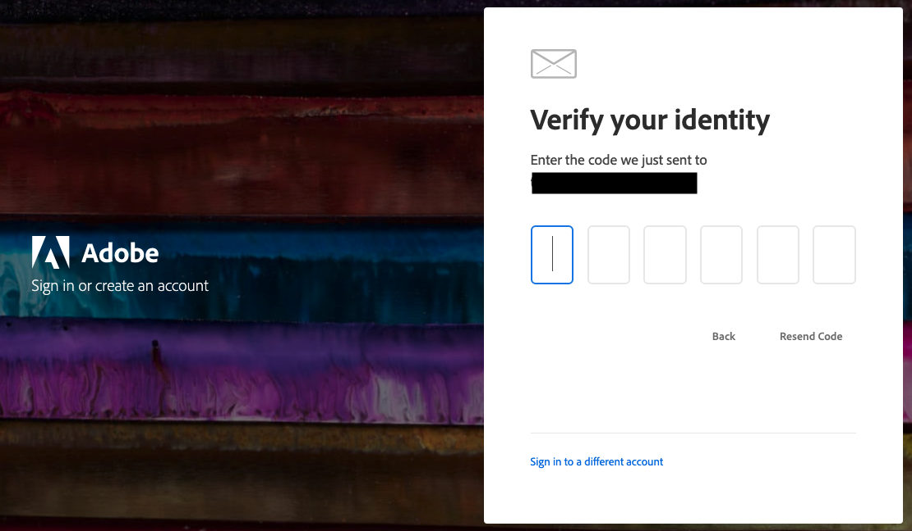

# Acceder a su cuenta de [!DNL Commerce]

Puede acceder a su cuenta de [!DNL Commerce] desde el sitio web de [!DNL Commerce]. Desde el panel de su cuenta de [!DNL Commerce], puede encontrar información relacionada con los productos y servicios que ha adquirido, así como información de contacto y facturación. Algunos datos solo están visibles para los propietarios de licencias.

![Su cuenta de [!DNL Commerce]](./assets/home-acct.png){width="700"}

El inicio de sesión de la cuenta de [!DNL Commerce] es independiente del inicio de sesión del administrador de tienda. Normalmente, utilizará credenciales diferentes para cada uno y el acceso a cada sistema se administra de forma independiente.

Sin embargo, un usuario que quiera optimizar sus inicios de sesión en Adobe Commerce y en los productos para empresas de Adobe puede configurar su Adobe ID para iniciar sesión en el administrador de tienda: [Configure the Commerce Admin Integration with Adobe ID](https://experienceleague.adobe.com/es/docs/commerce-admin/start/admin/ims/adobe-ims-config) en la *Guía de integración de IMS para Commerce*.

>[!NOTE]
>
>Después de crear la cuenta, se recomienda usar la Autenticación de doble factor (TFA) para [proteger la cuenta](commerce-account-secure.md).

## Inicie sesión en su cuenta de [!DNL Commerce]

Se requiere un Adobe ID para acceder a su cuenta de Commerce. Si tiene una cuenta existente de [!DNL Commerce] pero no ha iniciado sesión desde agosto de 2022, debe crear una Adobe ID durante el proceso de inicio de sesión. Es necesario completar este paso antes de poder iniciar sesión en la cuenta.

>[!WARNING]
>
>Utilice la dirección de correo electrónico asociada a su MAGEID de cuenta de Commerce existente para crear Adobe ID. Usar una dirección de correo electrónico diferente y completamente nueva crea un nuevo MAGEID.

1. Vaya al [[!DNL Commerce] sitio](https://account.magento.com/customer/account/login/).

1. Haga clic en **[!UICONTROL Sign in with Adobe ID]**.

   {width="700"}

1. Escriba su dirección de correo electrónico y haga clic en **[!UICONTROL Continue]**.

   >[!TIP]
   >
   >Si ha utilizado una dirección de correo electrónico asociada a un MAGEID de cuenta de Commerce existente, el proceso de inicio de sesión la vincula automáticamente a su Adobe ID.

## Crear una cuenta de [!DNL Commerce]

Cualquiera puede crear una cuenta gratuita de [!DNL Commerce]. La dirección de correo electrónico que utiliza solo puede asociarse a una cuenta de Commerce.

>[!NOTE]
>
>Utilice una Adobe ID para crear y acceder a una cuenta de Commerce.
>- Si no tiene una cuenta de Commerce, puede crearla durante el proceso de registro.
>- Si ya tiene una cuenta de Commerce pero no tiene una cuenta de Adobe ID, consulte [iniciar sesión en una cuenta de Commerce](#log-in-to-your-dnl-commerce-account).

1. Vaya al [[!DNL Commerce] sitio](https://account.magento.com/customer/account/login/).

1. Haga clic en **[!UICONTROL Sign in with Adobe ID]**.

1. Si no dispone de un Adobe ID, haga clic en **[!UICONTROL Create an account]**. De lo contrario, vaya al paso 7.

   {width="700"}

1. Complete el formulario de registro.

   {width="700"}

1. Haga clic en **[!UICONTROL Create account]**.

1. Introduce el código de verificación enviado a tu dirección de correo electrónico.

   {width="700"}

1. Una vez creada y verificada la Adobe ID, vuelva a https://account.magento.com/. Se creará un ID de IMAGEN y se vinculará automáticamente a su Adobe ID.

## Restablecer la contraseña

1. Vaya al [[!DNL Commerce] sitio](https://account.magento.com/customer/account/login/).

1. Haga clic en **[!UICONTROL Sign in with Adobe ID]**.

1. Haga clic en **[!UICONTROL Get help signing in]**.

   {width="700"}

1. Haga clic en **[!UICONTROL Reset your password]**.

   {width="700"}

1. Introduzca su dirección de correo electrónico.

1. Haga clic en **[!UICONTROL Continue]**.
