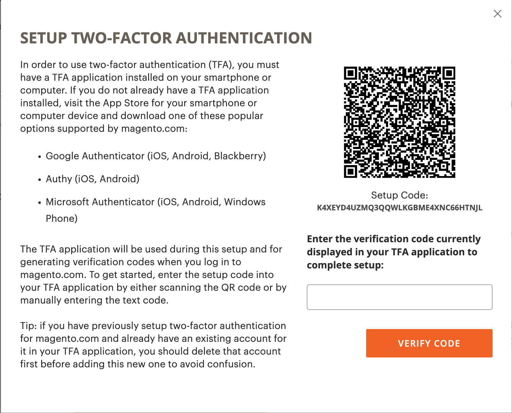
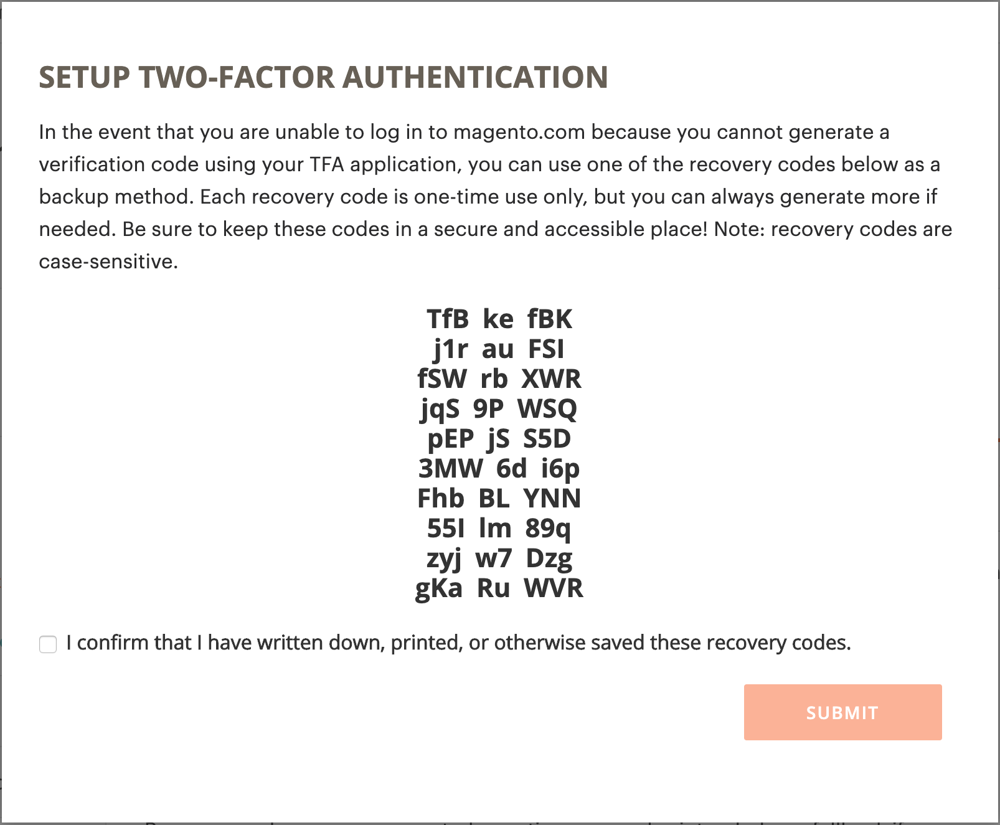

# Proteja su cuenta de [!DNL Commerce]

La autenticación de doble factor (TFA o 2FA) es una capa adicional de seguridad para proteger mejor su cuenta de [!DNL Commerce] del acceso no autorizado. Para completar el proceso de inicio de sesión, TFA requiere un _segundo factor_ además de las credenciales de nombre de usuario y contraseña estándar. Este segundo factor adopta la forma de códigos de verificación temporales que genera continuamente una aplicación TFA instalada en su dispositivo móvil y emparejada con su cuenta de [!DNL Commerce].

Con TFA habilitado, su cuenta es más segura. Un usuario no autorizado no puede iniciar sesión a menos que tenga sus credenciales de nombre de usuario y contraseña (primer factor) y un código de verificación válido de la aplicación TFA en su dispositivo personal (segundo factor).

>[!NOTE]
>
>La autenticación de doble factor que protege a _Admin_ de tu tienda tiene una configuración por separado. Para obtener más información, consulte [Autenticación de doble factor](../systems/security-two-factor-authentication.md).

## Antes de empezar

Para usar TFA, debes tener una aplicación TFA instalada en tu dispositivo personal (como tu smartphone, tablet, computadora). Hay muchos disponibles, pero algunas opciones populares y gratuitas incluyen:

- Google Authenticator (iOS, Android™, BlackBerry®)

- Autoridad (iOS, Android™)

- Microsoft® Authenticator (iOS, Android™, Windows Phone)

## Habilitar autenticación de doble factor

1. Inicie sesión en su [[!DNL Commerce] cuenta][1]{:target=&quot;_blank&quot;}.

1. En el panel de navegación izquierdo, seleccione **[!UICONTROL Account Settings]** y, a continuación, seleccione **[!UICONTROL Two-factor Authentication]**.

   {width="600" zoomable="yes"}

1. Seleccione **[!UICONTROL Enable]** para iniciar el proceso de configuración de autenticación de doble factor.

1. Escriba el(la) **[!UICONTROL Verification Code]** enviado(a) a su correo electrónico y seleccione **[!UICONTROL Verify Code]** para continuar.

   {width="400"}

1. Abra la aplicación de autenticación de doble factor que descargó e instaló en su dispositivo personal.

1. En el formulario [!UICONTROL SETUP TWO-FACTOR AUTHENTICATION], use **[!UICONTROL Setup Code]** para agregar Adobe Commerce a su aplicación TFA.

   {width="400"}

   Puede agregar el código escaneando el código QR usando la aplicación TFA o ingresándolo manualmente. Este código empareja su aplicación TFA con su cuenta [!DNL Commerce] y permite que los permisos generen la aplicación TFA para generar códigos de verificación para el acceso seguro a la cuenta.

1. Complete la configuración.

   - En el formulario [!UICONTROL SETUP TWO FACTOR-AUTHENTICATION], escriba el código de verificación de su aplicación de autenticación de doble factor.

   - Seleccione **[!UICONTROL Verify Code]**.

   >[!NOTE]
   >
   >Por motivos de seguridad, los códigos de verificación de la aplicación TFA caducan y se regeneran continuamente. **_Siempre_** usa el código que se muestra actualmente.

1. Guarde el(la) **[!UICONTROL Recovery Codes]** presentado(a) en un lugar seguro y accesible.

   {width="400"}

   Si no puede proporcionar un código de verificación al iniciar sesión en su cuenta de [!DNL Commerce], debe usar un código de recuperación para recuperar el acceso a la cuenta.

   Cada código de recuperación se puede usar una sola vez, pero [puede generar](#generate-new-recovery-codes) nuevos. Los códigos de recuperación distinguen entre mayúsculas y minúsculas.

1. Seleccione la casilla de verificación de confirmación y seleccione **[!UICONTROL Submit]** para continuar.

1. Para asegurarse de que puede recuperar el acceso a su cuenta, escriba un **[!UICONTROL Recovery Email]**.

   Esta dirección de correo electrónico es necesaria si no puede generar un código de verificación a partir de la aplicación de autenticación de doble factor y no tiene acceso a un código de recuperación generado previamente que no se utilice.

   Una vez cada 24 horas, puede generar y enviar un código de recuperación temporal a la dirección de correo electrónico de recuperación designada. Utilice este código para recuperar el acceso a la cuenta.

   >[!IMPORTANT]
   >
   >Mantenga el acceso a su cuenta de correo electrónico de recuperación. De lo contrario, no podrá utilizar los códigos de recuperación temporales enviados a esa cuenta.

   {width="400"}

1. Seleccione la casilla de verificación de confirmación y seleccione **[!UICONTROL Submit]** para completar el proceso de configuración de autenticación de doble factor.

   - Se envía una notificación a la dirección de correo electrónico asociada a su cuenta de [!DNL Commerce] para confirmar que ha habilitado correctamente la autenticación de doble factor.

   - Se envía una notificación a la cuenta de correo electrónico de recuperación para confirmar la configuración.

>[!TIP]
>
>Si pierdes tu dispositivo personal o consigues uno nuevo, puedes [cambiar tu aplicación de autenticación de doble factor](#change-your-two-factor-authentication-application) y generar nuevos códigos de recuperación.

## Iniciar sesión con un código de verificación

1. Vaya a [!DNL Commerce] [inicio de sesión con la cuenta][1]{:target=&quot;_blank&quot;}.

1. Escriba sus credenciales de nombre de usuario y contraseña y, a continuación, seleccione **[!UICONTROL Login]**.

1. Escriba el(la) **[!UICONTROL Verification Code]** mostrado(a) en su aplicación de autenticación de doble factor cuando se le solicite.

   {width="600"}

1. Seleccione **[!UICONTROL Submit]** para completar el proceso de inicio de sesión.

## Inicie sesión con un código de recuperación

1. Vaya a [!DNL Commerce] [inicio de sesión con la cuenta][1]{:target=&quot;_blank&quot;}.

1. Escriba sus credenciales de nombre de usuario y contraseña y, a continuación, seleccione **[!UICONTROL Login]**.

1. Seleccione **[!UICONTROL Use recovery code]** para omitir la solicitud de código de verificación.

1. Escriba un(a) **[!UICONTROL Recovery Code]** sin usar cuando se le solicite.

   {width="600"}

1. Seleccione **[!UICONTROL Submit]** para completar el proceso de inicio de sesión.

## Inicie sesión con el correo electrónico de recuperación

1. Inicie sesión en su [[!DNL Commerce] cuenta][1]{:target=&quot;_blank&quot;}.

1. Escriba sus credenciales de nombre de usuario y contraseña y, a continuación, seleccione **[!UICONTROL Login]**.

1. Seleccione **[!UICONTROL Use recovery code]** para omitir la solicitud de código de verificación.

1. Para obtener un código de recuperación temporal por correo electrónico, seleccione el vínculo **[!UICONTROL recovery email]**.

   {width="600"}

1. Abra la cuenta de correo electrónico de recuperación para obtener el código temporal y, a continuación, introduzca el código en los campos designados.

1. Seleccione **[!UICONTROL Submit]** para completar el proceso de inicio de sesión.

Después de usar un código de recuperación temporal para tener acceso a tu cuenta, [genera nuevos códigos de recuperación](#generate-new-recovery-codes) y guárdalos para evitar más problemas de acceso a la cuenta.

## Ver los códigos de recuperación

1. Vaya a [!DNL Commerce] [inicio de sesión con la cuenta][1]{:target=&quot;_blank&quot;}.

1. Escriba sus credenciales de nombre de usuario y contraseña y, a continuación, seleccione **[!UICONTROL Login]**.

1. Complete el proceso de inicio de sesión utilizando uno de los métodos de autenticación de doble factor descritos anteriormente.

1. En el panel de navegación izquierdo, seleccione **[!UICONTROL Account Settings]** y, a continuación, seleccione **[!UICONTROL Two-factor Authentication]**.

   {width="600" zoomable="yes"}

1. Para ver los códigos de recuperación generados previamente, seleccione **Ver códigos de recuperación**.

1. Escriba el(la) **[!UICONTROL Verification Code]** enviado(a) a su correo electrónico y seleccione **[!UICONTROL Verify Code]** para continuar.

   {width="400"}

1. Guarde los **códigos de recuperación** que se presentan en un lugar seguro y accesible.

   Si no puede proporcionar un código de verificación para iniciar sesión en su cuenta de [!DNL Commerce], el único modo de recuperar el acceso a la cuenta es utilizar un código de recuperación.

   Cada código de recuperación es de un solo uso, pero siempre puede [generar](#generate-new-recovery-codes) nuevos. Los códigos de recuperación distinguen entre mayúsculas y minúsculas.

   {width="400"}

1. Seleccione la casilla de verificación de confirmación y seleccione **[!UICONTROL Submit]** para cerrar el cuadro de diálogo.

## Generar nuevos códigos de recuperación

1. Vaya a [!DNL Commerce] [inicio de sesión con la cuenta][1]{:target=&quot;_blank&quot;}.

1. Escriba sus credenciales de nombre de usuario y contraseña y, a continuación, seleccione **[!UICONTROL Login]**.

1. Complete el proceso de inicio de sesión utilizando uno de los métodos de autenticación de doble factor descritos anteriormente.

1. En el panel de navegación izquierdo, seleccione **[!UICONTROL Account Settings]** y, a continuación, seleccione **[!UICONTROL Two-factor Authentication]**.

1. Para generar nuevos códigos de recuperación generados previamente, seleccione **Generar nuevos códigos de recuperación**.

1. Escriba el(la) **[!UICONTROL Verification Code]** enviado(a) a su correo electrónico y seleccione **[!UICONTROL Verify Code]** para continuar.

1. Guarde los **códigos de recuperación** que se presentan en un lugar seguro y accesible.

   Si no puede proporcionar un código de verificación al iniciar sesión en su cuenta de [!DNL Commerce], el único modo de recuperar el acceso a la cuenta es utilizar un código de recuperación.

   Todos los códigos de recuperación generados anteriormente ahora se representan como no válidos y deben descartarse (solo funciona el conjunto actual de códigos de recuperación generados). Los códigos de recuperación distinguen entre mayúsculas y minúsculas.

1. Seleccione la casilla de verificación de confirmación y seleccione **[!UICONTROL Submit]** para cerrar el cuadro de diálogo.

## Cambiar el correo electrónico de recuperación

1. Vaya a [!DNL Commerce] [inicio de sesión con la cuenta][1]{:target=&quot;_blank&quot;}.

1. Escriba sus credenciales de nombre de usuario y contraseña y, a continuación, seleccione **[!UICONTROL Login]**.

1. Complete el proceso de inicio de sesión utilizando uno de los métodos de autenticación de doble factor descritos anteriormente.

1. En el panel de navegación izquierdo, seleccione **[!UICONTROL Account Settings]** y, a continuación, seleccione **[!UICONTROL Two-factor Authentication]**.

1. Seleccione **Cambiar correo electrónico de recuperación** para cambiar el correo electrónico de recuperación del archivo de su cuenta.

1. Escriba el(la) **[!UICONTROL Verification Code]** enviado(a) a su correo electrónico y seleccione **[!UICONTROL Verify Code]** para continuar.

1. Para asegurarte de que puedes recuperar el acceso a tu cuenta, escribe un **Correo electrónico de recuperación**.

   Esta dirección de correo electrónico es necesaria si no puede generar un código de verificación a partir de la aplicación de autenticación de doble factor y no tiene acceso a un código de recuperación generado previamente que no se utilice.

   Una vez cada 24 horas, puede generar y enviar un código de recuperación temporal a la dirección de correo electrónico de recuperación designada. Puede utilizar este código para recuperar el acceso a la cuenta.

   >[!IMPORTANT]
   >
   >Mantenga el acceso a su cuenta de correo electrónico de recuperación. De lo contrario, no podrá utilizar los códigos de recuperación temporales enviados a esa cuenta.

1. Seleccione la casilla de verificación de confirmación y seleccione **[!UICONTROL Submit]** para cerrar el cuadro de diálogo.

   El sistema envía una notificación por correo electrónico al correo electrónico de recuperación que designó para confirmar que esa dirección de correo electrónico concreta está archivada como correo electrónico de recuperación para recibir códigos de recuperación temporales.

## Cambiar la aplicación de autenticación de doble factor

1. Vaya a [!DNL Commerce] [inicio de sesión con la cuenta][1]{:target=&quot;_blank&quot;}.

1. Escriba sus credenciales de nombre de usuario y contraseña y, a continuación, seleccione **[!UICONTROL Login]**.

1. Complete el proceso de inicio de sesión utilizando uno de los métodos de autenticación de doble factor descritos anteriormente.

1. En el panel de navegación izquierdo, seleccione **[!UICONTROL Account Settings]** y, a continuación, seleccione **[!UICONTROL Two-factor Authentication]**.

1. Seleccione **Cambiar aplicación TFA** para usar una aplicación TFA diferente con su cuenta de magento.com.

1. Escriba el(la) **[!UICONTROL Verification Code]** enviado(a) a su correo electrónico y seleccione **[!UICONTROL Verify Code]** para continuar.

1. Abra la aplicación de autenticación de doble factor en su dispositivo personal.

1. Escriba el **código de instalación** en la aplicación de autenticación de doble factor.

   Puede añadir el código escaneando el código QR usando la aplicación TFA o introduciéndolo manualmente. Este código empareja su aplicación TFA con su cuenta [!DNL Commerce] y habilita los permisos para que la aplicación TFA genere códigos de verificación para el acceso seguro a la cuenta.

   >[!NOTE]
   >
   >Por motivos de seguridad, los códigos de verificación de la aplicación TFA caducan y se regeneran continuamente. **_Siempre_** usa el código que se muestra actualmente.

1. Ahora que su aplicación TFA está emparejada con su cuenta [!DNL Commerce], ingrese el **[!UICONTROL Verification Code]** que se muestra en su aplicación TFA y seleccione **[!UICONTROL Verify Code]** para continuar.

1. Guarde los **códigos de recuperación** que se presentan en un lugar seguro y accesible.

   Si no puede proporcionar un código de verificación al iniciar sesión en su cuenta de [!DNL Commerce], la única manera de recuperar el acceso a la cuenta es utilizar un código de recuperación.

   Cada código de recuperación es de un solo uso, pero siempre puede [generar](#generate-new-recovery-codes) nuevos. Los códigos de recuperación distinguen entre mayúsculas y minúsculas. Los códigos de recuperación distinguen entre mayúsculas y minúsculas.

1. Seleccione la casilla de verificación para confirmar y seleccione **[!UICONTROL Submit]** para continuar.

1. Para asegurarte de que puedes recuperar el acceso a tu cuenta, escribe un **Correo electrónico de recuperación**.

   Esta dirección de correo electrónico es necesaria si no puede generar un código de verificación a partir de la aplicación de autenticación de doble factor y no tiene acceso a un código de recuperación generado previamente que no se utilice.

   Una vez cada 24 horas, puede generar y enviar un código de recuperación temporal a la dirección de correo electrónico de recuperación designada. Utilice este código para recuperar el acceso a la cuenta.

   >[!IMPORTANT]
   >
   >Mantenga el acceso a su cuenta de correo electrónico de recuperación. De lo contrario, no podrá utilizar los códigos de recuperación temporales enviados a esa cuenta.

1. Seleccione la casilla de verificación de confirmación y seleccione **[!UICONTROL Submit]** para completar el proceso de configuración de autenticación de doble factor.

   Se envía una notificación por correo electrónico al correo electrónico de recuperación que designó para confirmar que una dirección de correo electrónico en particular está archivada como correo electrónico de recuperación para recibir un código de recuperación temporal.

## Deshabilitar la autenticación de doble factor

>[!IMPORTANT]
>
>Si la directiva de seguridad de la organización requiere autenticación multifactor en las cuentas de Adobe Commerce, no puede deshabilitar la autenticación de doble factor.

1. Vaya a [!DNL Commerce] [inicio de sesión con la cuenta][1]{:target=&quot;_blank&quot;}.

1. Escriba sus credenciales de nombre de usuario y contraseña y, a continuación, seleccione **[!UICONTROL Login]**.

1. Complete el proceso de inicio de sesión utilizando uno de los métodos de autenticación de doble factor descritos anteriormente.

1. En el panel de navegación izquierdo, seleccione **[!UICONTROL Account Settings]** y seleccione **[!UICONTROL Two-factor Authentication]** debajo.

1. Seleccione **[!UICONTROL Disable]** para iniciar el proceso de desactivación de TFA.

1. Escriba el(la) **[!UICONTROL Verification Code]** enviado(a) a su correo electrónico y seleccione **[!UICONTROL Verify Code]** para continuar.

1. Seleccione la casilla de verificación de confirmación y seleccione **[!UICONTROL Submit]** para completar la desactivación de la autenticación de doble factor.

   El sistema enviará una confirmación por correo electrónico indicando que el TFA se ha deshabilitado en su cuenta de [!DNL Commerce].

   {width="400"}

[1]: https://account.magento.com/customer/account/login
