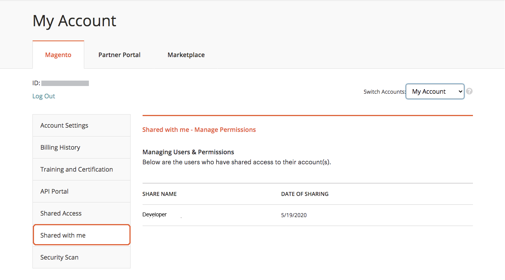

# Compartir una cuenta de [!DNL Commerce]

Su cuenta de [!DNL Commerce] contiene información que puede poner a disposición de empleados y proveedores de servicios de confianza que le ayuden a administrar el sitio. Como titular de la cuenta principal, tiene autoridad para otorgar acceso limitado a otros titulares de la cuenta de [!DNL Commerce]. El acceso compartido se puede revocar, pero no se puede transferir de un usuario a otro.

El equipo de soporte técnico de [!DNL Commerce] no tiene acceso a la cuenta y no puede configurar el acceso compartido para usted. Solo el titular de la cuenta principal con los permisos adecuados puede configurar el acceso compartido. Al compartir el acceso a la cuenta, toda la información confidencial, como el historial de facturación o la información de la tarjeta de crédito, permanece protegida y nunca está disponible para otros usuarios.

>[!NOTE]
>
>Todas las acciones que realicen los usuarios con acceso compartido son responsabilidad exclusiva del titular de la cuenta principal. Adobe no se responsabiliza de las acciones realizadas por los usuarios que han compartido el acceso a su cuenta.

{width="600" zoomable="yes"}

## Configuración de una cuenta compartida

1. Antes de empezar, obtenga la siguiente información de la cuenta [!DNL Commerce] del **nuevo beneficiario de acceso compartido**:

   - El usuario ya debe haberse registrado para obtener una cuenta en account.adobe.com y haber iniciado sesión a través de account.magento.com. Consulte [Crear una cuenta de Commerce](https://experienceleague.adobe.com/en/docs/commerce-admin/start/commerce-account/commerce-account-create#create-a-commerce-account) para obtener más información.
   - `MAGE ID/Account ID (MAG00XXXXXXX)` se muestra en la esquina superior izquierda de la ficha _[!UICONTROL Magento]_, justo encima del vínculo **Cerrar sesión**.
   - La dirección `Email` asociada con la cuenta.

1. Inicie sesión en su [[!DNL Commerce] cuenta](commerce-account-create.md).

1. En el panel de navegación izquierdo, haga clic en **[!UICONTROL Shared Access]**.

1. Haga clic en **[!UICONTROL Add New User]**.

   {width="600" zoomable="yes"}

1. En [!UICONTROL _New User Information]_, haga lo siguiente:

   - Escriba **[!UICONTROL Account ID]** de la cuenta [!DNL Commerce] del nuevo usuario.
   - Escriba la dirección **[!UICONTROL Email]** asociada a la cuenta [!DNL Commerce] del nuevo usuario.

   {width="600"}

1. En _[!UICONTROL Shared Information]_, haga lo siguiente:

   - Para identificar la cuenta compartida, escriba un **[!UICONTROL Share Name]**. Este nombre es para referencia interna y solo es visible para usted y la persona con la que comparte su cuenta.

     Una práctica recomendada es utilizar su nombre de organización como [!UICONTROL Share Name]. No utilice un nombre que comience por `CLOUD SHARED ACCESS FROM MAG XYX`.
   - Si desea compartir su información de contacto personal con el nuevo usuario, escriba **[!UICONTROL Your Email]** y **[!UICONTROL Your Phone]**.

1. En _[!UICONTROL Grant Account Permissions]_, active la casilla de verificación de cada producto y servicio [!DNL Commerce] que desee compartir.

   {width="600"}

1. Haga clic en **[!UICONTROL Create Shared Access]**.

   La nueva información de usuario aparece en la sección _[!UICONTROL Manage Permissions]_&#x200B;de la página Acceso compartido y se envía al nuevo usuario una invitación por correo electrónico con instrucciones para acceder a la cuenta compartida.

   {width="600" zoomable="yes"}

>[!NOTE]
>
>No es necesario compartir el acceso a _[!UICONTROL Security Tool]_: cualquier usuario con un ID de MAGE puede configurar la herramienta de exploración de seguridad con su propia cuenta. Solo necesitan los privilegios necesarios para realizar cambios en el sitio y comprobar la propiedad del dominio mediante uno de los [métodos necesarios](https://experienceleague.adobe.com/en/docs/commerce-admin/systems/security/security-scan)).

## Acceso a una cuenta compartida

Las siguientes instrucciones se escriben desde la perspectiva de un usuario compartido que recibe una invitación a una cuenta compartida.

1. Cuando reciba una invitación a una cuenta compartida, siga las instrucciones del mensaje de correo electrónico para iniciar sesión en su propia cuenta de [!DNL Commerce].

   El panel de navegación izquierdo de su cuenta tiene una nueva ficha _[!UICONTROL Shared with me]_. El control&#x200B;_[!UICONTROL Switch Accounts]_ de la esquina superior derecha tiene opciones para `My Account` y el nombre de la cuenta compartida.

   {width="600" zoomable="yes"}

   >[!NOTE]
   >
   >   Si no ve el control _[!UICONTROL Switch Accounts]_, póngase en contacto con el titular de la cuenta principal y confirme que ha escrito la [información de cuenta](#set-up-a-shared-account) correcta.

1. Para obtener acceso a la cuenta compartida, establezca **[!UICONTROL Switch Accounts]** en el nombre de la cuenta compartida.

   {width="600" zoomable="yes"}

   La cuenta compartida muestra un mensaje de bienvenida e información de contacto. El panel de navegación izquierdo incluye sólo los elementos que tiene permiso para utilizar.

1. Para conectar la cuenta compartida al Centro de ayuda, haga clic en **[!UICONTROL Support]** en el panel de navegación izquierdo de la cuenta compartida.

   {width="600" zoomable="yes"}

   Puede usar el [Centro de ayuda de Adobe Commerce](https://experienceleague.adobe.com/en/docs/commerce-knowledge-base/kb/overview) de la cuenta compartida para buscar artículos e información de solución de problemas, buscar parches para problemas conocidos y crear vales de soporte técnico.

   >[!NOTE]
   >
   >Después de recibir acceso compartido, para [enviar un caso de soporte técnico](https://experienceleague.adobe.com/en/docs/commerce-knowledge-base/kb/help-center-guide/magento-help-center-user-guide#support-case) en Experience League, asegúrese de seleccionar primero el nombre de la organización que termina en &quot;([!DNL Commerce])&quot; en la columna izquierda.

1. Para volver a su cuenta, haga clic en **Atrás** en los controles del explorador y establezca **[!UICONTROL Switch Accounts]** en `My Account`.

## Revocar acceso compartido

1. Inicie sesión en su cuenta de Commerce.

1. En el panel de navegación izquierdo, haga clic en **[!UICONTROL Shared Access]**.

1. Busque la cuenta que desea revocar en _[!UICONTROL Managing Users & Permissions]_&#x200B;y haga clic en **[!UICONTROL Delete]**.

   >[!NOTE]
   >
   > Si no se muestra **[!UICONTROL Delete]**, compruebe si **[!UICONTROL Share Name]** contiene el patrón de nombres `Cloud Shared Access from MAG0XYZ`. Si la cuenta tiene ese [patrón de nomenclatura y no se puede eliminar](https://experienceleague.adobe.com/en/docs/commerce-knowledge-base/kb/help-center-guide/magento-help-center-user-guide#remove-cloud-shared-access-users), esto se debe a que el acceso compartido se creó mediante una API y no directamente desde la [cuenta de Commerce](https://account.magento.com/).
   > 
   > Si no se puede eliminar, haga que el propietario de la cuenta modifique la cuenta de acceso compartido y en Conceder permisos de cuenta, desactive todos los elementos. Después de esta actualización, el usuario ya no podrá acceder a ningún recurso de la cuenta.
   > 
   >
   > Además, asegúrese de que los usuarios se eliminen del proyecto para que ya no reciban notificaciones por correo electrónico: [Los integrantes anteriores del equipo reciben notificaciones por correo electrónico de Adobe Commerce Cloud](https://experienceleague.adobe.com/en/docs/commerce-knowledge-base/kb/troubleshooting/miscellaneous/former-teammembers-receive-cloud-notification-emails)

1. Cuando se le pida que confirme, haga clic en **[!UICONTROL Delete User]**.

>[!NOTE]
>
>No puede eliminar usuarios con el nombre compartido de _Acceso compartido en la nube de MAG[XYZ]_ en esta interfaz. Consulte [¿Cómo eliminar usuarios a los que se les concedió acceso compartido a través de un proyecto de Cloud?](https://experienceleague.adobe.com/en/docs/commerce-knowledge-base/kb/help-center-guide/magento-help-center-user-guide#remove-cloud-shared-access-users).

## Lectura relacionada

[Solución de problemas de acceso compartido](https://experienceleague.adobe.com/en/docs/commerce-knowledge-base/kb/troubleshooting/miscellaneous/shared-access-troubleshooting)

