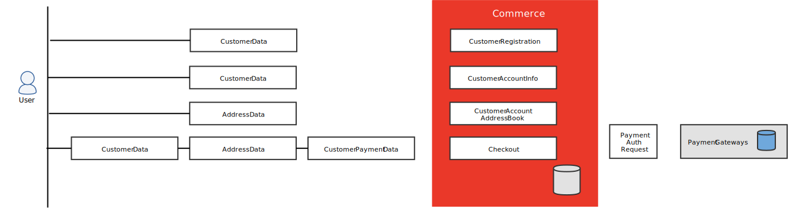

# Cumplimiento de CCPA

>[!NOTE]
>
>Esta información es uno de una serie de temas para ayudar a los comerciantes y desarrolladores de Adobe Commerce a comprender las implicaciones de la Ley de Privacidad del Consumidor de California. La información se basa en el texto del estatuto. Para confirmar si la CCPA se aplica a su negocio, consulte con su abogado.

La [Ley de Privacidad del Consumidor de California](https://oag.ca.gov/privacy/ccpa) (CCPA) amplía los derechos de los consumidores de California para determinar cómo se recopila, almacena y utiliza su información personal. Su énfasis es la protección de los consumidores de la venta o intercambio no autorizado o de su información personal. La CCPA se promulgó en 2018 y entró en vigor el 1 de enero de 2020.

La CCPA otorga los siguientes derechos nuevos a los consumidores:

- **Derecho a conocer** las categorías de información personal sobre ellos que se han recopilado, utilizado, compartido o vendido en los últimos 12 meses.
- **Derecho a eliminar** ciertos tipos de información personal que posee una empresa y/o sus proveedores de servicios.
- **Derecho de exclusión** de la venta de su información personal.
- **Derecho a la no discriminación** en términos de precio o servicio por haber ejercido un derecho de privacidad según CCPA.

A efectos de la CCPA, la información personal en este contexto se define como:

>Información que identifique, relacione, describa, pueda asociarse o pueda razonablemente vincularse, directa o indirectamente, con un consumidor o unidad familiar determinados. (Sección 1798.140)

A este respecto, abarca ciertos elementos de datos que no pueden considerarse datos personales en el contexto de otras leyes o regulaciones. Los comerciantes deben tener esto en cuenta al determinar si deben cumplir con la ley y cómo deben hacerlo.

La CCPA también requiere que las empresas proporcionen _seguridad razonable_, e incluye disposiciones ampliadas de protección de datos para los consumidores, incluido el derecho a iniciar acciones legales si se produce una violación de datos.

Consulte con su asesor legal para determinar si debe cumplir con cualquier requisito de la CCPA que pueda ser aplicable a usted y a su empresa y cómo debe hacerlo. Esto incluye los nuevos requisitos de notificación, exclusión y mantenimiento de registros que las empresas deben implementar de acuerdo con la ley.

## Requisitos empresariales

La CCPA se aplica a las empresas con fines de lucro que realizan negocios en California y cumplen cualquiera de las siguientes condiciones:

- Tener un ingreso anual bruto de más de $25 millones
- Compre, reciba o venda la información personal de 100,000 o más residentes, hogares o dispositivos de California
- Derive el 50% o más de sus ingresos anuales de la venta de información personal de los residentes de California.

## Guía de cumplimiento de CCPA

Esta sección proporciona una descripción de alto nivel de los pasos necesarios para que los comerciantes cumplan con las regulaciones de privacidad como la Ley de Privacidad del Consumidor de California (CCPA).

### RGPD y CCPA

Si su empresa debe cumplir con el [Reglamento General de Protección de Datos](compliance-gdpr.md) (RGPD) y la CCPA, puede usar parte del trabajo de su programa de cumplimiento del RGPD para la CCPA. Aunque las regulaciones tienen algunas similitudes, algunas diferencias incluyen:

- La definición de información personal difiere según la normativa.
- El RGPD requiere que los consumidores acepten la inclusión antes de que sus datos personales puedan utilizarse para determinados fines; la CCPA otorga a los consumidores el derecho de exclusión.
- La CCPA incluye requisitos adicionales de asignación e inventario de datos.
- Las regulaciones tienen diferentes requisitos de política de privacidad.

Las empresas que cumplan con el RGPD podrían tener obligaciones adicionales según la CCPA. Para obtener más información, consulte la [Hoja informativa de la CCPA](https://oag.ca.gov/system/files/attachments/press_releases/CCPA%20Fact%20Sheet%20%2800000002%29.pdf){:target="_blank"}.

### Plan de cumplimiento

Se requiere un esfuerzo coordinado para elaborar y aplicar un plan para abordar el cumplimiento. Utilice esta hoja de ruta como guía para movilizar recursos y priorizar tareas para que pueda avanzar en varios frentes. El proceso es esencialmente el mismo para todas las instalaciones de [!DNL Commerce], con la siguiente excepción:

- **Adobe Commerce en la infraestructura en la nube**: Los comerciantes con tiendas alojadas en la [infraestructura en la nube](https://www.adobe.com/commerce/magento.html){:target="_blank"} de Adobe pueden solicitar ayuda a su administrador de cuentas técnico de Adobe Commerce o a la atención al cliente para responder a las solicitudes de los consumidores.

- **Local**: los comerciantes con instalaciones locales de Adobe Commerce o Magento Open Source deben desarrollar sus propios procesos y herramientas para responder y administrar las solicitudes de los consumidores relacionadas con las normas de privacidad.

#### Paso 1: Reunir un equipo interfuncional para abordar el cumplimiento de la normativa

Organice un equipo que represente las siguientes funciones funcionales en su empresa y programe una sesión de formación para que se pongan al día respecto a la legislación. A continuación, asigne las tareas necesarias a las partes interesadas por función.

- Estrategia y operaciones empresariales
- Legal
- Tecnología de la información
- Experiencia del usuario
- Servicio al cliente
- Soporte administrativo

Desde una perspectiva empresarial, debe determinar si su empresa amplía estas medidas de protección de la privacidad únicamente a los consumidores de California o si las pone a disposición de todos los consumidores, independientemente de su ubicación.

#### Paso 2: Haga un inventario de sus propiedades digitales

**Partes interesadas:** Tecnología de la información, asistencia legal y administrativa

Haga un inventario de sus propiedades digitales, incluidas todas las integraciones y quién tiene acceso a los datos de sus consumidores.

1. Determine qué información personal pública y privada se recopila a través de sus sitios web y aplicaciones móviles. Por ejemplo, una base de datos estándar de Commerce almacena los siguientes tipos de información personal pública y privada:

   - **Público**: Listas de deseos, críticas de productos

   - **Privado**: Información Del Cliente, Información Del Pedido, Puntos De Recompensa, Registro De Regalos, Libreta De Direcciones, Crédito De Tienda, Métodos De Pago, Contratos De Facturación, Suscripciones A Boletines Informativos, Invitaciones.

     Si se ha personalizado la instalación de [!DNL Commerce], podría recopilarse información personal adicional. La información personal también puede residir en [cookies](./compliance-cookie-law.md), etiquetas y otras tecnologías que recopilan información.

1. Identifique a las partes con las que comparte datos. La lista debe incluir proveedores de servicios y terceros. Los terceros incluyen redes publicitarias, proveedores de servicios de Internet, proveedores de análisis de datos, entidades gubernamentales, sistemas operativos y plataformas, redes sociales y distribuidores de datos de consumo que no recopilan directamente información personal de sus consumidores.

   - **Proveedores de servicios**: Entidades que tienen acceso a los datos de sus consumidores con fines comerciales y que proporcionan servicios en su nombre. Por ejemplo, Adobe es un proveedor de servicios, al igual que algunos desarrolladores de personalizaciones, extensiones y servicios.

     Compruebe la configuración predeterminada de Google Universal Analytics, Google Tag Manager y cualquier otro servicio de datos que utilice, y realice los cambios necesarios para cumplir con la normativa. Para obtener más información, consulte [Configuración de privacidad de Google](../merchandising-promotions/google-tools.md#google-privacy-settings).

   - **Otros terceros**: Entidades con las que comparte o vende datos de consumidores. Por ejemplo, podría compartir datos de consumidores con una red de publicidad a cambio de publicidad.

#### Paso 3: Asignar el recorrido del cliente y el proceso de recopilación de datos en sus tiendas

**Partes interesadas:** Experiencia del usuario, tecnología de la información, soporte administrativo

1. Identifique cada punto del [recorrido del cliente] donde se recopila información personal y el tipo de información que se recopila en cada paso.

   Se debe notificar a los visitantes del sitio con antelación o en el momento de la recopilación de datos. Por ejemplo, una tienda sin integraciones personalizadas recopila información personal cuando se crea una cuenta de cliente y durante el cierre de compra. Si su tienda tiene integraciones personalizadas, es posible que haya elementos de datos y atributos adicionales que identificar.

1. Consulte los siguientes temas para ver los diagramas de flujo de datos aplicables y las asignaciones de entidades de base de datos para cada versión:

   - [Referencia de información personal (2.x)](https://experienceleague.adobe.com/docs/commerce-operations/security-and-compliance/reference/data-m2.html?lang=es)
   - [Referencia de información personal (1.x)](https://experienceleague.adobe.com/docs/commerce-operations/security-and-compliance/reference/data-m1.html?lang=es)

   

#### Paso 4: Establecer procedimientos y mecanismos para responder a las solicitudes de los clientes

**Partes interesadas:** Servicio al cliente, Tecnología de la información, Experiencia del usuario, Soporte administrativo

Desde la perspectiva de la gestión de datos, cada solicitud de información personal implica a las siguientes partes:

- **Sujetos de datos** (consumidores): según la CCPA, cualquier persona en California que proporcione información personal para realizar una compra o mantener una cuenta de cliente, puede enviar una solicitud para acceder a sus datos personales o eliminarlos.

- **Entidades que actúan como empresas en el ámbito de la CCPA** (marcas): [!DNL Commerce] comerciantes recopilan y almacenan información personal de sus clientes e invitados que realizan compras en sus tiendas.

- **Procesador de datos** (proveedores de tecnología): Adobe Commerce y Magento Open Source actúan como procesadores de los datos personales almacenados como parte de los servicios proporcionados a los comerciantes. Como procesador, Adobe procesa los datos personales de acuerdo con los permisos e instrucciones del comerciante, según el acuerdo de licencia.

Los comerciantes son responsables de lo siguiente:

1. Identifique a las partes involucradas en la solicitud de acceso del sujeto de datos (DSAR) y verifique la identidad de cualquier persona que solicite conocer, rechazar o eliminar. Esto se aplica a una persona que tiene una cuenta de cliente protegida con contraseña o a una persona que compra en su tienda como invitado.

1. Revelar y entregar información a un consumidor en respuesta a su solicitud de derechos dentro de los 45 días posteriores a la recepción de una solicitud verificable del consumidor, a menos que no sea posible. (La ley contiene otros requisitos para que una empresa mantenga el cumplimiento por demoras de hasta 45 días adicionales).

   Los comerciantes deben responder a cada DSAR en un plazo de 45 días, a partir del día en que se reciba la solicitud. Si es necesario, los comerciantes pueden tardar hasta 45 días más en responder, para un total máximo de 90 días desde el día en que se recibe la solicitud. Esto requiere que el comerciante notifique al cliente para explicar el motivo de la demora.

1. Desarrolle un mecanismo para presentar las notificaciones necesarias en su tienda y recopilar la respuesta de los consumidores.

1. Establezca procedimientos de respuesta y documente cada una de las siguientes solicitudes:

   - **Solicitudes para saber**: se debe informar a los visitantes de su tienda de cualquier acuerdo que tenga para vender o compartir su información personal con terceros y se les debe permitir excluirse. Los detalles de su uso de la información personal, y las partes con las que comparte o vende datos se pueden mantener en su política de privacidad.

   - **Solicitudes de exclusión**: si los datos personales se venden o transfieren a terceros a cambio de una consideración valiosa, la CCPA requiere un vínculo de _No vender mi información_ en cada punto donde se recopilen. Se pueden utilizar controles de entrada adicionales habilitados por el usuario, como casillas de verificación y botones, en las comunicaciones por correo electrónico, la configuración de preferencias de sitios web o en los formularios de sitios web en el momento de la recopilación de datos para que las personas envíen una solicitud de exclusión válida.

   - **Solicitudes para eliminar**

      - Los comerciantes cuyas tiendas estén alojadas en Adobe Commerce Cloud deben ponerse en contacto con el servicio de asistencia de Adobe para obtener ayuda y eliminar información personal. Póngase en contacto con el administrador de cuentas técnico de Adobe o con la asistencia al cliente para obtener más información.
      - Los comerciantes que ejecuten instalaciones de Adobe Commerce o Magento Open Source on-premise deben implementar su propio proceso y script para eliminar la información personal si se solicita.

#### Paso 5: escribir el contenido para las notificaciones requeridas al cliente

**Partes interesadas:** asistencia legal, servicio al cliente, experiencia del usuario, tecnología de la información, soporte administrativo

1. En colaboración con su asesor legal, determine los tipos de avisos que deben agregarse a su sitio web para cumplir con las obligaciones de la CCPA.

   - **Aviso de colección**: Un aviso que se da en el momento en que se recopila la información personal del consumidor o antes de este. El aviso debe escribirse en un lenguaje sencillo y ser fácil de entender para la persona promedio. El aviso debe ser visible y se debe proporcionar en uno o más idiomas que el contenido del sitio web.

   - **Aviso de derecho de exclusión**: Un aviso que informa a los consumidores de su derecho a no participar en la venta de su información personal.

   - **Aviso de incentivo financiero**: Un aviso que explica cada incentivo financiero, precio o diferencia de servicio que su compañía recibe a cambio de información personal.

   - **Cómo enviar una solicitud de recopilación y uso de información personal**: instrucciones para que las personas envíen una solicitud de que usted divulgue la información personal que ha recopilado sobre la persona, incluyendo:

      - Información personal específica que ha recopilado sobre el consumidor
      - Categorías de información personal que ha recopilado sobre el consumidor
      - Categorías de fuentes de las que se obtiene la información personal
      - Categorías de información personal acerca del consumidor que ha vendido o revelado con fines comerciales
      - Categorías de terceros a los que se vendió o reveló la información personal con fines comerciales
      - Las razones por las que su empresa recopila y/o vende información personal

1. Envíe el contenido al equipo de y, si es posible, a su asesor jurídico para que lo revise.

1. Determine dónde aparecen los avisos, cómo funcionan (para cada visita, en la autenticación o al hacer clic), y su posición y formato en relación con otro contenido.

1. Pase el contenido aprobado a su equipo de desarrollo.

#### Paso 6: Revisar los acuerdos con los proveedores de servicios

**Partes interesadas:** asistencia legal y administrativa

Revise y, si es necesario, actualice todos los contratos de proveedor de servicios para reflejar los requisitos de la CCPA.

#### Paso 7: Actualizar la política de privacidad

**Partes interesadas:** asistencia legal y administrativa

Revise su política de privacidad actual y considere qué divulgaciones adicionales son necesarias, si las hay.

- **Uso de información personal**: debe revelar qué información personal se recopila y los incentivos financieros que reciba a cambio de la venta de información personal. También es necesario que explique cómo se permite el incentivo según la CCPA y cómo se calcula el valor de la información personal.

- **Edad del consentimiento**: Si recopila o usa información personal sobre menores, puede estar sujeto a los siguientes requisitos:

   - **Menores &lt; 13**: se requiere la autorización de los padres para que los menores de 13 años se incluyan en la venta de su información personal.

   - **Menores de 13 a &lt; 16**: Los menores de 13 años y menores de 16 años pueden optar por la venta de su información personal, siempre y cuando el negocio establezca un proceso razonable para documentar la acción. El proceso debe describirse en la [política de privacidad](privacy-policy.md) de la compañía. Cuando una empresa recibe solicitudes de menores de este rango de edad, debe informarles de su derecho a optar por la exclusión más tarde y explicarles cómo hacerlo.

  >[!IMPORTANT]
  >
  >Los comerciantes tienen prohibido almacenar los datos personales de los niños en la plataforma o los sistemas [!DNL Commerce]. Si hay motivos para creer que los datos recopilados pertenecen a un menor de edad, deben eliminarse de una plataforma de [!DNL Commerce] inmediatamente para evitar el incumplimiento de los términos de licencia de Adobe.

#### Paso 8: Documentar todos los procedimientos relacionados y mantener registros

**Partes interesadas:** Servicio al cliente, Soporte administrativo

Durante 24 meses después de recibir cada solicitud de derechos individual, mantenga un registro de la solicitud y de la respuesta de su compañía.
