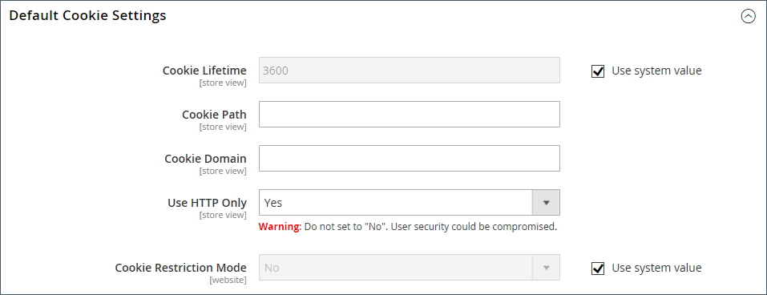

# Cumplimiento de la ley de cookies

Las cookies son pequeños archivos que se guardan en el equipo de cada visitante del sitio y que se utilizan como lugares de retención temporales para la información. La información que se guarda en las cookies se utiliza para personalizar la experiencia de compra, vincular a los visitantes con sus carros de compras, medir los patrones de tráfico y mejorar la eficacia de las promociones. Para mantenerse al día con la legislación en muchos países sobre el uso de cookies, Adobe Commerce y Magento Open Source ofrecen a los comerciantes una selección de métodos para obtener el consentimiento del cliente. Para obtener una lista de las cookies predeterminadas en Adobe Commerce y Magento Open Source, consulte [Referencia de cookies](#default-cookies).

>[!NOTE]
>
>Si modifica la configuración de privacidad predeterminada de [Google](../merchandising-promotions/google-tools.md#google-privacy-settings) para cumplir con el [Reglamento general de protección de datos](compliance-gdpr.md), no es necesario obtener el consentimiento del usuario para el uso de cookies de Google Analytics.

## Modo de restricción de cookies

Cuando el modo de restricción de cookies está habilitado, los visitantes de su tienda reciben una notificación avisando que se necesitan cookies para realizar operaciones con todas las funciones. Según la temática, el mensaje podría aparecer encima del encabezado, debajo del pie de página o en otro lugar de la página. El mensaje se vincula a su política de privacidad para obtener más información y anima a los visitantes a hacer clic en el botón Permitir para dar su consentimiento. Una vez concedido el consentimiento, el mensaje desaparece.

Su [política de privacidad](privacy-policy.md) debe incluir el nombre de su tienda y la información de contacto, así como explicar el propósito de cada cookie que usa su tienda. Para obtener más información, consulte [Referencia de cookies](#default-cookies).

>[!NOTE]
>
>Si cambia la clave URL de la política de privacidad, también debe crear una reescritura de URL personalizada para redirigir el tráfico a la nueva clave URL. De lo contrario, el vínculo del mensaje Modo de restricción de cookies devuelve `404 Page Not Found`.

{width="600"}

### Paso 1: Habilitar el modo de restricción de cookies

1. En la barra lateral _Admin_, vaya a **[!UICONTROL Stores]** > _[!UICONTROL Settings]_>**[!UICONTROL Configuration]**.

1. En el panel de navegación izquierdo bajo **[!UICONTROL General]**, elija **[!UICONTROL Web]**.

1. Expanda la sección **[!UICONTROL Default Cookie Settings]** y haga lo siguiente:

   {width="600"}

   - Escriba **[!UICONTROL Cookie Lifetime]** en segundos.

   - Si desea que las cookies estén disponibles para otras carpetas, escriba **[!UICONTROL Cookie Path]**. Para que las cookies estén disponibles en cualquier parte del sitio, escriba una barra diagonal (`/`). Este valor solo puede contener la ruta de la cookie y **_no puede_** contener ningún otro parámetro de cookie.

   - Para que las cookies estén disponibles para un subdominio, escriba el nombre de subdominio en el campo **[!UICONTROL Cookie Domain]** (`subdomain.yourdomain.com`). Para que las cookies estén disponibles para todos los subdominios, escriba el nombre de dominio precedido de un punto (`.yourdomain.com`). Este valor solo puede contener el dominio de la cookie y **_no puede_** contener ningún otro parámetro de cookie.

   - Para evitar que los lenguajes de scripts, como JavaScript, obtengan acceso a las cookies, asegúrese de que **Usar solo HTTP** está establecido en `Yes`.

   - Establezca **[!UICONTROL Cookie Restriction Mode]** en `Yes`.

     Si es necesario, desmarque la casilla de verificación y haga clic en **[!UICONTROL OK]** para confirmar el cambio de ámbito.

1. Una vez finalizado, haga clic en **[!UICONTROL Save Config]**.

1. Cuando se le pida que actualice la caché, haga clic en el vínculo **[!UICONTROL Cache Management]** en el mensaje del sistema y actualice cada caché no válida.

### Paso 2: Actualizar la política de privacidad

Actualice la [política de privacidad](privacy-policy.md) para que refleje la información que recopila su compañía y cómo se utiliza.

## Cookies predeterminadas

Las cookies predeterminadas de Adobe Commerce y Magento Open Source se clasifican como Exentas/No exentas para ayudar a los comerciantes a cumplir con los requisitos de las regulaciones de privacidad como el [RGPD](compliance-gdpr.md). Los comerciantes deben utilizar esta información como guía y consultar con asesores legales para actualizar sus políticas de privacidad y cookies como parte de una estrategia integral de cumplimiento de la regulación de privacidad.

[!DNL Commerce] usa las siguientes cookies &quot;listas para usar&quot; para instalaciones locales y en la nube. Estas cookies pueden ser necesarias para la funcionalidad que solicita explícitamente el cliente. Para obtener más información acerca de la duración de las cookies de sesión, consulte [Duración de la sesión](../customers/customer-online-options.md).

Algunas de estas cookies pueden proporcionar opciones de configuración, incluida la activación o desactivación, según sea necesario.

### Cookies de funcionalidad solicitadas (exentas)

| Nombre | Tipo | Descripción |
| ------ | ------ | ------------- |
| **`add_to_cart`** | Cookie |  (solo Adobe Commerce) Registra el SKU, el nombre, el precio y la cantidad del producto que se quitó del carro de compras. Permite a Google Analytics saber cuándo se ha agregado un producto al carro de compras. |
| **`guest-view`** | Cookie | Vincula un pedido de invitado a un invitado (porque no hay cuenta para invitado). Para mantener la estabilidad del sistema, no desactive esta cookie. |
| **`login_redirect`** | Cookie | Guarda la URL de redireccionamiento para dirigir al usuario si el inicio de sesión y el registro de usuarios se realizan correctamente. Guarda la página en la que se encontraba un usuario antes de iniciar sesión (para determinar la ubicación a la que regresará después de iniciar sesión). |
| **`mage-banners-cache-storage`** | Almacenamiento local |  (solo Adobe Commerce): almacenamiento local para la funcionalidad de banner. Almacena el contenido del banner localmente para mejorar el rendimiento. El contenido del titular incluye recursos generales del sitio web que muestran información a un comprador. Para mantener la estabilidad del sistema, no desactive esta cookie. |
| **`mage-messages`** | Cookie | Rastrea mensajes de error y otras notificaciones que se muestran al usuario, como el mensaje de consentimiento de cookies y varios mensajes de error. El mensaje se elimina de la cookie después de mostrarse al comprador. No existe una opción para deshabilitar esta cookie. Así es como se comunica la información única al usuario, como los mensajes de error. Para mantener la estabilidad del sistema, no desactive esta cookie. |
| **`product_data_storage`** | Almacenamiento local | Almacena la configuración de los datos de producto utilizados para utilizar las funciones &quot;Vistos recientemente&quot; y &quot;Comparar productos&quot;. Almacena la configuración específica de un usuario (por ejemplo, si ha visto recientemente un producto o si ha comparado productos). Para mantener la estabilidad del sistema, no desactive esta cookie. |
| **`recently_compared_product`** | Almacenamiento local | Almacena los ID de productos de productos comparados recientemente. Para mantener la estabilidad del sistema, no desactive esta cookie. |
| **`recently_compared_product_previous`** | Almacenamiento local | Almacena los ID de productos de productos comparados anteriormente para facilitar la navegación. Para mantener la estabilidad del sistema, no desactive esta cookie. |
| **`recently_viewed_product`** | Almacenamiento local | Almacena los ID de productos de productos vistos recientemente para facilitar la navegación. Para mantener la estabilidad del sistema, no desactive esta cookie. |
| **`recently_viewed_product_previous`** | Almacenamiento local | Almacena los ID de productos de productos vistos recientemente para facilitar la navegación. Para mantener la estabilidad del sistema, no desactive esta cookie. |
| **`remove_from_cart`** | Cookie |  (solo Adobe Commerce) permite que Google Analytics sepa cuándo se ha eliminado un producto de un carro de compras. |
| **`stf`** | Cookie | Registra la hora en que el módulo SendFriend ([Enviar correo electrónico a un amigo](../stores-purchase/email-a-friend.md)) envía los mensajes. Cuando un comprador envía un vínculo a un producto, esta cookie registra una marca de tiempo y mantiene un recuento. |
| **`X-Magento-Vary`** | Cookie | Indica cuándo se debe proporcionar una nueva versión de una página desde la caché. Admite el rendimiento del sitio web. Para mantener la estabilidad del sistema, no desactive esta cookie. |
| **`form_key`** | Cookie | Mecanismo de seguridad que contiene un valor generado aleatoriamente para evitar ataques de falsificación de solicitud en sitios múltiples (CSRF), al ayudar a determinar si una solicitud procede de una fuente auténtica o de un actor incorrecto. Se trata de una práctica estándar en la industria para evitar ataques de CSRF. Para mantener la estabilidad del sistema, no desactive esta cookie. |
| **`mage-cache-sessid`** | Cookie | Útil para determinar cuándo limpiar el almacenamiento local en el explorador después de la caducidad de la sesión. Se utiliza para determinar si se debe limpiar el almacenamiento local. La falta de esta cookie déclencheur la limpieza del almacenamiento local. Para mantener la estabilidad del sistema, no desactive esta cookie. |
| **`mage-cache-storage`** | Almacenamiento local | Almacenamiento local de contenido específico del visitante que habilita las funciones de comercio electrónico. No se usa de forma predeterminada, pero cuando se usa, se usa para acelerar el cierre de compra, de modo que la información básica del usuario esté disponible cuando alguien se marcha y vuelve. Para mantener la estabilidad del sistema, no desactive esta cookie. |
| **`mage-cache-storage-section-invalidation`** | Almacenamiento local | Almacena información relacionada con las secciones de la página que deben invalidarse y eliminarse. Para mantener la estabilidad del sistema, no desactive esta cookie. |
| **`mage-cache-timeout`** | Almacenamiento local | Controla cuánto tiempo se almacenan en caché los datos relacionados con el cliente en el explorador. Cuando caduca el tiempo de espera, Magento borra y vuelve a cargar secciones de clientes en caché, como el carro de compras, la lista de deseos y los datos de clientes. Este comportamiento ayuda a mantener la precisión y la privacidad de los datos a la vez que equilibra el rendimiento del lado del cliente. El valor de tiempo de espera se alinea con la Duración de la cookie configurada para mantener la coherencia con la administración de sesiones del lado del servidor. |
| **`persistent_shopping_cart`** | Cookie | Almacena el ID de clave de un carro de compras persistente para permitir la restauración del carro de compras para un comprador anónimo. Para mantener la estabilidad del sistema, no desactive esta cookie. |
| **`private_content_version`** | Cookie | Adjunta un número y una hora aleatorios y únicos a las páginas con contenido de cliente para evitar que se almacenen en la caché del servidor. Se configura en varios lugares: en PHP, en JavaScript como cookie y en JavaScript para almacenamiento local. Para mantener la estabilidad del sistema, no desactive esta cookie. |
| **`section_data_ids`** | Cookie | Almacena información específica del cliente relacionada con las acciones iniciadas por el comprador, como la visualización de la lista de deseos y la información de cierre de compra. Para mantener la estabilidad del sistema, no desactive esta cookie. |
| **`store`** | Cookie | Registra la vista o configuración regional de la tienda seleccionada por el comprador. Para mantener la estabilidad del sistema, no desactive esta cookie. |
| **`PHPSESSID`** | Cookie | Rastrea sesiones de usuario en la tienda. Son los compradores que usan los productos finales. Para mantener la estabilidad del sistema, no desactive esta cookie. |
| **`admin`** | Cookie | Rastrea sesiones de usuario en el lado del administrador. Para mantener la estabilidad del sistema, no desactive esta cookie. |
| **`loggedOutReasonCode`** | Cookie | Se establece cuando un usuario administrador está bloqueado tras un determinado número de intentos de contraseña fallidos. |
| **`section_data_clean`** | Cookie | Se establece cuando un usuario cambia de vista de tienda. La presencia de esta cookie déclencheur a JavaScript a volver a cargar determinadas secciones de la página para reflejar la vista de tienda correcta. Para mantener la estabilidad del sistema, no desactive esta cookie. |
| **`lang`** | Cookie | Establecido indirectamente por el módulo Admin Analytics. Se utiliza solo en un área administrativa de una tienda. No aplicable a los compradores. Para mantener la estabilidad del sistema, no desactive esta cookie. |
| **`s_fid`** | Cookie | Establecido indirectamente por el módulo Admin Analytics. Marca de fecha y hora del ID único de visitante de reserva. Se usa para identificar a un visitante único si la cookie estándar `s_vi` no está disponible debido a las restricciones de cookies de terceros. Se utiliza solo en un área administrativa de una tienda. No aplicable a los compradores. Para mantener la estabilidad del sistema, no desactive esta cookie. |
| **`s_cc`** | Cookie | Establecido indirectamente por el módulo Admin Analytics. El código JavaScript lo establece y lo lee para determinar si las cookies están habilitadas. Se utiliza solo en un área administrativa de una tienda. No aplicable a los compradores. Para mantener la estabilidad del sistema, no desactive esta cookie. |
| **`apt.sid`** | Cookie | Establecido por la biblioteca PX de Gainsight utilizado indirectamente por el módulo Admin Analytics. El propósito de esta cookie es permitir el seguimiento continuado del ID de sesión en el dominio de nivel superior del producto y se utiliza como ID de referencia para la sesión activa. Se utiliza solo en un área administrativa de una tienda. No aplicable a los compradores. Para mantener la estabilidad del sistema, no desactive esta cookie. |
| **`apt.uid`** | Cookie | Establecido por la biblioteca PX de Gainsight utilizado indirectamente por el módulo Admin Analytics. El propósito de esta cookie es permitir el seguimiento continuado del ID en el dominio de nivel superior del producto y se utiliza como ID de referencia para la entidad del usuario. Se utiliza solo en un área administrativa de una tienda. No aplicable a los compradores. Para mantener la estabilidad del sistema, no desactive esta cookie. |
| **`s_sq`** | Cookie | Establecido indirectamente por el módulo Admin Analytics. Lo utiliza la función de ClickMap que recopila datos sobre dónde y en qué hacen clic los visitantes. Almacena información de cada clic. Se utiliza solo en un área administrativa de una tienda. No aplicable a los compradores. Para mantener la estabilidad del sistema, no desactive esta cookie. |
| **`pagebuilder_modal_dismissed`** | Cookie | La establece el módulo Page Builder. Contiene un indicador que evita que las solicitudes posteriores pidan a un administrador que confirme la apertura de una acción determinada si el administrador las descartó explícitamente antes. Se utiliza solo en un área administrativa de una tienda. No aplicable a los compradores. |
| **`pagebuilder_template_apply_confirm`** | Cookie | La establece el módulo Page Builder. Contiene un indicador que evita que las solicitudes posteriores pidan a un administrador que confirme la apertura de una acción determinada si el administrador las descartó explícitamente antes. Se utiliza solo en un área administrativa de una tienda. No aplicable a los compradores. |
| **`accordion-{VARIABLE}-{VARIABLE}`** | Cookie | Se utiliza como parte de la implementación de la funcionalidad de pestañas solo en un área administrativa de una tienda. No aplicable a los compradores. |

{style="table-layout:auto"}

## Cookies de Product Recommendations

 (solo Adobe Commerce) Las siguientes cookies las usan Product Recommendations para clientes de Adobe Commerce. Estas cookies se instalan con el [módulo DataServices](https://experienceleague.adobe.com/en/docs/commerce/product-recommendations/getting-started/install-configure).

- `mg_dnt`: le permite [restringir la recopilación de datos de Adobe Commerce](https://experienceleague.adobe.com/en/docs/commerce/product-recommendations/developer/setting-cookie) si tiene código personalizado para administrar el consentimiento de cookies en su sitio.
- `user_allowed_save_cookie`: se usa para [modo de restricción de cookies](#cookie-restriction-mode).
- `authentication_flag`: indica si un comprador ha iniciado sesión o ha cerrado sesión. Esta cookie se actualiza al mismo tiempo que la cookie `dataservices_customer_id`.
- `dataservices_customer_id`: indica si un comprador ha iniciado sesión o ha cerrado sesión. Esta cookie contiene el ID único del cliente en el sistema.
- `dataservices_customer_group`: indica el grupo de un cliente. Esta cookie se almacena como [sha1](https://en.wikipedia.org/wiki/SHA-1) suma de comprobación del ID de grupo del cliente.
- `dataservices_cart_id`: identifica las acciones del carro de compras de un comprador. Esta cookie contiene el ID único de carro de compras del cliente en el sistema.
- `dataservices_product_context`: identifica las interacciones de productos de un comprador. Esta cookie contiene el ID de cotización único del cliente en el sistema.

### Datos de almacenamiento local de Product Recommendations

Los siguientes datos se guardan en el almacenamiento local para tiendas que utilizan el tema de Luma cuando se instala Live Search o Product Recommendations:

- `ds-cart`: Almacena información del carro de compras para la funcionalidad específica de Luma.
- `ds-cart-order`: Almacena información de pedidos para la funcionalidad del carro de compras
- `ds-purchase-history`: Rastrea el historial de compras del cliente
- `ds-view-history-time-decay`: almacena el historial de vistas de productos con deterioro basado en el tiempo
- `ds-logged-in`: indica el estado de inicio de sesión del cliente. Estos datos solo existen cuando el cliente ha iniciado sesión y se almacenan incluso cuando el modo de restricción de cookies está habilitado. Son los únicos datos que Commerce almacena en el almacenamiento local cuando el modo de restricción de cookies está habilitado, independientemente del estado de consentimiento del usuario.

## Cookies adicionales

 (solo Adobe Commerce) Las siguientes cookies están configuradas para los clientes de Adobe Commerce. Estas cookies se instalan con el [módulo DataServices](https://experienceleague.adobe.com/en/docs/commerce/product-recommendations/getting-started/install-configure).

- `mg`: configurado por el rastreador de JavaScript de Snowplow. Encontrará más información en la [documentación de Snowplow](https://docs.snowplow.io/docs/sources/trackers/javascript-trackers/web-tracker/tracker-setup/initialization-options/).
- `com.adobe.alloy.getTld`: dado el nombre de host de la página web actual, este es el dominio de primer nivel que no es un &quot;sufijo público&quot; como se describe en https://publicsuffix.org. Básicamente, este es el dominio de primer nivel que puede aceptar cookies. Esta cookie es parte de [Alloy Web SDK](https://github.com/adobe/alloy).
- `aep-segments-membership`: contiene [información de audiencia](https://experienceleague.adobe.com/en/docs/commerce-admin/customers/audience-activation), como a qué segmento pertenece un comprador.
