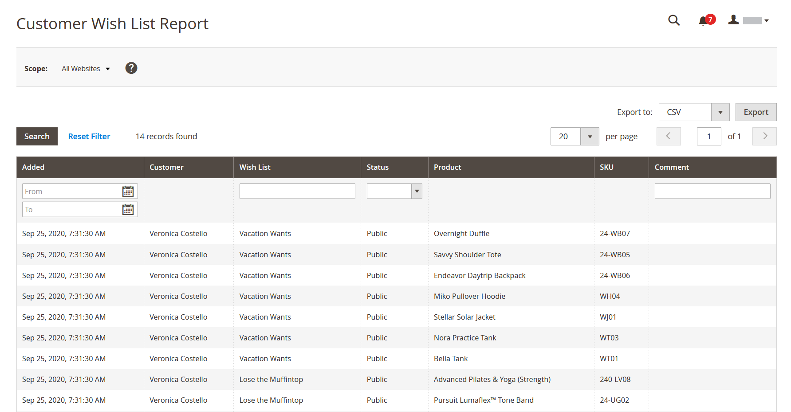

# Informes del cliente

Los informes del cliente proporcionan a insight la actividad del cliente durante un período de tiempo o un intervalo de fechas especificados.

## [!UICONTROL Order Total Report]

El [!UICONTROL Order Total Report] muestra los pedidos de los clientes para un intervalo de tiempo o intervalo de fechas especificado. El informe incluye el número de pedidos por cliente, el importe promedio del pedido y el importe total.

En la barra lateral _Admin_, vaya a **[!UICONTROL Reports]** > _[!UICONTROL Customers]_>**[!UICONTROL Order Total]**.

{width="600"}

### Controles de Workspace

| Control | Descripción |
|--- |--- |
| [!UICONTROL From / To] | Se utiliza para definir una búsqueda de pedidos basada en las fechas de inicio y finalización. |
| [!UICONTROL Show By] | Define la granularidad de la división del registro de pedidos. Opciones: `Month` / `Day` / `Year` |
| [!UICONTROL Refresh] | Actualiza la cuadrícula a los filtros especificados. |
| [!UICONTROL Export] | Exporta los registros seleccionados como un archivo CSV o XML de Excel. |
| [!UICONTROL Scope] | Se utiliza para establecer el sitio o almacén para el que se genera el informe. |

{style="table-layout:auto"}

### Descripciones de columna

| Columna | Descripción |
|--- |--- |
| [!UICONTROL Interval] | Intervalo total del pedido, por `Month` / `Day` / `Year`. |
| [!UICONTROL Customer] | El nombre del cliente que realizó los pedidos. |
| [!UICONTROL Orders] | Número de pedidos para el intervalo especificado. |
| [!UICONTROL Average] | Cantidad de pedido promedio. Esta cantidad siempre se calcula para los precios de productos **sin incluir impuestos**, incluso si los precios de productos de catálogo, el subtotal de pedidos y el total de pedidos incluyen impuestos. Como resultado, el importe que se muestra en el informe es diferente al importe que se muestra en los detalles del pedido en los casos en los que los totales de pedidos incluyen impuestos. |
| [!UICONTROL Total] | La suma de todos los pedidos del periodo. Esta cantidad siempre se calcula para los precios de productos **sin incluir impuestos**, incluso si los precios de productos de catálogo, el subtotal de pedidos y el total de pedidos incluyen impuestos. Como resultado, el total que se muestra en el informe es diferente a la cantidad que se muestra en los detalles del pedido en los casos en que los totales de pedidos incluyen impuestos. |

{style="table-layout:auto"}

## [!UICONTROL Order Count Report]

[!UICONTROL Order Count Report] muestra el número de pedidos por cliente para un intervalo de tiempo o intervalo de fechas especificado. El informe incluye el número de pedidos por cliente, el importe promedio del pedido y el importe total.

En la barra lateral _Admin_, vaya a **[!UICONTROL Reports]** > _[!UICONTROL Customers]_>**[!UICONTROL Order Count]**.

{width="600"}

### Controles de Workspace

| Control | Descripción |
|--- |--- |
| [!UICONTROL From / To] | Se utiliza para definir una búsqueda de pedidos basada en las fechas de inicio y finalización. |
| [!UICONTROL Show By] | Define la granularidad de la división del registro de pedidos. Opciones: `Month` / `Day` / `Year` |
| [!UICONTROL Refresh] | Actualiza la cuadrícula a los filtros especificados. |
| [!UICONTROL Export] | Exporta los registros seleccionados como un archivo CSV o XML de Excel. |
| [!UICONTROL Scope] | Se utiliza para establecer el sitio o almacén para el que se genera el informe. |

{style="table-layout:auto"}

### Descripciones de columna

| Columna | Descripción |
|--- |--- |
| [!UICONTROL Interval] | Intervalo de recuento de pedidos, por `Month` / `Day` / `Year`. |
| [!UICONTROL Customer] | El cliente que realizó el pedido. |
| [!UICONTROL Orders] | Número de pedidos para el intervalo especificado. |
| [!UICONTROL Average] | Cantidad de pedido promedio. Esta cantidad siempre se calcula para los precios de productos **sin incluir impuestos**, incluso si los precios de productos de catálogo, el subtotal de pedidos y el total de pedidos incluyen impuestos. Como resultado, el importe que se muestra en el informe es diferente al importe que se muestra en los detalles del pedido en los casos en los que los totales de pedidos incluyen impuestos. |
| [!UICONTROL Total] | La suma de todos los pedidos del periodo. Esta cantidad siempre se calcula para los precios de productos **sin incluir impuestos**, incluso si los precios de productos de catálogo, el subtotal de pedidos y el total de pedidos incluyen impuestos. Como resultado, el total que se muestra en el informe es diferente a la cantidad que se muestra en los detalles del pedido en los casos en que los totales de pedidos incluyen etiquetas. |

{style="table-layout:auto"}

## [!UICONTROL New Accounts Report]

[!UICONTROL New Accounts Report] muestra el número de nuevas cuentas de cliente abiertas durante un intervalo de tiempo o intervalo de fechas especificado.

En la barra lateral _Admin_, vaya a **[!UICONTROL Reports]** > _[!UICONTROL Customers]_>**[!UICONTROL New]**.

{width="600"}

### Controles de Workspace

| Control | Descripción |
|--- |--- |
| [!UICONTROL From / To] | Se utiliza para definir una búsqueda de las nuevas cuentas basada en las fechas de inicio y finalización. |
| [!UICONTROL Show By] | Define la granularidad de la división del registro de pedidos. Opciones: mes/día/año |
| [!UICONTROL Refresh] | Actualiza la cuadrícula a los filtros especificados. |
| [!UICONTROL Export] | Exporta los registros seleccionados como un archivo CSV o XML de Excel. |
| [!UICONTROL Scope] | Se utiliza para establecer el sitio o almacén para el que se genera el informe. |

{style="table-layout:auto"}

### Descripciones de columna

| Columna | Descripción |
|--- |--- |
| [!UICONTROL Interval] | Nuevo intervalo de creación de cuenta, por mes/día/año. |
| [!UICONTROL New Accounts] | Número de cuentas nuevas creadas en un intervalo determinado. |

{style="table-layout:auto"}

## [!UICONTROL Customer Wish List Report]

[!BADGE Solo PaaS]{type=Informative url="https://experienceleague.adobe.com/es/docs/commerce/user-guides/product-solutions" tooltip="Se aplica solo a proyectos de Adobe Commerce en la nube (infraestructura PaaS administrada por Adobe) y a proyectos locales."}

 (solo Adobe Commerce)

[!UICONTROL Customer Wish List Report] proporciona información sobre listas de deseos de clientes.

En la barra lateral _Admin_, vaya a **[!UICONTROL Reports]** > _[!UICONTROL Customers]_>**[!UICONTROL Wish Lists]**.

{width="600"}

### Controles de Workspace

| Control | Descripción |
|--- |--- |
| [!UICONTROL Scope] | Se utiliza para establecer el sitio o almacén para el que se genera el informe. |
| [!UICONTROL Search] | Inicia una búsqueda según los parámetros especificados. |
| [!UICONTROL Reset Filter] | Inicia un restablecimiento de todos los parámetros de búsqueda. |
| [!UICONTROL Per Page] | Establece el número de registros mostrados en una sola página. |
| [!UICONTROL Export] | Exporta los registros seleccionados como un archivo CSV o XML de Excel. |
| [!UICONTROL From / To] | Se utiliza para definir una búsqueda de las listas de deseos en función de las fechas de inicio y finalización. |
| [!UICONTROL Wishlist] | Inicia una búsqueda en la lista de artículos deseados por nombre. |
| [!UICONTROL Status] | El estado de la lista de deseos. Opciones: `Private` / `Public` |
| [!UICONTROL Comment] | Inicia una búsqueda por texto en los comentarios de la lista de artículos deseados. |

{style="table-layout:auto"}

### Descripciones de columna

| Columna | Descripción |
|--- |--- |
| [!UICONTROL Added] | Fecha en la que se creó la lista de deseos. |
| [!UICONTROL Customer] | Nombre y apellidos del cliente que creó la lista de deseos. |
| [!UICONTROL Wishlist] | Nombre de la lista de deseos. |
| [!UICONTROL Status] | El estado de la lista de deseos. Opciones: `Private` / `Public` |
| [!UICONTROL Product] | Nombre del producto añadido a la lista de artículos deseados. |
| [!UICONTROL SKU] | SKU del producto añadido a la lista de artículos deseados. |
| [!UICONTROL Comment] | Texto del comentario introducido cuando se creó la lista de deseos. |

{style="table-layout:auto"}

## [!UICONTROL Customer Segment Report]

 (solo Adobe Commerce)

[!UICONTROL Customer Segment Report] proporciona información sobre la cantidad de clientes en cada segmento.

En la barra lateral _Admin_, vaya a **[!UICONTROL Reports]** > _[!UICONTROL Customers]_>**[!UICONTROL Segments]**.

{width="600"}

### Controles de Workspace

| Control | Descripción |
|--- |--- |
| [!UICONTROL Search] | Inicia una búsqueda según los parámetros especificados. |
| [!UICONTROL Reset Filter] | Inicia un restablecimiento de todos los parámetros de búsqueda. |
| [!UICONTROL Action] | Inicia la visualización de segmentos por parámetros. Opciones: `Action` / `View Combined Report` |
| [!UICONTROL Per Page] | Establece el número de registros mostrados en una sola página. |

{style="table-layout:auto"}

### Descripciones de columna

| Columna | Descripción |
|--- |--- |
| [!UICONTROL ID] | Identificador numérico único asignado a cada segmento. |
| [!UICONTROL Segment] | Nombre del segmento. |
| [!UICONTROL Status] | Estado del segmento. Opciones: `Active` / `Inactive` |
| [!UICONTROL Website] | Sitio web al que se asigna el segmento. |
| [!UICONTROL Customers] | Número de clientes asignados al segmento. |

{style="table-layout:auto"}
