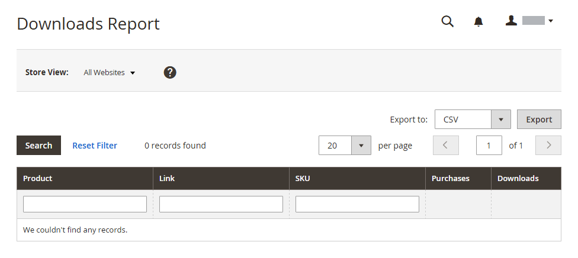

# Informes del producto

Los informes de productos le proporcionan información sobre los productos vistos y pedidos, los más vendidos, los niveles de stock y las descargas.

## [!UICONTROL Product Views Report]

El [!UICONTROL Product Views Report] muestra los productos que se han visto durante un intervalo de tiempo o un intervalo de fechas. El informe incluye el nombre del producto, el precio y el número de vistas.

En la barra lateral _Admin_, vaya a **[!UICONTROL Reports]** > _[!UICONTROL Products]_>**[!UICONTROL Views]**.

{width="600"}

## [!UICONTROL Bestsellers Report]

[!UICONTROL Bestsellers Report] muestra los cinco más vendidos durante un intervalo de tiempo o intervalo de fechas. El informe incluye el nombre del producto, el precio y la cantidad solicitada.

En la barra lateral _Admin_, vaya a **[!UICONTROL Reports]** > _[!UICONTROL Products]_>**[!UICONTROL Bestsellers]**.

{width="600"}

## [!UICONTROL Low Stock Report]

El [!UICONTROL Low Stock Report] enumera todos los productos con niveles de stock dentro de un rango especificado. Con [[!DNL Inventory Management]](../inventory-management/introduction.md) habilitado, el informe incluye cantidades bajas de inventario de existencias por origen con el código fuente enumerado.

En la barra lateral _Admin_, vaya a **[!UICONTROL Reports]** > _[!UICONTROL Products]_>**[!UICONTROL Low Stock]**.

{width="600"}

## [!UICONTROL Ordered Products Report]

El [!UICONTROL Ordered Products Report] enumera todos los productos pedidos para un intervalo de tiempo o un intervalo de fecha especificados. El informe incluye el nombre del producto y la cantidad solicitada.

En la barra lateral _Admin_, vaya a **[!UICONTROL Reports]** > _[!UICONTROL Products]_>**[!UICONTROL Ordered]**.

{width="600"}

## [!UICONTROL Downloads Report]

[!UICONTROL Downloads Report] enumera todas las descargas durante el intervalo de tiempo o el intervalo de fecha especificados. El informe incluye el nombre del producto, el vínculo de descarga y el SKU, con el número de compras y descargas.

En la barra lateral _Admin_, vaya a **[!UICONTROL Reports]** > _[!UICONTROL Products]_>**[!UICONTROL Downloaded]**.

{width="600"}
