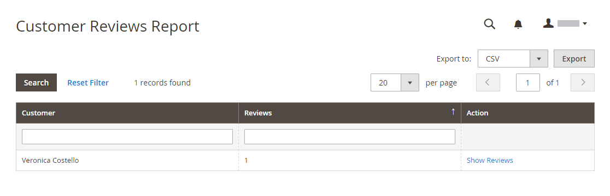

# Revisar informes

Si utiliza el complemento integrado de [!DNL Commerce] Los informes de revisión proporcionan información sobre revisiones de productos por cliente y por producto.

## [!UICONTROL Customer Reviews Report]

El [!UICONTROL Customer Reviews Report] proporciona una lista de todos los clientes que han enviado críticas de productos. El informe incluye el número de revisiones enviadas por cada cliente y un vínculo a la lista de revisiones.

En el _Administrador_ barra lateral, vaya a **[!UICONTROL Reports]** > _[!UICONTROL Reviews]_>**[!UICONTROL By Customers]**.

{width="600"}

## [!UICONTROL Product Reviews Report]

El [!UICONTROL Product Reviews Report] enumera todos los productos que han revisado los clientes. El informe incluye el número de reseñas y la clasificación promedio, la última revisión del producto y un vínculo a la lista de reseñas de cada producto.

En el _Administrador_ barra lateral, vaya a **[!UICONTROL Reports]** > _[!UICONTROL Reviews]_>**[!UICONTROL By Products]**.

{width="600"}
