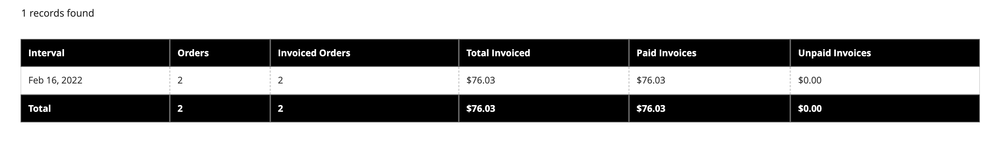

# Informes de ventas

La selección de informes de ventas incluye Pedidos, Impuestos, Facturados, Envíos, Devoluciones, Cupones y Liquidación de PayPal.

## Filtros de informes

Puede generar un informe de ventas para un sitio web completo o para una tienda. Los informes de ventas pueden filtrarse por intervalo de tiempo, fecha y estado.

{width="600"}

Para filtrar un informe de ventas, defina las siguientes opciones:

| Opción | Descripción |
|--- |--- |
| [!UICONTROL Date Used] | Establece los datos que se utilizarán para el informe. |
| [!UICONTROL Period] | Período para el que se utilizan los datos: día/mes/año. |
| [!UICONTROL From/To] | Se utiliza para definir los datos de búsqueda por fecha de inicio y finalización. |
| [!UICONTROL Order Status] | Indica el estado del pedido |
| [!UICONTROL Empty Rows] | Indica si se deben agregar filas en blanco al informe. |

## [!UICONTROL Orders Report]

[!UICONTROL Orders Report] incluye el número de pedidos realizados y cancelados, con totales de ventas, importes facturados, reembolsados, impuestos cobrados, gastos de envío cargados y descuentos.

1. En la barra lateral _Admin_, vaya a **[!UICONTROL Reports]** > _[!UICONTROL Sales]_>**[!UICONTROL Orders]**.

1. En la sección **[!UICONTROL Filter]**, seleccione las opciones del período de informe y el estado del pedido utilizados para rellenar el informe.

1. Haga clic en **[!UICONTROL Show Report]**.

{width="600"}

## [!UICONTROL Tax Report]

El [!UICONTROL Tax Report] incluye la regla de impuestos aplicada, la tasa de impuestos, el número de pedidos y la cantidad de impuestos cobrados.

1. En la barra lateral _Admin_, vaya a **[!UICONTROL Reports]** > _[!UICONTROL Sales]_>**[!UICONTROL Tax]**.

1. En la sección **[!UICONTROL Filter]**, seleccione las opciones del período de informe y el estado del pedido utilizados para rellenar el informe.

1. Haga clic en **[!UICONTROL Show Report]**.

{width="600"}

## [!UICONTROL Invoice Report]

[!UICONTROL Invoice Report] incluye el número de pedidos y facturas durante el período de tiempo, con importes facturados, pagados y no pagados.

1. En la barra lateral _Admin_, vaya a **[!UICONTROL Reports]** > _[!UICONTROL Sales]_>**[!UICONTROL Invoiced]**.

1. En la sección **[!UICONTROL Filter]**, seleccione las opciones del período de informe y el estado del pedido utilizados para rellenar el informe.

1. Haga clic en **[!UICONTROL Show Report]**.

{width="600"}

## [!UICONTROL Shipping Report]

[!UICONTROL Shipping Report] incluye el número de pedidos del transportista o método de envío utilizado, incluidos los importes de las ventas totales y el envío total.

1. En la barra lateral _Admin_, vaya a **[!UICONTROL Reports]** > _[!UICONTROL Sales]_>**[!UICONTROL Shipping]**.

1. En la sección **[!UICONTROL Filter]**, seleccione las opciones del período de informe y el estado del pedido utilizados para rellenar el informe.

1. Haga clic en **[!UICONTROL Show Report]**.

{width="600"}

## [!UICONTROL Refunds Report]

[!UICONTROL Refunds Report] incluye el número de pedidos reembolsados y el importe total reembolsado en línea y sin conexión.

1. En la barra lateral _Admin_, vaya a **[!UICONTROL Reports]** > _[!UICONTROL Sales]_>**[!UICONTROL Refunds]**.

1. En la sección **[!UICONTROL Filter]**, seleccione las opciones del período de informe y el estado del pedido utilizados para rellenar el informe.

1. Haga clic en **[!UICONTROL Show Report]**.

{width="600"}

## [!UICONTROL Coupons Report]

[!UICONTROL Coupons Report] incluye cada código de cupón utilizado durante el intervalo de tiempo especificado, la regla de precio relacionada y el número de veces utilizado, con totales y subtotales de ventas y descuentos.

1. En la barra lateral _Admin_, vaya a **[!UICONTROL Reports]** > _[!UICONTROL Sales]_>**[!UICONTROL Coupons]**.

1. En la sección **[!UICONTROL Filter]**, seleccione las opciones del período de informe y el estado del pedido utilizados para rellenar el informe.

1. Haga clic en **[!UICONTROL Show Report]**.

Para obtener más información acerca del uso de [!UICONTROL Coupons Report] con el fin de recopilar datos para sus campañas de promoción, consulte [Informes de cupones](../merchandising-promotions/price-rules-cart-coupon.md#coupons-report) en la _Guía de comercialización y promociones_.

<!---  need coupon data  -->

## [!UICONTROL PayPal Settlement Reports]

La página [Informes de liquidación de PayPal] incluye el tipo de evento, como una transacción con tarjeta de débito, las fechas de inicio y finalización, el importe bruto y las tarifas relacionadas. El informe se puede actualizar automáticamente con los datos más actuales de PayPal. Existen opciones de filtrado para el intervalo de fechas, la cuenta de comerciante, el ID de transacción, el ID de factura o el ID de referencia de PayPal.

En la barra lateral _Admin_, vaya a **[!UICONTROL Reports]** > _[!UICONTROL Sales]_>**[!UICONTROL PayPal Settlement]**.

{width="600"}

Para obtener más información sobre cómo usar [!UICONTROL PayPal Settlement Reports] para recuperar información sobre cada transacción de PayPal que afecte a la liquidación de fondos, consulte [Informes de liquidación de PayPal](../stores-purchase/paypal-settlement-reports.md) en la _Guía de tiendas y compras_.

## [!UICONTROL Braintree Settlement Report]

El informe de liquidación [Braintree](../stores-purchase/braintree.md) se puede filtrar según la fecha de creación, el importe, el estado, el tipo de transacción, el tipo de pago, el ID de transacción, el ID de pedido, el ID de pago de PayPal, el tipo, el ID de cuenta de comerciante o el ID de lote de liquidación. El informe contiene el ID de transacción, el ID de pedido, el ID de pago de PayPal, el tipo, la fecha de creación, el importe, el código de liquidación, el estado, el texto de respuesta de liquidación, los ID de reembolso, el ID de cuenta de comerciante, el ID de lote de liquidación y la divisa.

En la barra lateral _Admin_, vaya a **[!UICONTROL Reports]** > _[!UICONTROL Sales]_>**[!UICONTROL Braintree Settlement]**.

<!---  need a Braintree connection to update report screen -->

## Exportación de informes

1. Para exportar el informe, seleccione el tipo de archivo: `Excel XML` o `CSV`

1. Haga clic en **[!UICONTROL Export]**.

## Actualizar estadísticas

Para reducir el impacto en el rendimiento de la generación de informes de ventas, [!DNL Commerce] calcula y almacena las estadísticas necesarias para cada informe. En lugar de volver a calcular las estadísticas cada vez que se genera un informe, se utilizan las estadísticas almacenadas, a menos que actualice las estadísticas. Para incluir los datos más recientes, las estadísticas del informe deben actualizarse antes de generar un informe de ventas.

{width="700"}

1. En la barra lateral _Admin_, vaya a **[!UICONTROL Reports]** > _[!UICONTROL Statistics]_>**[!UICONTROL Refresh Statistics]**.

1. En la lista, active la casilla de verificación de cada informe que desee actualizar.

1. Establezca el control **[!UICONTROL Actions]** en uno de los siguientes:

   - `Refresh Lifetime Statistics`
   - `Refresh Statistics for the Last Day`

1. Haga clic en **[!UICONTROL Submit]**.
