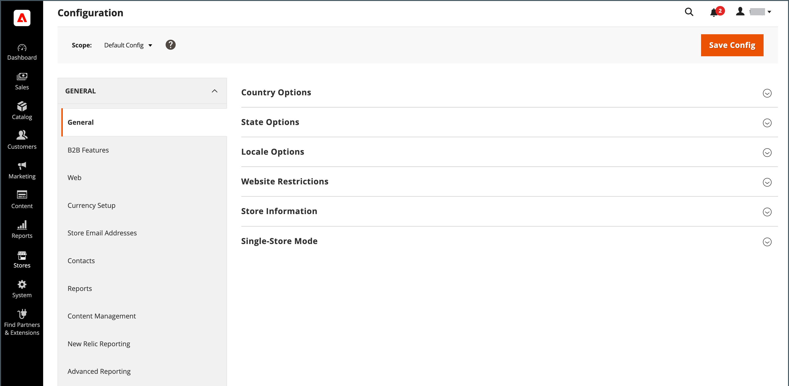
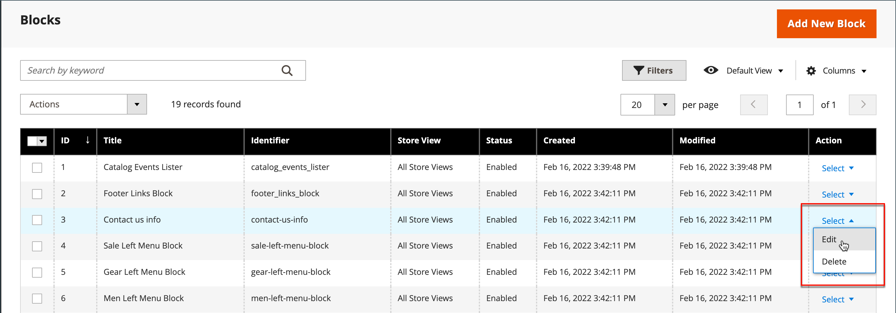

# Detalles de tienda

La información básica de la tienda incluye el nombre y la dirección de la tienda, el número de teléfono y la dirección de correo electrónico que aparecen en los mensajes de correo electrónico, las facturas y otras comunicaciones enviadas a los clientes.

{width="900" zoomable="yes"}

## [!UICONTROL Store Information]

El _[!UICONTROL Store Information]_proporciona la información básica que aparece en los documentos de venta y en otras comunicaciones.

1. En el _Administrador_ barra lateral, vaya a **[!UICONTROL Stores]** > _[!UICONTROL Settings]_>**[!UICONTROL Configuration]**.

1. En **[!UICONTROL General]** en el panel de navegación izquierdo, elija **[!UICONTROL General]**.

1. Expandir  el **[!UICONTROL Store Information]** sección.

   {width="700"}

1. Configure las opciones según los detalles de la tienda:

   - Introduzca el **[!UICONTROL Store Name]** que desee utilizar en todas las comunicaciones.

   - Introduzca el **[!UICONTROL Store Phone Number]**, con el formato que desee que aparezca.

   - Para **[!UICONTROL Store Hours of Operation]**, introduzca las horas de apertura de su tienda. Por ejemplo: `Mon - Fri, 9-5, Sat 9-noon PST`.

   - Seleccione el **[!UICONTROL Country]** dónde se encuentra su empresa.

   - Seleccione el **[!UICONTROL Region/State]** con el país.

   - Introduzca el **[!UICONTROL Store Address]**. Si la dirección es larga, continúe con la dirección en **Línea 2 de dirección de tienda**.

   - Si procede, introduzca la variable **[!UICONTROL VAT Number]** de su tienda.

     Para comprobar el número, haga clic en **[!UICONTROL Validate VAT Number]** botón. Para obtener más información, consulte [Validación de ID de IVA](../stores-purchase/vat.md#vat-id-validation).

1. Cuando termine, haga clic en **[!UICONTROL Save Config]**.

Para obtener más información sobre las opciones de configuración de información de almacén, consulte la [_Guía de referencia de configuración_](../configuration-reference/general/general.md#store-information).

## [!UICONTROL Locale Options]

La configuración regional determina la mayoría de las opciones de configuración que se usan en el almacén. Algunos de ellos son:

- Idioma
- País
- Tipo impositivo
- Moneda
- Precio
- Formato de número

La configuración regional determina la zona horaria y el idioma utilizados para cada tienda e identifica los días de la semana laboral en el área.

1. En el _Administrador_ barra lateral, vaya a **[!UICONTROL Stores]** > _[!UICONTROL Settings]_>**[!UICONTROL Configuration]**.

1. En el panel de navegación izquierdo, debajo de **[!UICONTROL General]**, elija **[!UICONTROL General]**.

1. Expandir  el **[!UICONTROL Locale Options]** sección.

   {width="700"}

1. Seleccione su **[!UICONTROL Timezone]** de la lista.

1. Establecer **[!UICONTROL Locale]** al idioma de la tienda.

1. Establecer **[!UICONTROL Weight Unit]** a la unidad de medida que se utiliza normalmente para los envíos desde su configuración regional.

1. Establecer **[!UICONTROL First Day of the Week]** al día que se considere el primer día de la semana en su área.

1. En el **[!UICONTROL Weekend Days]** , seleccione los días que caen en un fin de semana en su área.

   Para seleccionar varios días, mantenga presionada la tecla Ctrl (PC) o la tecla Comando (Mac) y haga clic en cada elemento.

1. Cuando termine, haga clic en **[!UICONTROL Save Config]**.

Para obtener más información sobre las opciones de configuración de configuración regional, consulte la [Guía de referencia de configuración](../configuration-reference/general/general.md#locale-options).

## [!UICONTROL State Options]

En muchos países, el estado, la provincia o la región es una parte obligatoria de una dirección postal. La información se utiliza para la información de envío y facturación, para calcular las tasas de impuestos, etc. En los países en los que el estado no es obligatorio, el campo se puede omitir por completo de la dirección o incluirse como campo opcional.

Dado que los formatos de dirección estándar varían de un país a otro, también puede editar la plantilla que se utiliza para dar formato a la dirección de las facturas, los albaranes y las etiquetas de envío.

1. En el _Administrador_ barra lateral, vaya a **[!UICONTROL Stores]** > _[!UICONTROL Settings]_>**[!UICONTROL Configuration]**.

1. En **[!UICONTROL General]** en el panel de navegación izquierdo, elija **[!UICONTROL General]**.

1. Expandir  el **[!UICONTROL State Options]** sección.

   {width="700"}

1. Utilice el **[!UICONTROL State is required for]** para seleccionar cada país donde Región/Estado sea una entrada obligatoria.

1. Establecer **[!UICONTROL Allow to Choose State if it is Optional for Country]** a uno de los siguientes:

   `Yes` - En países donde el campo de estado no es obligatorio, incluye el campo de estado como entrada opcional.

   `No` - En los países donde el campo de estado no es obligatorio, omite el campo de estado.

1. Cuando termine, haga clic en **[!UICONTROL Save Config]**.

Para obtener más información sobre las opciones de configuración de estado, consulte la [Guía de referencia de configuración](../configuration-reference/general/general.md#state-options).

## [!UICONTROL Country Options]

Las opciones de país identifican el país donde se encuentra su negocio y los países desde los que acepta el pago.

### Establece las opciones de país para tu tienda

1. En el _Administrador_ barra lateral, vaya a **[!UICONTROL Stores]** > _[!UICONTROL Settings]_>**[!UICONTROL Configuration]**.

1. En el panel de navegación izquierdo, debajo de **[!UICONTROL General]**, elija **[!UICONTROL General]**.

1. Expandir  el **[!UICONTROL Country Options]** sección.

   >[!NOTE]
   >
   >Si es necesario, borre la **[!UICONTROL Use system value]** para cada configuración que desee cambiar.

   {width="700"}

1. Elija la **[!UICONTROL Default Country]** dónde se encuentra su empresa.

1. En el **[!UICONTROL Allow Countries]** , seleccione cada país desde el que acepta pedidos.

   De forma predeterminada, se seleccionan todos los países de la lista. Para seleccionar varios países, mantenga presionada la tecla Ctrl (PC) o la tecla Comando (Mac) y haga clic en cada elemento.

1. Utilice el **[!UICONTROL Zip/Postal Code is Optional for]** para seleccionar cada país en el que realice negocios que no requieran que se incluya un código postal como parte de la dirección postal.

1. En el **[!UICONTROL European Union Countries]** , seleccione cada país de la UE en el que lleve a cabo su actividad comercial.

   De forma predeterminada, se seleccionan todos los países de la UE. Para seleccionar los países que necesita, mantenga presionada la tecla Ctrl (PC) o la tecla Comando (Mac) y haga clic en cada elemento.

1. En el **[!UICONTROL Top Destinations]** , seleccione los países principales a los que desea destinar las ventas.

1. Cuando termine, haga clic en **[!UICONTROL Save Config]**.

### Definir las opciones de país para un método de envío específico

También puede configurar el envío a países específicos para cada disponible [método de envío](../stores-purchase/delivery.md) (UPS, FedEx, etc.).

1. En el _Administrador_ barra lateral, vaya a **[!UICONTROL Stores]** > _[!UICONTROL Settings]_>**[!UICONTROL Configuration]**.

1. En el panel de navegación izquierdo, expanda **[!UICONTROL Sales]** y elija **[!UICONTROL Delivery Methods]**.

1. Seleccione el transportista al que desea aplicar determinados países.

1. Para **[!UICONTROL Ship to Applicable Countries]**, anule la selección del **[!UICONTROL Use system value]** y seleccione la **[!UICONTROL Specific Countries]** opción.

1. En el **[!UICONTROL Top Destinations]** , seleccione los países principales de destino para el envío.

   {width="700"}

1. Cuando termine, haga clic en **[!UICONTROL Save Config]**.

### Solución de problemas de recursos

Para obtener ayuda sobre la resolución de problemas de configuración de país, consulte los siguientes temas [!DNL Commerce] Artículos de Knowledge Base de soporte:

- [Cómo añadir un país](https://experienceleague.adobe.com/docs/commerce-knowledge-base/kb/how-to/how-to-add-a-new-country-to-magento-2.html)
- [El countryId proporcionado no existe](https://experienceleague.adobe.com/docs/commerce-knowledge-base/kb/support-tools/patches/v1-0-15/mdva-33393-magento-patch-provided-countryid-does-not-exist.html)

## [!UICONTROL Merchant Location]

La configuración Ubicación del comerciante se utiliza para configurar [métodos de pago](../stores-purchase/payments.md). Si no hay ningún valor para esta configuración, la variable [País predeterminado](#uicontrol-country-options) se utiliza el ajuste.

1. En el _Administrador_ barra lateral, vaya a **[!UICONTROL Stores]** > _[!UICONTROL Settings]_>**[!UICONTROL Configuration]**.

1. En el panel de navegación izquierdo, expanda **[!UICONTROL Sales]** y elija **[!UICONTROL Payment Methods]**.

1. Expandir  el **Ubicación del comerciante** y elija su **[!UICONTROL Merchant Country]**.

   {width="600"}

1. Cuando termine, haga clic en **[!UICONTROL Save Config]**.

Para obtener más información sobre las opciones de configuración de Métodos de pago, consulte la [Guía de referencia de configuración](../configuration-reference/sales/payment-methods.md).

## Moneda

Configuración de moneda: define la base [moneda](../stores-purchase/currency-configuration.md) y cualquier divisa adicional que se acepte como pago. Establece también la conexión y programación de importación que se utiliza para actualizar las tasas de cambio automáticamente.

Símbolos de moneda: define la variable [símbolos de moneda](../stores-purchase/currency-configuration.md#step-5-customize-currency-symbols-optional) que aparecen en precios de productos y documentos de venta, como pedidos y facturas. [!DNL Commerce] admite monedas de más de 200 países de todo el mundo.

Actualización de Tipos de Cambio de Divisa: Los tipos de cambio de divisa pueden ser [actualizado](../stores-purchase/currency-update.md) manualmente o importando en su tienda según sea necesario, o según una programación predefinida.

Selector de moneda: si hay varias monedas disponibles, la variable [selector de moneda](../stores-purchase/currency.md) está disponible en el encabezado de la tienda.

## [!UICONTROL Store Email Addresses]

Puede tener hasta cinco direcciones de correo electrónico diferentes para representar funciones o departamentos distintos para cada tienda o vista. Además de las siguientes identidades de correo electrónico predefinidas, hay algunas identidades personalizadas que puede configurar según sus necesidades.

- Contacto general
- Representante de ventas
- Atención al cliente

Cada identidad y su dirección de correo electrónico asociada se pueden asociar con mensajes de correo electrónico automatizados específicos y aparecen como el remitente de los mensajes de correo electrónico que se envían desde la tienda.

### Paso 1: Configurar las direcciones de correo electrónico para su dominio

Para poder configurar las direcciones de correo electrónico de la tienda, debe configurarse cada una de ellas como una dirección de correo electrónico válida para su dominio. Para crear cada dirección de correo electrónico necesaria, siga las instrucciones del administrador del servidor o del proveedor de alojamiento de correo electrónico.

### Paso 2: Configurar las direcciones de correo electrónico de la tienda

1. En el _Administrador_ barra lateral, vaya a **[!UICONTROL Stores]** > _[!UICONTROL Settings]_>**[!UICONTROL Configuration]**.

1. En **[!UICONTROL General]** en el panel de navegación izquierdo, elija **[!UICONTROL Store Email Addresses]**.

1. Expandir  el **[!UICONTROL General Contact]** y haga lo siguiente:

   {width="600"}

   - Para **[!UICONTROL Sender Name]**, introduzca el nombre de la persona asociada con la identidad del contacto general para que aparezca como el remitente de cualquier mensaje de correo electrónico.

   - Para **[!UICONTROL Sender Email]**, introduzca la dirección de correo electrónico asociada.

1. Repita este proceso para cada dirección de correo electrónico de tienda que vaya a utilizar.

1. Cuando termine, haga clic en **[!UICONTROL Save Config]**.

### Paso 3: Actualizar la configuración del correo electrónico de ventas

Si utiliza direcciones de correo electrónico personalizadas, asegúrese de actualizar la configuración de cualquier mensaje de correo electrónico relacionado para que la identidad correcta aparezca como el remitente.

1. En el panel de navegación izquierdo, expanda **[!UICONTROL Sales]** y elija **[!UICONTROL Sales Emails]**.

   La página tiene una sección independiente para cada una de las siguientes opciones:

   - Comentarios sobre pedidos y pedidos
   - Factura y comentarios de factura
   - Comentarios sobre envíos y envíos
   - Notas de Abono y Comentarios de Notas de Abono
   - RMA, Autorización de RMA, Comentarios del Administrador de RMA y Comentarios del Cliente de RMA  (solo Adobe Commerce)

1. Primeros pasos con **[!UICONTROL Order]**, expanda la sección para cada mensaje y asegúrese de que está seleccionado el remitente correcto.

   {width="600"}

1. Cuando termine, haga clic en **[!UICONTROL Save Config]**.

Para obtener más información sobre las opciones de configuración de Correos electrónicos de ventas, consulte la [_Guía de referencia de configuración_](../configuration-reference/sales/sales-emails.md).

## Formulario de contacto

El _Contáctenos._ El enlace en el pie de página de la tienda es una manera fácil para que los clientes se mantengan en contacto con usted. Los clientes pueden completar el formulario para enviar un mensaje a su tienda. Un estándar [!DNL Commerce] instalación muestra la opción predeterminada _Contáctenos._ formulario. Después de enviar el formulario, aparece un mensaje de agradecimiento

Es importante comprender que el formulario predeterminado Póngase en contacto con nosotros se procesa directamente desde el código en lugar de desde una página de CMS.

{width="700"}

El pie de página de la tienda incluye un vínculo a la página Póngase en contacto con nosotros que está disponible en toda la tienda.

{width="700"}

Los datos de ejemplo de Luma incluyen información adicional sobre la página Póngase en contacto con nosotros que muestra cómo puede personalizar la página para su tienda.

{width="700"}

### Configuración del formulario de contacto

1. En el _Administrador_ barra lateral, vaya a **[!UICONTROL Stores]** > _[!UICONTROL Settings]_>**[!UICONTROL Configuration]**.

1. En el panel de navegación izquierdo, debajo de **[!UICONTROL General]**, elija **[!UICONTROL Contacts]**.

1. Expandir  el **[!UICONTROL Contact Us]** sección y conjunto **[!UICONTROL Enable Contact Us]** hasta `Yes`.

   {width="600"}

1. Expandir  el **[!UICONTROL Email Options]** y establezca las opciones de contacto de correo electrónico:

   {width="600"}

   - Para **[!UICONTROL Send Emails to]**, introduzca la dirección de correo electrónico a la que se envían los mensajes del formulario Contáctenos.

   - Establecer **[!UICONTROL Email Sender]** a la identidad del almacén que aparece como el remitente del mensaje desde el formulario Contáctenos. Por ejemplo: Correo electrónico personalizado 2.

   - Establecer **[!UICONTROL Email Template]** a la plantilla que se utiliza para los mensajes enviados desde el formulario Contáctenos.

1. Cuando termine, haga clic en **[!UICONTROL Save Config]**.

### Personalización del contenido

Puede personalizar el contenido en la variable _Contáctenos._ formulario adaptado a las necesidades de su tienda y a las políticas de servicio al cliente.

### Método 1: Uso de datos de ejemplo

Los datos de ejemplo de Luma incluyen una _Información de contacto_ bloque que se puede personalizar para su tienda. El `contact-us-info` [bloquear](../content-design/blocks.md) puede modificarse fácilmente para añadir su propio contenido a la página Contáctenos.

1. En el _Administrador_ barra lateral, vaya a **[!UICONTROL Content]** > _[!UICONTROL Elements]_>**[!UICONTROL Blocks]**.

1. Busque el **[!UICONTROL Contact Us Info]** bloque en la lista y abrir en **[!UICONTROL Edit]** modo.

   {width="700"}

1. En la parte inferior de la página del bloque, haga clic en **[!UICONTROL Edit with Page Builder]**.

   {width="700"}

   >[!NOTE]
   >
   >Si tiene [[!DNL Page Builder] inhabilitado](../page-builder/setup.md#disable-dnl-page-builder), puede utilizar el editor [toolbar](../content-design/editor.md) para dar formato al texto y agregue [imágenes](../content-design/editor-insert-image.md) y [vínculos](../content-design/editor-insert-link.md).

1. Pase el ratón sobre el contenedor del HTML para mostrar el cuadro de herramientas y seleccione _Configuración_ (  ) icono.

1. Edite el código del HTML según proporcione la información de contacto de la tienda y haga clic en **[!UICONTROL Save]**.

   {width="700"}

1. Salga del [!DNL Page Builder] stage y click **[!UICONTROL Save Block]**.

### Método 2: Sin datos de ejemplo

>[!IMPORTANT]
>
>A partir de la versión 2.4.0, el formulario de contacto ya no puede llamar dentro de un bloque CMS o una página CMS. Toda personalización del formulario de contacto debe realizarse utilizando el xml de diseño o plantillas de temas personalizadas.

De forma predeterminada, los compradores acceden al formulario de contacto mediante la variable _Vínculo de contacto_ al pie de las páginas de la tienda. Para obtener más información sobre cómo personalizar la página de contacto, consulte la [Guía para desarrolladores de Frontend][theme-guide].

[theme-guide]: https://developer.adobe.com/commerce/frontend-core/guide/themes/
