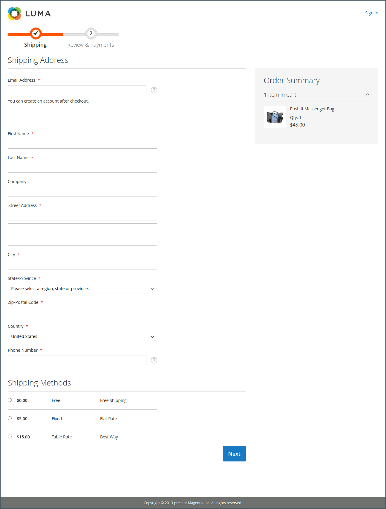

# ¿Qué es la tienda?

Dentro de la implementación de Adobe Commerce o Magento Open Source, la tienda es la parte externa y pública de la tienda. Proporciona el contenido y los componentes funcionales que sus clientes utilizan para realizar compras y realizar compras.

La ruta que toman los clientes a una venta a veces se denomina _ruta de compra_ y la tienda incluye los componentes para que los clientes completen esta ruta. Las siguientes secciones ofrecen una descripción general de los tipos de página básicos que proporcionan un valor estratégico: los lugares que los clientes suelen visitar mientras compran en su tienda. A medida que las revise, tenga en cuenta las diferentes funciones de la tienda que se pueden utilizar en cada fase del recorrido del cliente.

## Commerce Storefront

Con la presentación de [!DNL **Commerce Storefront con tecnología Edge Delivery Services**], Adobe ofrece una tienda confiable, escalable y de alto rendimiento que aprovecha la tecnología de vanguardia para ofrecer velocidad y experiencia de usuario superiores.

- **Rendimiento mejorado**: Alojar tiendas en Edge Delivery Services garantiza tiempos de carga más rápidos y un rendimiento del sitio mejorado, lo que puede llevar a tasas de conversión más altas y mejores clasificaciones de SEO.

- **Escalabilidad**: la arquitectura admite escalado sin problemas para gestionar el tráfico en aumento y catálogos de productos más grandes sin poner en riesgo el rendimiento.

- **Flexibilidad**: la tienda es altamente personalizable, lo que permite a las empresas adaptar la experiencia de compra a sus necesidades únicas.

- **Experiencia del usuario mejorada**: Algunas características, como el almacenamiento en caché avanzado, las actualizaciones en tiempo real y la entrega de contenido personalizado, contribuyen a que la experiencia de compra sea más fluida y atractiva.

### Características principales

Commerce Storefront con tecnología Edge Delivery Services ofrece varias funciones clave que benefician tanto a los comerciantes como a los desarrolladores. Estas funciones permiten a las empresas crear experiencias de compra atractivas a la vez que mantienen la flexibilidad para personalizar y escalar sus tiendas según sus necesidades.

Para obtener información e instrucciones más detalladas sobre cómo configurar y optimizar tu tienda Commerce, consulta la [Documentación de Adobe Commerce Storefront](https://experienceleague.adobe.com/en/docs/commerce).

>[!BEGINTABS]

>[!TAB Comerciantes]

Commerce Storefront con tecnología Edge Delivery Services ofrece una experiencia de creación intuitiva basada en documentos que facilita a los comerciantes la creación y administración de contenido. Con herramientas familiares como Microsoft Word o Google Docs, los comerciantes pueden crear contenido enriquecido manteniendo el control de versiones y colaborando con los integrantes del equipo.

- **Creación de contenido simplificada**: cree y edite contenido con herramientas conocidas de creación basada en documentos, como Microsoft Word o Google Docs.
- **Vista previa en tiempo real**: Vea los cambios al instante con las capacidades de vista previa en vivo antes de publicar.
- **Control de versiones**: Rastrea cambios de contenido y vuelve fácilmente a las versiones anteriores.
- **Flujo de trabajo colaborativo**: varios integrantes del equipo pueden trabajar en el contenido simultáneamente con procesos de revisión integrados.
- **Reutilización de contenido**: cree bloques de contenido que se puedan reutilizar en varias páginas para mantener la coherencia.

>[!TAB Desarrolladores]

La implementación sin encabezado permite a los desarrolladores desvincular la capa de presentación de front-end de la funcionalidad de comercio back-end, lo que permite tiendas personalizadas flexibles creadas con tecnologías modernas y, al mismo tiempo, aprovechar los sólidos servicios back-end de Commerce.

- **Arquitectura API-First**: cree experiencias de front-end personalizadas con marcos modernos mientras aprovecha los servicios back-end de Commerce.
- **Componentes componibles**: cree e implemente componentes modulares reutilizables que se puedan ensamblar en diferentes diseños de página.
- **Plataforma ampliable**: agregue funcionalidad personalizada a través de API y webhooks sin modificar el código principal.
- **Herramientas modernas de desarrollo**: use las herramientas y los flujos de trabajo de desarrollo estándar del sector para una implementación más rápida.

>[!ENDTABS]

>[!NOTE]
>
>Aunque la tienda de Commerce ofrece numerosas ventajas, Adobe sigue siendo compatible con la tienda original basada en Luma. Las empresas que actualmente utilizan Luma pueden seguir funcionando sin interrupciones y tienen la opción de pasar a la nueva tienda a su propio ritmo. Las secciones restantes de esta página se basan en ejemplos de Luma.

## Página de inicio

¿Sabías que la mayoría de las personas pasan solo unos segundos en una página antes de decidir quedarse o ir a otro lugar? No es mucho tiempo para hacer una impresión. Los estudios muestran que la gente también ama las fotografías, especialmente de otras personas. Sea cual sea el diseño que elija, todo lo que aparezca en su página de inicio debería llevar a los visitantes al siguiente paso del proceso de ventas. La idea es guiar su atención en un flujo cohesivo de un punto de interés al siguiente.

{width="700"}

## Página de catálogo

Las listas de páginas de catálogo suelen tener pequeñas imágenes de producto y descripciones breves, y pueden tener el formato de una lista o de una cuadrícula. Puede agregar bloques, vídeos y descripciones con palabras clave enriquecidas, así como crear diseños especiales para una promoción o temporada. Puede crear una categoría especial para mostrar un estilo de vida o una marca que sea una colección depurada de productos de diferentes categorías.

La descripción inicial del producto suele proporcionar a los compradores información suficiente para merecer una mirada más atenta. Las personas que saben lo que quieren pueden agregar el producto a sus carros de compras y marcharse. Los clientes que compran con una sesión iniciada en sus cuentas de disfrutan de una experiencia de compra personalizada.

{width="700"}

## Resultados de búsqueda

¿Sabía que las personas que utilizan la búsqueda tienen casi el doble de probabilidades de realizar una compra que las personas que dependen solo de la navegación? Puedes considerar a estos compradores como _preseleccionados_.

### [!DNL Live Search]

Con [[!DNL Live Search]](https://experienceleague.adobe.com/en/docs/commerce/live-search/overview) para Adobe Commerce, tu tienda ofrece una experiencia de búsqueda rápida, relevante e intuitiva, y está disponible para Adobe Commerce sin cargo adicional.

{width="700"}

### Búsqueda en el catálogo estándar

Con [búsqueda estándar en el catálogo](../catalog/search.md), tu tienda incluye un cuadro de búsqueda en la esquina superior derecha y un vínculo a Búsqueda avanzada en el pie de página. Todos los términos de búsqueda que los compradores envían se guardan para que pueda ver exactamente lo que están buscando. Puede ofrecer sugerencias e introducir sinónimos y errores ortográficos comunes. A continuación, muestre una página específica cuando introduzca un término de búsqueda.

{width="700"}

## Página de productos

¡La página de productos tiene muchas cosas en marcha! Lo primero que llama la atención en la página de producto es la imagen principal con un zoom de alta resolución y galería de miniaturas. Además del precio y la disponibilidad, hay una sección con pestañas con más información y una lista de productos relacionados.

{width="700"}

## Carro de compras

El carro de compras muestra el total del pedido, incluidos los cupones de descuento, el envío estimado y los impuestos. Estas características lo convierten en un buen lugar para mostrar distintivos y sellos de confianza. También puede utilizar la página del carro de compras como una oportunidad para una oferta final. Por ejemplo, puede configurar artículos de venta cruzada que aparezcan como opciones de compra por impulso cuando haya productos específicos en el carro de compras.

{width="700"}

## Página de cierre de compra

El proceso de cierre de compra consta de dos pasos:

1. Información de envío

   El primer paso del proceso de cierre de compra es que el cliente complete la información de la dirección de envío y elija el método de envío. Si el cliente tiene una cuenta, la dirección de envío se introduce automáticamente, pero se puede cambiar si es necesario.
Si un cliente invitado escribe una dirección de correo electrónico que se reconoce como registrada anteriormente, se mostrará el mensaje de inicio de sesión si el campo [!UICONTROL Enable Guest Checkout Login] de la configuración del almacén está establecido en `Yes` (consulte [[!UICONTROL Checkout Options]](../configuration-reference/sales/checkout.md#checkout-options) en la _Guía de referencia de configuración_). Sin embargo, esta configuración puede exponer la información del cliente a usuarios no autenticados.

   {width="700"}

1. Revisar e información de pago

   El segundo paso del proceso de cierre de compra es que el cliente seleccione el método de pago y, opcionalmente, aplique un código de descuento.

   >[!NOTE]
   >
   >Aunque [!DNL Commerce] permite configurar varios códigos de cupones, un cliente puede aplicar únicamente un código de cupón al carro de compras. (Consulte [Códigos de cupón](../merchandising-promotions/price-rules-cart-coupon.md#coupon-codes) para obtener más información).

   {width="700"}

La barra de progreso situada en la parte superior de la página sigue cada paso del proceso de cierre de compra y _Resumen de pedidos_ muestra la información que se ha introducido hasta este momento.

>[!NOTE]
>
>La excepción a un cierre de compra de dos pasos se aplica a los productos virtuales o descargables. Si solo hay estos tipos de productos en el carro de compras, el cierre de compra se transforma automáticamente en un procedimiento de un solo paso, ya que no se requiere información de envío.
