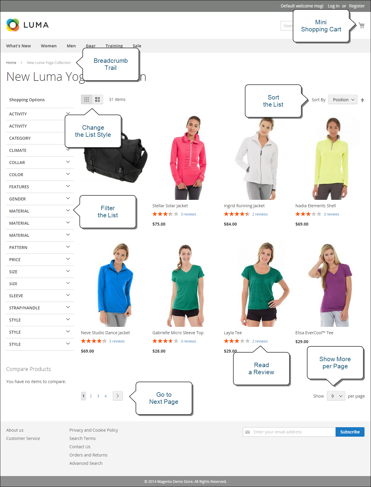

# ¿Qué es la tienda?

Dentro de la implementación de Adobe Commerce o Magento Open Source, la tienda es la parte externa y pública de la tienda. Proporciona el contenido y los componentes funcionales que sus clientes utilizan para realizar compras y realizar compras.

La ruta que los clientes siguen para llegar a una venta a veces se denomina _ruta de compra_ y la tienda incluye los componentes para que los clientes completen esta ruta. Las siguientes secciones ofrecen una descripción general de los tipos de página básicos que proporcionan un valor estratégico: los lugares que los clientes suelen visitar mientras compran en su tienda. A medida que las revise, tenga en cuenta las diferentes funciones de la tienda que se pueden utilizar en cada fase del recorrido del cliente.

## Página de inicio

¿Sabías que la mayoría de las personas pasan solo unos segundos en una página antes de decidir quedarse o ir a otro lugar? No es mucho tiempo para hacer una impresión. Los estudios muestran que la gente también ama las fotografías, especialmente de otras personas. Sea cual sea el diseño que elija, todo lo que aparezca en su página de inicio debería llevar a los visitantes al siguiente paso del proceso de ventas. La idea es guiar su atención en un flujo cohesivo de un punto de interés al siguiente.

{width="700"}

## Página de catálogo

Las listas de páginas de catálogo suelen tener pequeñas imágenes de producto y descripciones breves, y pueden tener el formato de una lista o de una cuadrícula. Puede agregar bloques, vídeos y descripciones con palabras clave enriquecidas, así como crear diseños especiales para una promoción o temporada. Puede crear una categoría especial para mostrar un estilo de vida o una marca que sea una colección depurada de productos de diferentes categorías.

La descripción inicial del producto suele proporcionar a los compradores información suficiente para merecer una mirada más atenta. Las personas que saben lo que quieren pueden agregar el producto a sus carros de compras y marcharse. Los clientes que compran con una sesión iniciada en sus cuentas de disfrutan de una experiencia de compra personalizada.

{width="700"}

## Resultados de búsqueda

¿Sabía que las personas que utilizan la búsqueda tienen casi el doble de probabilidades de realizar una compra que las personas que dependen solo de la navegación? Puede considerar a estos compradores como _preseleccionado_.

### [!DNL Live Search]

Con [[!DNL Live Search]](https://experienceleague.adobe.com/docs/commerce-merchant-services/live-search/overview.html) para Adobe Commerce, su tienda ofrece una experiencia de búsqueda rápida, relevante e intuitiva, y está disponible para Adobe Commerce sin coste adicional.

{width="700"}

### Búsqueda en el catálogo estándar

Con [búsqueda estándar en el catálogo](../catalog/search.md), la tienda incluye un cuadro de búsqueda en la esquina superior derecha y un vínculo a Búsqueda avanzada en el pie de página. Todos los términos de búsqueda que los compradores envían se guardan para que pueda ver exactamente lo que están buscando. Puede ofrecer sugerencias e introducir sinónimos y errores ortográficos comunes. A continuación, muestre una página específica cuando introduzca un término de búsqueda.

{width="700"}

## Página de productos

¡La página de productos tiene muchas cosas en marcha! Lo primero que llama la atención en la página de producto es la imagen principal con un zoom de alta resolución y galería de miniaturas. Además del precio y la disponibilidad, hay una sección con pestañas con más información y una lista de productos relacionados.

{width="700"}

## Carro de compras

El carrito es donde se puede determinar el total del pedido, junto con cupones de descuento y envíos e impuestos estimados, y un buen lugar para mostrar sus distintivos y sellos de confianza. También es una oportunidad ideal para ofrecer un último artículo. Como venta cruzada, puede seleccionar ciertos artículos para ofrecerlos como compra por impulso siempre que aparezca un artículo específico en el carro de compras.

{width="700"}

## Página de cierre de compra

El proceso de cierre de compra consta de dos pasos:

1. Información de envío

   El primer paso del proceso de cierre de compra es que el cliente complete la información de la dirección de envío y elija el método de envío. Si el cliente tiene una cuenta, la dirección de envío se introduce automáticamente, pero se puede cambiar si es necesario.
Si un cliente invitado introduce una dirección de correo electrónico reconocida como registrada anteriormente, se muestra el mensaje de inicio de sesión si la variable [!UICONTROL Enable Guest Checkout Login] el campo de la configuración de tienda se establece en `Yes` (consulte [[!UICONTROL Checkout Options]](../configuration-reference/sales/checkout.md#checkout-options) en el _Guía de referencia de configuración_). Sin embargo, esta configuración puede exponer la información del cliente a usuarios no autenticados.

   {width="700"}

1. Revisar e información de pago

   El segundo paso del proceso de cierre de compra es que el cliente seleccione el método de pago y, opcionalmente, aplique un código de descuento.

   >[!NOTE]
   >
   >Aunque [!DNL Commerce] permite configurar varios códigos de cupones, ya que los clientes solo pueden aplicar un código de cupón al carro de compras. (Consulte la [Códigos de cupón](../merchandising-promotions/price-rules-cart-coupon.md#coupon-codes) para obtener más información).

   {width="700"}

La barra de progreso de la parte superior de la página sigue cada paso del proceso de cierre de compra y la barra de _Resumen de pedidos_ muestra la información introducida hasta este punto.

>[!NOTE]
>
>La excepción a un cierre de compra de dos pasos se aplica a los productos virtuales o descargables. Si solo hay estos tipos de productos en el carro de compras, el cierre de compra se transforma automáticamente en un procedimiento de un paso, ya que no se requiere información de envío.
