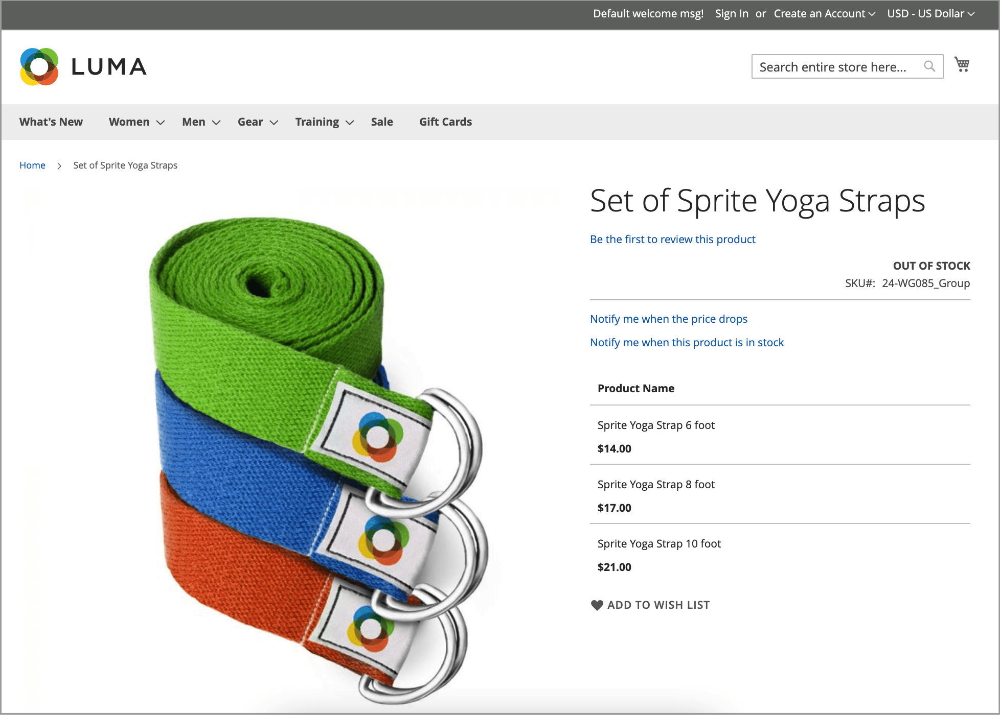

# Alertas de productos

Los clientes pueden suscribirse a dos tipos de alertas por correo electrónico: alertas de cambio de precio y alertas en stock. Para cada tipo de alerta, puede determinar si los clientes pueden suscribirse, seleccionar la plantilla de correo electrónico que se utiliza e identificar el remitente del correo electrónico.

{width="600" zoomable="yes"}

## Alertas de cambio de precio

Cuando las alertas de cambio de precio están habilitadas, se puede _Notificarme cuando el precio caiga_ El vínculo aparece en cada página de producto. Los clientes pueden hacer clic en el vínculo para suscribirse a las alertas relacionadas con el producto. Se le pide a los huéspedes que abran una cuenta en su tienda. Cada vez que el precio cambia o el producto pasa a ser especial, todos los que se hayan suscrito a la alerta reciben una alerta por correo electrónico.

## Alertas en stock

La alerta en existencia crea un vínculo llamado _Notificarme cuando este producto esté disponible_ por cada producto que esté agotado. Los clientes pueden hacer clic en el vínculo para suscribirse a la alerta. Cuando el producto vuelva a estar disponible, los clientes recibirán una notificación por correo electrónico avisando de que el producto está disponible. Los productos con alertas tienen un _Alertas de productos_ en el panel Información del producto que enumera los clientes que se han suscrito a una alerta.

{width="600" zoomable="yes"}

## Configurar alertas de productos

1. En el _Administrador_ barra lateral, vaya a **[!UICONTROL Stores]** > _[!UICONTROL Settings]_>**[!UICONTROL Configuration]**.

1. En el panel izquierdo, expanda **[!UICONTROL Catalog]** y elija **[!UICONTROL Catalog]** debajo.

1. Haga clic en para expandir _[!UICONTROL Product Alerts]_y haga lo siguiente:

   {width="600" zoomable="yes"}

   - Para ofrecer alertas de cambio de precio a sus clientes, establezca **[!UICONTROL Allow Alert When Product Price Changes]** hasta `Yes`.

   - Establecer **[!UICONTROL Price Alert Email Template]** a la plantilla que desee utilizar para las notificaciones de alerta de precios.

   - Para ofrecer alertas cuando los productos agotados vuelvan a estar disponibles, establezca **[!UICONTROL Allow Alert When Product Comes Back in Stock]** hasta `Yes`.

     >[!NOTE]
     >
     >El _Notificarme cuando este producto esté disponible_ el mensaje solo aparece cuando **[!UICONTROL Display Out of Stock Products]** se establece en `Yes` (en la Configuración, en [!UICONTROL Catalog] > [!UICONTROL Inventory]).

   - Establecer **[!UICONTROL Stock Alert Email Template]** a la plantilla que desea utilizar para las alertas de stock de productos.

   - Establecer **[!UICONTROL Alert Email Sender]** a la [contacto de tienda](../getting-started/store-details.md#store-email-addresses){target="_blank"} that you want to appear as the sender of the email alert. Learn more about [store email addresses](../configuration-reference/general/store-email-addresses.md){target="_blank"} en la guía del usuario principal.

1. Cuando termine, haga clic en **[!UICONTROL Save Config]**.

## Configurar alertas de productos y plantillas de correo electrónico

A continuación, configure, añada o modifique la plantilla de correo electrónico para la alerta de precio. Es posible que desee editar las configuraciones de alerta de precios después de crear plantillas adicionales.

Para obtener información más detallada sobre el uso de los mensajes de correo electrónico, consulte [Plantillas de mensaje](../systems/email-template-custom.md#message-templates) en el _Guía de sistemas de administración_.

1. En el _Administrador_ barra lateral, vaya a **[!UICONTROL Marketing]** > _[!UICONTROL Communications]_>**[!UICONTROL Email Templates]**.

1. Haga clic **[!UICONTROL Add New Template]**.

1. En _Cargar plantilla predeterminada_, elija la **[!UICONTROL Template]** que desee personalizar.

   Puede elegir la plantilla de alerta incluida con la temática. O puede seleccionar la `Price Alert` o `Stock Alert` plantillas en _[!UICONTROL Magento_PriceAlert]_.

1. Haga clic **[!UICONTROL Load Template]**.

1. Introduzca una **[!UICONTROL Template Name]**.

   Puede seleccionar este nombre en la _Alertas de precios_ configuración.

1. Lea el contenido existente y realice los cambios necesarios en lo siguiente:

   | Campo | Descripción |
   | ----- | ----- |
   | [!UICONTROL Template Subject] | Este texto se muestra en la línea de asunto de un correo electrónico. |
   | [!UICONTROL Template Content] | Este texto se muestra en el contenido completo del correo electrónico enviado. |

1. Para agregar información generada desde [!DNL Commerce] datos, utilice el **[!UICONTROL Insert Variable]** para utilizar una lista de variables disponibles.

1. Haga clic **[!UICONTROL Save Template]**.

## Configuración de ejecución de alerta de producto

Esta configuración le permite seleccionar con qué frecuencia [!DNL Commerce] comprueba los cambios que requieren que se envíen alertas. También puede seleccionar el destinatario, el remitente y la plantilla para los correos electrónicos que se envían si falla la entrega de alertas.

{width="600" zoomable="yes"}

1. En el _Administrador_ barra lateral, vaya a **[!UICONTROL Stores]** > _[!UICONTROL Settings]_>**[!UICONTROL Configuration]**.

1. En el panel izquierdo, expanda **[!UICONTROL Catalog]** y elija **[!UICONTROL Catalog]** debajo.

1. Expandir  el **[!UICONTROL Product Alerts Run Settings]** sección.

1. Para determinar la frecuencia con la que se envían las alertas de productos, establezca **[!UICONTROL Frequency]** a uno de los siguientes:

   - `Daily`
   - `Weekly`
   - `Monthly`

1. Para determinar la hora del día en que se envían las alertas de productos, establezca **[!UICONTROL Start Time]** a la hora, minuto y segundo.

   >[!NOTE]
   >
   >El consumidor &quot;product_alert&quot; envía las alertas de producto.

1. Para **[!UICONTROL Error Email Recipient]**, introduzca el correo electrónico de la persona con la que se va a contactar si se produce un error.

1. Para el **[!UICONTROL Error Email Sender]**, seleccione la identidad del almacén que aparece como remitente de la notificación de error.

1. Establecer **[!UICONTROL Error Email Template]** a la plantilla de correo electrónico transaccional que se utilizará para la notificación de error.

1. Cuando termine, haga clic en **[!UICONTROL Save Config]**.
