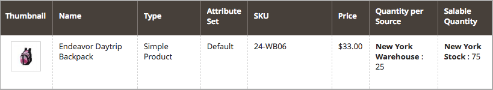

# Configurar [!DNL Inventory Management] pedidos pendientes

Los pedidos pendientes permiten que su tienda siga vendiendo productos después de que la cantidad alcance cero o esté efectivamente sin existencias. Cuando un pedido del cliente es un pedido pendiente, los fondos se autorizan y se capturan inmediatamente, el estado de procesamiento del pedido no cambia y el envío permanece en espera hasta que esté disponible el stock.

Según la tienda y las ventas, es posible que desee habilitar o deshabilitar los pedidos pendientes en los siguientes niveles:

- **[!UICONTROL Global]** - Todos los productos del catálogo en el nivel de sitio

- **[!UICONTROL Product]** - Productos específicos que anulan la configuración del sitio, el origen y el stock

## Comprender la configuración de pedidos pendientes

Se recomienda encarecidamente que configure umbrales y configuraciones específicos para admitir mejor los pedidos pendientes.

### Umbral de Agotado el stock

Use un valor negativo para este umbral para establecer la cantidad máxima de productos que se pueden poner en reserva antes de que el producto se considere verdaderamente agotado. Esta cantidad se suma a la cantidad vendible. El valor establecido en el nivel de producto anula cualquier valor establecido en el nivel global.

La fórmula para la cantidad vendible es `(Quantity - (Out-of-Stock Threshold))`.

El siguiente es un ejemplo:

- Cantidad: 25
- Notificar para la cantidad inferior: 10
- Solo X umbral izquierdo: 5
- Umbral de Agotado: -50

La cantidad vendible para este producto es `75 (25 - (-50))`.

{width="600" zoomable="yes"}

{width="600" zoomable="yes"}

Cuando los clientes compran los 25 productos disponibles, los nuevos pedidos se introducen como pedidos no satisfechos. Como la cantidad vendible del producto se reduce a 5 (se han vendido 70 artículos), la _Product_ La página muestra un mensaje `Only 5 left` en la tienda. Cuando la cantidad comercializable alcance `0`, el producto se muestra como `Out of Stock` en la tienda.

>[!NOTE]
>
>Cuando un cliente realiza un pedido utilizando _[!UICONTROL backorder qty]_, [!DNL Inventory Management] resta automáticamente la cantidad de la cantidad vendible. Si un pedido no se envía y se cancela, la cantidad vuelve a la cantidad virtual vendible agregada. El **_la cantidad de pedido cancelado no está asignada a ninguno de los orígenes_**, pero se devuelve al número total de productos disponibles para la venta (_[!UICONTROL Salable Quantity]_ en la cuadrícula de productos).

<!--### Notify for Quantity Below JIRA MDVA-8099 MDVA-33783

The _Notify for Quantity Below_ configuration option is configurable at the global, source, and product levels. When it is enabled, the system sends an email notification when the product quantity reaches a level at or below the configured value. For this example, a notification is triggered when the product has a quantity of 10 or less. When backorders are enabled, _Notify for Quantity Below_ is determined by the Salable Quantity (`Salable Quantity = Quantity - (Out-of-Stock Threshold)`). -->

### Estado de stock

Los productos deben configurarse como `In Stock` estado al activar pedidos pendientes. Puede establecer este valor desde la variable _Product_ página. Para los comerciantes de varios orígenes, debe haber al menos un origen marcado como `In Stock`. Acceda y establezca el estado a través de _Product_ página y asignada _Fuentes_ rejilla.

## Configurar pedidos pendientes globalmente

Estos pasos permiten pedidos pendientes de todos los productos en el nivel de sitio.

1. En el _Administrador_ barra lateral, vaya a **[!UICONTROL Stores]** > _[!UICONTROL Settings]_>**[!UICONTROL Configuration]**.

1. Establecer **[!UICONTROL Store View]** hasta `Default Config`.

1. En el panel izquierdo, expanda **[!UICONTROL Catalog]** y elija **[!UICONTROL Inventory]**.

1. Expandir  **[!UICONTROL Product Stock Options]**.

1. Para **[!UICONTROL Backorders]**, anule la selección del **[!UICONTROL Use system value]** y seleccione una opción:

   | Opción | Descripción |
   | -- | -- |
   | `No Backorders` | Para no aceptar pedidos pendientes cuando el producto esté agotado. |
   | `Allow Qty Below 0` | Para aceptar pedidos pendientes cuando la cantidad es inferior a cero. |
   | `Allow Qty Below 0 and Notify Customer` | Para aceptar pedidos pendientes cuando la cantidad es inferior a cero y notificar al cliente que se puede realizar el pedido. |

1. Para **[!UICONTROL Out-of-Stock Threshold]**, anule la selección del **[!UICONTROL Use system value]** y escriba una cantidad diferente.

   | Valor | Descripción |
   | -- | -- |
   | Cantidad positiva | Con Pedidos no satisfechos desactivado, introduzca un valor positivo. |
   | Cero | Con Pedidos No Satisfechos activado, introducir `0` permite pedidos pendientes infinitos. |
   | Importe negativo | Con los pedidos no satisfechos activados, se recomienda introducir un valor negativo. El importe se añade a la cantidad vendible. Por ejemplo, introduzca `-50` para permitir pedidos de hasta este importe. |

1. Haga clic **[!UICONTROL Save Config]**.

## Configurar pedidos no satisfechos de un producto

Las configuraciones de nivel de producto anulan las configuraciones globales. Es posible que desee configurar los pedidos pendientes en el nivel de producto para anular la configuración en el nivel de origen o almacén global. Por ejemplo, es posible que su tienda admita pedidos no satisfechos a nivel global. Con la configuración del producto, puede deshabilitar los pedidos no satisfechos o cambiar el umbral de Agotado sin que ello afecte a otros productos y orígenes.

1. En el _Administrador_ barra lateral, vaya a **[!UICONTROL Catalog]** > **[!UICONTROL Products]**.

1. Abra un producto en **[!UICONTROL Edit]** y desplácese hacia abajo por la página hasta el _[!UICONTROL Sources]_área.

   Para productos configurados sin [!DNL Inventory Management], la pestaña no aparece. El `Advanced Inventory` se muestra debajo de la etiqueta _[!UICONTROL Quantity]_field.

1. Haga clic **[!UICONTROL Advanced Inventory]**.

   Esta acción muestra una página de configuraciones específicas del producto. Cualquier configuración enumerada como `global` muestra la configuración global actual del almacén.

1. Para **[!UICONTROL Backorders]**, anule la selección del **[!UICONTROL Use Config Setting]** y seleccione una opción:

   | Opción | Descripción |
   | -- | -- |
   | `No Backorders` | Para no aceptar pedidos pendientes cuando el producto esté agotado. |
   | `Allow Qty Below 0` | Para aceptar pedidos pendientes cuando la cantidad es inferior a cero. |
   | `Allow Qty Below 0 and Notify Customer` | Para aceptar pedidos pendientes cuando la cantidad es inferior a cero y para notificar al cliente que aún se puede realizar el pedido. |

1. Para **[!UICONTROL Out-of-Stock Threshold]**, anule la selección del **[!UICONTROL Use Config Setting]** e introduzca una cantidad:

   | Valor | Descripción |
   | -- | -- |
   | Cantidad positiva | Con Pedidos no satisfechos desactivado, introduzca un valor positivo. |
   | Cero | Con Pedidos No Satisfechos activado, introducir `0` permite pedidos pendientes infinitos. |
   | Importe negativo | Con los pedidos no satisfechos activados, se recomienda introducir un valor negativo. El importe se añade a la cantidad vendible. Por ejemplo, introduzca `-50` para permitir pedidos de hasta ese importe. |

   {width="600" zoomable="yes"}

1. Clic **[!UICONTROL Done]**, y luego **[!UICONTROL Save]**.
