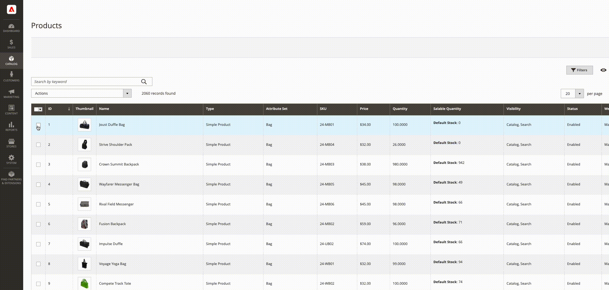
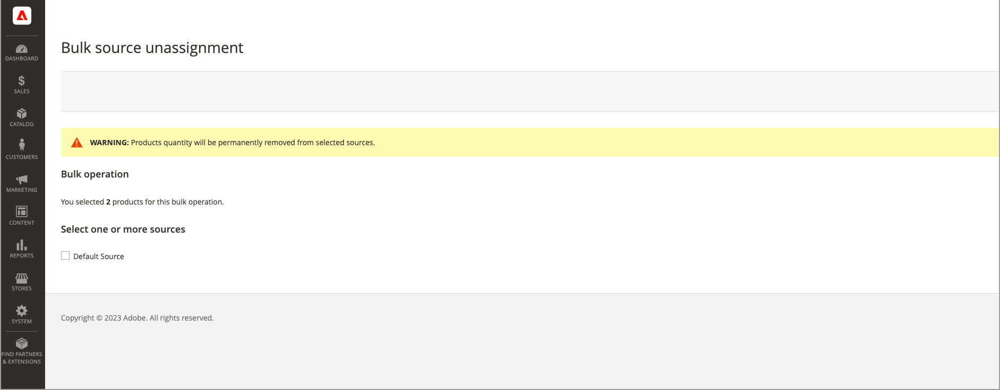

# Asignación y cancelación de asignación de origen masivo

Utilice el _Asignar orígenes_ para añadir una o más fuentes a sus productos. La herramienta ayuda a crear y asignar fuentes personalizadas a sus existencias predeterminadas o existencias personalizadas y a preparar nuevas ubicaciones e inventarios.

Después de agregar nuevas fuentes personalizadas, puede agregar lo siguiente [cantidades de inventario por producto](quantities-assign-per-product.md) o para varios productos a través del administrador o utilizando [función de importación](inventory-import-export.md).

## Asignación de orígenes y cantidades

1. En el _Administrador_ barra lateral, vaya a **[!UICONTROL Catalog]** > **[!UICONTROL Products]**.

1. Seleccione los productos para los que desea modificar las fuentes.

   Busque los productos y marque las casillas de verificación correspondientes.

1. Haga clic en **[!UICONTROL Actions]** en la parte superior y elija **[!UICONTROL Assign Inventory Source]**.

1. Clic **[!UICONTROL OK]** en el cuadro de diálogo de confirmación.

1. Para todos los orígenes que desee agregar a los productos, active las casillas de verificación.

1. Haga clic **[!UICONTROL Assign Sources]**.

   {width="600" zoomable="yes"}

Las fuentes se añaden a los productos con una cantidad de inventario de 0. Puede añadir [cantidades de inventario](quantities-assign-per-product.md) por origen.

## Desasignar orígenes y cantidades

Al anular la asignación de un origen a partir de un producto, se indica que el producto ya no está almacenado en esa ubicación. Este proceso borra por completo todos los datos de inventario del origen asignado actualmente al producto. Si desea mover el inventario existente a una nueva ubicación, considere la posibilidad de utilizar la variable _Transferir inventario_ opción.

{{$include /help/_includes/unassign-source.md}}

Se recomienda completar todos los pedidos y envíos de esos productos antes de eliminar el origen.

1. En el _Administrador_ barra lateral, vaya a **[!UICONTROL Catalog]** > **[!UICONTROL Products]**.

1. Seleccione los productos para los que desea modificar las fuentes.

   Busque los productos y marque las casillas de verificación correspondientes.

1. Haga clic en **[!UICONTROL Actions]** en la parte superior y elija **[!UICONTROL Unassign Inventory Source]**.

1. Clic **[!UICONTROL OK]** en el cuadro de diálogo de confirmación.

1. Seleccione el origen que desea eliminar de los productos.

   La página muestra una alerta que indica que al anular la asignación se eliminan todos los datos de origen y cantidad específicos del producto.

1. Haga clic **[!UICONTROL Unassign Sources]**.

   {width="600" zoomable="yes"}
