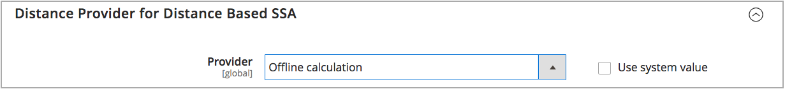

# Configuración del algoritmo de prioridad de distancia

El algoritmo de prioridad de distancia compara la ubicación de la dirección de destino de envío con las ubicaciones de origen para determinar el origen más cercano para realizar envíos. La distancia puede determinarse por la distancia física o el tiempo que se pasa viajando de un lugar a otro, usando datos de la base de datos o direcciones para conducir, caminar o andar en bicicleta. Use esto [Algoritmo de selección de origen](selection-reservations.md) para recomendar la fuente más cercana a las direcciones de destino de envío.

>[!NOTE]
>
>Si utiliza el algoritmo de prioridad de distancia, introduzca la dirección de la calle completa y las coordenadas GPS para su [orígenes](sources-add.md) se recomienda.

Tiene dos opciones para calcular la distancia y el tiempo para encontrar el origen más cercano para la satisfacción del envío:

- **MAPA DE GOOGLE** - Usos [Plataforma de mapas de Google][1] servicios para calcular la distancia y el tiempo entre la dirección de destino de envío y las ubicaciones de origen. Esta opción utiliza la latitud y longitud de la fuente (coordenadas GPS) y puede utilizar la dirección de la calle según el modo de cálculo. Se requiere una clave de API de Google con [API de geocodificación][2] y [API de matriz a distancia][3] activado y puede incurrir en gastos a través de Google.

- **Cálculo sin conexión** - Calcula la distancia utilizando datos de geocódigo descargado e importado utilizando códigos postales y coordenadas GPS para determinar la fuente más cercana a la dirección de destino de envío. Para configurar esta opción, es posible que necesite asistencia del desarrollador para descargar e importar inicialmente geocódigos mediante instrucciones de la línea de comandos.

>[!NOTE]
>
>Para sitios web de varias tiendas con varios países, configure el [destino de impuestos predeterminado](../stores-purchase/tax-class.md#default-tax-destination){target="_blank"} para cada país.

## Uso de mapas de Google

No necesita una cuenta de Google para empezar. El proceso incluye la creación de cuentas de Google y proyectos, si es necesario. Esta opción requiere que se agregue una cuenta de facturación y un método de pago a la cuenta de Google para completar las configuraciones y utilizar el algoritmo.
Sin embargo, se recomienda utilizar un algoritmo basado en la distancia MAP de Google como más avanzado y preciso en comparación con el cálculo sin conexión.

### Paso 1: Crear la clave de API de Google

La clave es del [Plataforma de mapas de Google][1] y debería tener [API de geocodificación][2] y [API de matriz a distancia][3] activado. Para obtener más información, consulte [Configuración del algoritmo de prioridad de distancia](distance-priority-algorithm.md).

1. Visita [Plataforma de mapas de Google][1] y haga clic en **[!UICONTROL Get Started]**.

1. Para habilitar la plataforma, seleccione **[!UICONTROL Maps, Routes, and Places]** y haga clic en **[!UICONTROL Continue]**.

   {width="350" zoomable="yes"}

1. Inicie sesión con una cuenta de Google o cree una cuenta.

1. Configurar un proyecto:

   - Seleccione un proyecto o escriba un nombre nuevo.

   - Para aceptar los términos, seleccione `Yes`.

   - Haga clic **[!UICONTROL Next]**.

1. Introduzca una cuenta de facturación o cree una. Puede omitir y agregar una cuenta de facturación más adelante.

   Se requiere una cuenta de facturación para utilizar este servicio.

1. Para abrir y configurar las opciones de Google Cloud Platform, haga clic en **[!UICONTROL Console]**.

   - Abra el proyecto.

   - Expanda el menú y haga clic en **[!UICONTROL APIs & Services]** > **[!UICONTROL Library]**.

     {width="350" zoomable="yes"}

   - Buscar por [API de geocodificación][2] y [API de matriz a distancia][3]. Seleccione y habilite cada servicio.

1. Expanda el menú y haga clic en **[!UICONTROL APIs & Services]** > **[!UICONTROL Credentials]** y copie la clave de API de Google.

   {width="350" zoomable="yes"}

### Paso 2: Configuración del proveedor de Google MAP

1. En el _Administrador_ barra lateral, vaya a **[!UICONTROL Stores]** > _[!UICONTROL Settings]_>**[!UICONTROL Configuration]**.

1. En el panel izquierdo, expanda **[!UICONTROL Catalog]** y elija **[!UICONTROL Inventory]**.

1. Expandir  el _[!UICONTROL Distance Provider for Distance Based SSA]_sección y conjunto **[!UICONTROL Provider]**hasta `Google MAP`.

   {width="350" zoomable="yes"}

1. Expandir  el _[!UICONTROL Google Distance Provider]_y configure las opciones de:

   - Para **[!UICONTROL Google API Key]**, introduzca la clave copiada de su cuenta de Google.

   - Para **[!UICONTROL Computation mode]**, seleccione una configuración.

     >[!NOTE]
     >
     >Cuando se utiliza este algoritmo para el envío, si las rutas y los datos no se devuelven para el modo de cálculo seleccionado (conducir, montar en bicicleta o caminar) para un envío, el SSA utiliza de forma predeterminada la prioridad de origen. Configuración de la [prioridad de fuentes por stock](stocks-prioritize-sources.md) se recomienda.

     | Opción | Descripción |
     | ----- | ----- |
     | `Driving` | (Predeterminado) Solicita las indicaciones de conducción estándar a través de la red de carreteras. |
     | `Walking` | Solicita indicaciones para caminar usando senderos peatonales y aceras (cuando estén disponibles). |
     | `Bicycling` | Solicita direcciones de ciclismo usando rutas de bicicleta y calles preferidas (cuando estén disponibles). El [Servicio de matriz de distancia][4] solo está disponible en los Estados Unidos y en algunas ciudades canadienses. |

   - Para **[!UICONTROL Value]**, seleccione un tipo de valor:

     | Opción | Descripción |
     | ----- | ----- |
     | `Distance` | (Predeterminado) Devuelve la distancia entre puntos en métricas (kilómetros y metros) o imperiales (millas y pies). |
     | `Time to Destination` | Devuelve el tiempo necesario para viajar desde las ubicaciones de origen a la dirección de envío en horas y minutos. |

   {width="350" zoomable="yes"}

1. Cuando termine, haga clic en **[!UICONTROL Save Config]**.

## Usar cálculo sin conexión

Los cálculos sin conexión utilizan códigos de país para determinar la distancia entre el destino de envío y las direcciones de origen. Esta opción puede requerir la asistencia del desarrollador para configurarla. Utilice un [!DNL Inventory Management] Comando CLI para descargar e importar datos de [geonames.org][5].

>[!NOTE]
>
>Códigos geográficos importados de [geonames.org][5] tiene limitaciones para algunos países, como Canadá e Irlanda. Consulte [Archivos de código postal de GeoNames][6] para obtener más información.

### Paso 1: Descargar e importar códigos geográficos

Configuración completa de la línea de comandos para descargar e importar códigos geográficos de países a los que realizar envíos y ubicaciones de origen en. Este paso puede requerir la ayuda del desarrollador para las tareas de línea de comandos. Consulte [Importar geocódigos](cli.md#import-geocodes).

Complete estos comandos siempre que desee agregar más geocódigos.

### Paso 2: Configurar el cálculo

1. En el _Administrador_ barra lateral, vaya a **[!UICONTROL Stores]** > _[!UICONTROL Settings]_>**[!UICONTROL Configuration]**.

1. En el panel izquierdo, expanda **[!UICONTROL Catalog]** y elija **[!UICONTROL Inventory]**.

1. Expandir  el _[!UICONTROL Distance Provider for Distance Based SSA]_sección.

1. Anule la selección de **[!UICONTROL Use system value]** casilla de verificación y definir **[!UICONTROL Provider]** hasta `Offline Calculation`.

   {width="350" zoomable="yes"}

1. Cuando termine, haga clic en **[!UICONTROL Save Config]**.

[1]: https://cloud.google.com/maps-platform/
[2]: https://developers.google.com/maps/documentation/geocoding/start
[3]: https://developers.google.com/maps/documentation/distance-matrix/start
[4]: https://developers.google.com/maps/documentation/javascript/distancematrix#travel_modes
[5]: https://www.geonames.org/
[6]: https://download.geonames.org/export/zip/readme.txt
