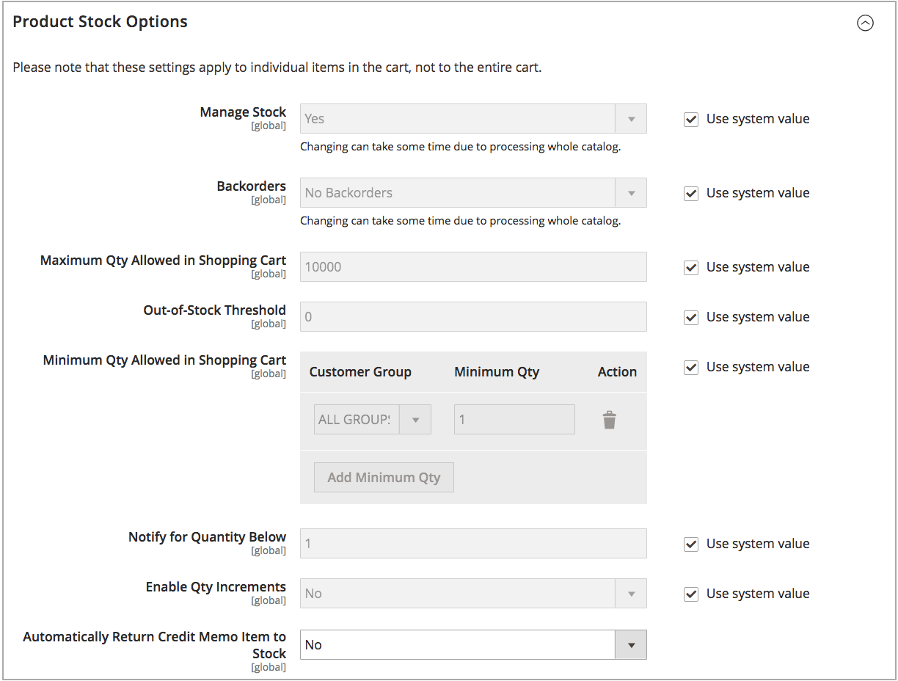

# Habilitar [!DNL Inventory Management]

Para administrar el inventario de productos, habilite [!DNL Inventory Management] en el nivel de producto o almacén global. Cuando la opción _Administrar existencias_ está habilitada, [!DNL Inventory Management] realiza un seguimiento automático de las cantidades de productos disponibles para el sitio a través de las existencias y los orígenes configurados. Todas las funciones y opciones de comienzan a rastrear y generar informes cuando se habilitan, sin necesidad de configuración adicional.

Su empresa se ejecuta y se actualiza el inventario a la velocidad de las ventas. A medida que los clientes compran, recibe información exacta y actualizada sobre las existencias disponibles por canal de ventas y fuente. Las Cantidades Vendibles Disponibles se actualizan por stock cuando los clientes añaden productos al carro de compras y finalizan las compras, y cuando gestiona los pedidos, crea envíos y emite reembolsos. Llegadas de stock nuevo o transferido a sus fuentes, inmediatamente disponible para ventas en línea. Los pedidos pendientes se completan hasta umbrales especificados sin pedidos infinitos ni configuraciones adicionales. Además, puede introducir y completar envíos parciales o completos a través de uno o más orígenes con recomendaciones, lo que le proporciona un control completo sobre la satisfacción de pedidos y el inventario disponible.

>[!NOTE]
>
>De manera predeterminada, [!DNL Inventory Management] está habilitado al instalar o actualizar [!DNL Commerce]. Según sus necesidades comerciales, es posible que desee habilitar o deshabilitar el(la) [!DNL Inventory Management] rastreado(a) dentro de [!DNL Commerce].

Cómo funciona esta configuración en inventarios de un solo origen y de varios orígenes:

- Para usar [!DNL Inventory Management], habilite _[!UICONTROL Manage Stock]_.

- La configuración de [!UICONTROL Manage Stock] en el nivel de producto anula la configuración del almacén.

- Para usar Order Management o servicios de terceros (como ERP), deshabilite [!UICONTROL Manage Stock].

- Si la configuración de nivel de producto utiliza el valor predeterminado del sistema, se anula la configuración de tienda.

Con [!DNL Inventory Management] habilitado, consulte lo siguiente para configurar todas las opciones:

- [Configuración de opciones globales](global-options.md): opciones que afectan a todo el catálogo y que se consideran la configuración predeterminada del sistema.

- [Configuración de opciones de producto](product-options.md) - Configuración de un producto específico que anula las opciones globales.

## Habilitar o deshabilitar [!DNL Inventory Management]

1. En la barra lateral _Admin_, vaya a **[!UICONTROL Stores]** > _[!UICONTROL Settings]_>**[!UICONTROL Configuration]**.

1. En el panel izquierdo, expanda **[!UICONTROL Catalog]** y elija **[!UICONTROL Inventory]**.

1. Expanda  _Opciones de productos_ y configure:

   {width="600" zoomable="yes"}

   - Para administrar el inventario y usar todas las características de [!DNL Commerce], establezca **[!UICONTROL Manage Stock]** en `Yes` (predeterminado).

   - Para deshabilitar [!DNL Inventory Management], anule la selección de la casilla de verificación **[!UICONTROL Use system value]** y establezca **[!UICONTROL Manage Stock]** en `No`.

1. Una vez finalizado, haga clic en **[!UICONTROL Save Config]**.

## Administrar existencias de una tienda

Consulte [Configurar opciones globales](global-options.md).

## Administración de existencias de un producto

Consulte [Configuración de opciones de producto](product-options.md).
