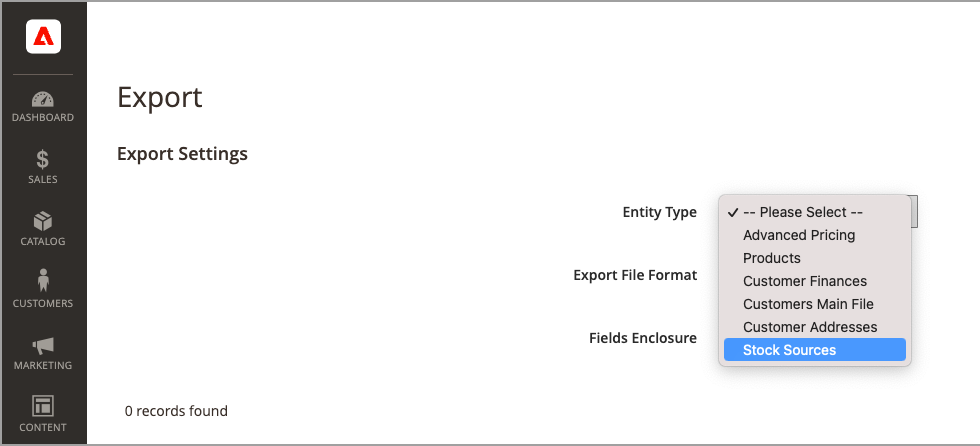

# Importar y exportar inventario

Para catálogos con muchos productos, use las características nativas de importación y exportación con las opciones expandidas de [!DNL Inventory Management] para actualizar los orígenes y las cantidades por SKU. Con estas opciones, puede agregar nuevos orígenes y actualizar las cantidades de inventario para todos los orígenes o para un origen específico. Por ejemplo, puede exportar productos para una fuente en Alemania sin afectar a la información del producto para fuentes en Francia, Inglaterra o Estados Unidos.

- [!DNL Commerce] asigna automáticamente el Source predeterminado a sus productos al actualizar [!DNL Commerce] o al importar nuevos productos. Si importa productos con un origen personalizado asignado, la Source predeterminada se agrega con una cantidad de 0. Para actualizar orígenes y cantidades, utilice estas instrucciones de importación.

- Los comerciantes de un solo origen utilizan la importación para actualizar solo las cantidades de productos. Todos los productos existentes y añadidos se asignan al Source predeterminado.

- Los comerciantes de varios orígenes utilizan la importación para agregar varios orígenes y cantidades por fila y por SKU.

Para importar actualizaciones, primero exporte un archivo CSV para un origen específico o todos los orígenes. Edite el archivo CSV y añada una fila por SKU para cada origen y cantidad. Necesita el código fuente cuando agregue un origen y agregue cantidades de existencias. No es posible añadir ni actualizar stock mediante funciones de importación y exportación.

## Contenido del archivo CSV

El archivo de exportación e importación incluye la siguiente información según el origen:

- `source_code` - El código para orígenes en [!DNL Commerce]. Hay una fila para cada origen y SKU.
- `sku`: SKU del producto en [!DNL Commerce]. La SKU debe coincidir con un producto de tu tienda para actualizar correctamente los datos de [!DNL Inventory Management].
- `status` - 0 para Agotado. 1 para En existencia. Este valor debe ser 1 para adquirir stock de este origen.
- `quantity`: cantidad total de inventario disponible para este SKU y origen.

Utilice un archivo CSV para actualizar rápidamente varios productos y orígenes asignados a fin de actualizar y corregir cualquier imprecisión en los registros de inventario en lugar de hacerlo de uno en uno a través de la interfaz de la aplicación. Para un archivo base, exporte primero y actualice según sea necesario.

{width="600" zoomable="yes"}

## Exportar datos de productos para todas las fuentes

1. En la barra lateral _Admin_, vaya a **[!UICONTROL System]** > _[!UICONTROL Data Transfer]_>**[!UICONTROL Export]**.

1. Para **[!UICONTROL Entity Type]**, elija `Stock Sources`.

   La exportación solo extrae datos para productos con un SKU.

1. Haga clic en **[!UICONTROL Continue]**.

   El archivo genera y descarga para abrirlo y editarlo.

Después de actualizar las cantidades de inventario y los datos de productos, vuelva a importar el archivo en [!DNL Commerce].

{width="350" zoomable="yes"}

## Exportación de datos de productos para una fuente específica

1. En la barra lateral _Admin_, vaya a **[!UICONTROL System]** > _[!UICONTROL Data Transfer]_>**[!UICONTROL Export]**.

1. Para **[!UICONTROL Entity Type]**, elija `Stock Sources`.

   La exportación solo extrae datos para productos con un SKU.

1. Use **[!UICONTROL Entity Attributes]** para filtrar los productos exportados para un origen específico.

   Para `source_code`, introduzca el código de origen en el campo de filtro.

1. Haga clic en **[!UICONTROL Continue]**.

   El archivo genera y descarga para abrirlo y editarlo.

Después de actualizar las cantidades de inventario y los datos de productos, vuelva a importar el archivo en [!DNL Commerce].

## Importar datos de productos

1. En la barra lateral _Admin_, vaya a **[!UICONTROL System]** > _[!UICONTROL Data Transfer]_>**[!UICONTROL Import]**.

1. Para **[!UICONTROL Entity Type]**, elija `Stock Sources`.

   La exportación solo extrae datos para productos con un SKU.

1. Seleccione configuraciones para **[!UICONTROL Import Behavior]**.

1. Seleccione el archivo .csv que desea importar.

1. Haga clic en **[!UICONTROL Check Data]** y complete la importación.

{width="600" zoomable="yes"}
