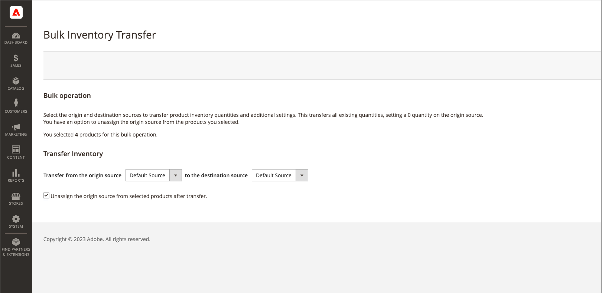

# Transferir inventario al origen

Según las necesidades comerciales y el estado de la ubicación, los comerciantes de varios orígenes suelen transferir el inventario de productos de una ubicación de origen a otra. Por ejemplo, es posible que esté cerrando una ubicación de almacén o que ya no envíe productos específicos desde una ubicación, moviendo todas las operaciones de esos productos a una nueva ubicación.

Esta opción permite seleccionar uno o varios productos, el origen de origen para transferir inventario y el origen de destino para recibir cantidades:

- Las cantidades de inventario, el estado de artículo de Source (en stock/sin stock) y la cantidad de notificación del origen seleccionado se mueven por producto.

- Si un producto no tiene esa fuente, se omite.

- Se mueve todo el inventario de productos para el origen. No se puede transferir una cantidad parcial.

>[!NOTE]
>
>Si los orígenes de origen y destino están en diferentes existencias, afecta a la cantidad vendible agregada y a las reservas de pedidos en curso.

También puede anular la asignación del origen al transferir cantidades de inventario.

{{$include /help/_includes/unassign-source.md}}

1. En la barra lateral _Admin_, vaya a **[!UICONTROL Catalog]** > **[!UICONTROL Products]**.

1. Seleccione los productos para los que desea modificar las fuentes.

   Busca o busca productos y selecciona casillas de verificación para la transferencia.

1. Haga clic en el menú **[!UICONTROL Actions]** en la parte superior y elija **[!UICONTROL Transfer Inventory to Source]**.

1. Haga clic en **[!UICONTROL OK]** en el cuadro de diálogo de confirmación.

1. Para transferir productos a un nuevo destino, seleccione el origen (_[!UICONTROL from]_).

1. para transferir productos a un nuevo destino, seleccione el origen de destino (_[!UICONTROL to]_).

1. Para quitar el origen de los productos, active la casilla de verificación opcional **[!UICONTROL Unassign from origin source after transfer]**.

   {width="600" zoomable="yes"}

1. Haga clic en **[!UICONTROL Transfer Inventory]**.

   Todas las cantidades de productos se deducen del origen y se añaden al origen de destino. La cantidad y la cantidad vendible se actualizan automáticamente.

<!-- Last updated from includes: 2022-08-30 15:36:09 -->
