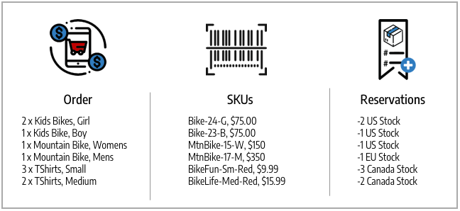

# Estado del pedido y reservas

[!DNL Inventory Management] admite la facturación, los pagos, los envíos y las cancelaciones parciales y totales por pedido. A medida que administra un pedido mediante procesamiento, facturación, envío y posibles reembolsos, [!DNL Commerce] introduce o cambia automáticamente las reservas para actualizar la cantidad vendible de un inventario (o canal de ventas) y la cantidad de inventario disponible por origen. No tiene que acceder ni introducir reservas de forma activa. La realización de acciones para cumplir, cancelar o reembolsar un pedido lo hace por usted.

Estas reservas siempre ajustan la cantidad vendible, con cantidades positivas o negativas para aumentar o disminuir las cantidades. El resultado es una actualización del inventario disponible y de las cantidades vendibles para obtener una disponibilidad de productos actualizada.

Para obtener información específica sobre los pedidos y envíos, consulte [Administración de pedidos y envíos](shipments.md).

## Opciones de Order Management

Según el estado de inventario y las solicitudes del cliente, puede actualizar pedidos con pagos y cancelaciones parciales, envíos parciales de varios orígenes o para pedidos pendientes, o notas de abono para reembolsar productos devueltos.

### Envíos

Después de facturar los pedidos, envíe envíos parciales o completos hasta que complete todo el pedido. Cada envío convierte la reserva, deduciendo la cantidad de la cantidad del producto por origen. Compensaciones de Reserva Introduzca para actualizar la cantidad vendible de su stock. Si envía envíos parciales, cada envío deduce esa cantidad de la cantidad y reservas del producto. Cualquier reserva de productos sin enviar se mantiene hasta que también se envía, de modo que el importe vendible esté actualizado y le proporcione control sobre el inventario de productos y soporte para varios envíos de origen y pedidos pendientes.

### Pedidos cancelados

Si un cliente cancela su pedido antes del envío (parcial o total), se introduce una nueva reserva para devolver el importe de inventario a la cantidad vendible. Las reservas se cancelan entre sí, sin deducir la cantidad de ninguna fuente. Otros clientes pueden comprar activamente esas cantidades de productos a través de los canales de stock y ventas asociados.

### Pedidos reembolsados

Si un cliente solicita un reembolso, emita la nota de abono para los importes parciales o totales del producto. Cuando reciba los productos devueltos, introduzca una nota de abono para proporcionar los fondos y actualizar los importes del producto. Al seleccionar la opción Devolver a Stock, [!DNL Commerce] vuelve a agregar cantidades a los productos y orígenes que enviaron los pedidos y las compensaciones de reserva para actualizar las cantidades vendibles del stock asociado.

## Tipos de pedidos

Los pedidos simples comienzan con un carro de compras, continúan con el pago y terminan con una entrega satisfecha. En estos pedidos, [!DNL Inventory Management] procesa fácilmente las reservas con respecto a la disponibilidad (o cantidad vendible) en el carro de compras y el cierre de compra, y deduce del inventario disponible en el envío.

{width="600" zoomable="yes"}

Un pedido más complicado puede tener cancelaciones parciales, envíos parciales y reembolsos. En estas situaciones, las reservas afectan al inventario disponible para añadir cantidades para cancelaciones y reembolsos y disminuir las cantidades cuando se encargan y envían.

{width="600" zoomable="yes"}

Las reservas de disponibilidad y los cambios de inventario se producen en función del estado del pedido.

## Estado y reservas

Las siguientes tablas detallan el estado del pedido y la nota de abono con los cambios de reserva introducidos por [!DNL Commerce] para administrar el inventario.

| Estado del pedido | Descripción | Reserva de cantidad vendible |
|--|--|--|
| [!UICONTROL Open] | Nuevo y enviado recientemente, sin procesamiento | La reserva se guarda cuando se envía el pedido de stock. |
| [!UICONTROL Canceled] | Cancelado en su totalidad o en parte antes del pago | La compensación de reserva se introduce para devolver la cantidad total o parcial a la cantidad vendible de stock. |
| [!UICONTROL On Hold] | Pago y envío no procesados ni facturados | La reserva se mantiene en su lugar. |
| [!UICONTROL Suspected Fraud] | No procesado debido a fraude | Si se aprueba o se revisa, la reserva permanece en su lugar. Si se rechaza, la reserva permanece en su lugar hasta que el comerciante decida aprobarla o cancelarla. Si se cancela, se introduce la compensación de reserva para devolver la cantidad completa a la cantidad vendible de stock. |
| [!UICONTROL Pending] | Esperando el pago | La reserva se mantiene en su lugar. |
| [!UICONTROL Processing] | Procesamiento de pago, no recibido | La reserva se mantiene en su lugar. |
| [!UICONTROL Pending Payment] | Pago no recibido | La reserva se mantiene en su lugar. |
| [!UICONTROL Payment Review] | Pago revisado para su procesamiento y finalización | La reserva se mantiene en su lugar. |
| [!UICONTROL Complete] | Pagado y enviado en su totalidad | El importe de la reserva se deduce de la cantidad del producto para el origen seleccionado cuando se factura parcial o totalmente. La compensación de reserva se introduce para actualizar la cantidad total vendible. |
| [!UICONTROL Closed] | Reembolsado o archivado | Si se archiva, no hay cambios en las cantidades. Si se devuelve parcial o totalmente, la compensación de la reserva se introduce y convierte para volver a añadir cantidades de productos por origen y cantidad vendible por stock. |

| Estado de abono | Descripción | Reserva de cantidad vendible |
|--|--|--|
| [!UICONTROL Open] | El reembolso se debe, no se ha completado | No hay cambios en las reservas. |
| [!UICONTROL Refunded] | Finalizado, fondos devueltos | Si se devuelve total o parcialmente, la compensación de la reserva se introduce y se convierte para volver a añadir cantidades de productos por origen y cantidad vendible por stock. |

## Ejemplo de orden complejo

Blake Sanders pide bicicletas y ropa para sus vacaciones familiares y diversión. Ven algunas grandes ventas en su tienda de Biking Adventures con stock y fuentes que abarcan los Estados Unidos, Canadá y Europa.

Compran dos grandes bicicletas de parque para sus hijos pequeños, una bicicleta BMX para su adolescente, una bonita bicicleta de montaña para ellos mismos, y una moderna bicicleta de fondo alemana para su cónyuge. La tienda tenía una venta de camisas lindas, así que compraron algunas para que toda la familia coincidiera. Consulte la lista de compras de vacaciones que aparece a continuación, los SKU coincidentes y las reservas introducidas con respecto a las cantidades vendibles en stock.

{width="600" zoomable="yes"}

Muestran a su familia lo que encontraron, pero hacen algunos cambios. Antes de que se complete el pago, cancelan dos de las SKU de 33-BikeFun (a los niños no les gustaban). Se trata de una cancelación parcial debido al pago pendiente, por lo que no se necesita nota de crédito. Para actualizar, [!DNL Commerce] agrega de nuevo el stock de cantidad vendible para Canadá. El pedido se paga, y todos los productos se envían, llegando a tiempo para las vacaciones. [!DNL Commerce] actualiza la cantidad vendible y las cantidades de origen para los almacenes de envío de los productos enviados.

Pero la camisa no le quedaba bien a su esposa. Blake solicita un reembolso y devuelve su camisa. La creación de la nota de crédito agrega una camiseta 54-BikeLife de nuevo al almacén de stock y envío de Canadá.

- **Productos enviados** - Con los productos comprados y enviados, [!DNL Commerce] actualiza el inventario. Las compensaciones de reserva se convierten en deducciones de cantidad de inventario disponible del origen enviado. Las actualizaciones de cantidad vendible disponibles para el stock.

- **Productos cancelados**: al cancelar el inventario de existencias, [!DNL Commerce] elimina la reserva de ese producto. La compensación de reserva se introduce al nivel de stock para añadir cantidades vendibles de vuelta para la cancelación parcial de dos camisas. Esto no afecta a la cantidad de inventario en el nivel de origen.

- **Producto con abono o reembolso**: al devolver las existencias, se debe volver a agregar a las cantidades. Al emitir la nota de abono, puede seleccionar volver a stock. [!DNL Commerce] vuelve a agregar la cantidad de inventario al origen enviado para el producto. Las compensaciones de reserva se introducen para borrar las reservas restantes. La cantidad vendible se vuelve a calcular respecto a la cantidad actualizada.

{width="600" zoomable="yes"}
