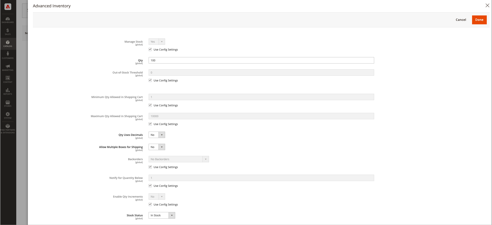

# Configurar las opciones de producto de [!DNL Inventory Management]

Estas configuraciones se aplican únicamente al producto editado, anulando todas las configuraciones en el nivel de sitio web global. Modifique esta configuración al editar un producto, a través de la sección _[!UICONTROL Sources]_&#x200B;y la página&#x200B;_[!UICONTROL Advanced Inventory]_.

- Configurar opciones de producto por origen
- Configurar opciones de producto para inventario avanzado

## Opciones de producto por origen

Configure las cantidades y la configuración adicional por [origen agregado](sources-add.md) para el producto.

1. En la barra lateral _Admin_, vaya a **[!UICONTROL Catalog]** > **[!UICONTROL Products]**.

1. Abra un producto en modo de edición.

1. Expanda  en la sección **[!UICONTROL Sources]** y configure las opciones del producto para cada origen:

   - Escriba un importe de **[!UICONTROL Qty]** (cantidad).

   - Establezca **[!UICONTROL Source Item Status]** como `In Stock` o `Out of Stock`.

   - Para modificar la notificación de la cantidad inferior por origen, desactive o active la casilla de verificación **[!UICONTROL Notify Quantity Use Default]**.

     Si está conciliado, introduzca la cantidad de nivel de stock que déclencheur el aviso de falta de existencias del artículo. La cantidad introducida se resta de la cantidad vendible del artículo en el nivel de stock.

     `Select to use Default` - [!DNL Commerce] comprueba las opciones de inventario avanzado del producto para obtener las opciones de configuración.
     `Clear to Modify`: escriba un valor para Notificar cantidad, anulando los valores de configuración de inventario avanzado y tienda.

   {width="350" zoomable="yes"}

1. Una vez finalizado, haga clic en **[!UICONTROL Done]** y luego en **[!UICONTROL Save]**.

### Descripciones de campos

| Campo | Ámbito | Descripción |
|--|--|--|
| [!UICONTROL Source Code] | Global | Código único de un [origen](sources-manage.md). |
| [!UICONTROL Name] | Global | El nombre único de un origen. |
| [!UICONTROL Status] | Global | El producto está activado o desactivado en el catálogo. |
| [!UICONTROL Source Item Status] | Global | Determina la disponibilidad actual del producto. Opciones: `In Stock` - Hace que el producto esté disponible para la compra. `Out of Stock` - A menos que se activen los pedidos no satisfechos, impide que el producto esté disponible para la compra y elimina el listado del catálogo. |
| [!UICONTROL Qty] | Global | Cantidades de stock disponibles para cada origen o ubicación. |
| [!UICONTROL Notify Quantity] | Global | Una cantidad para _[!UICONTROL Notify for Quantity Below]_&#x200B;para este origen específico si&#x200B;_[!UICONTROL Notify Quantity Use Default]_ no está seleccionado. |
| [!UICONTROL Notify Quantity Use Default] | Global | Indica que se debe usar la configuración predeterminada para _[!UICONTROL Notify for Quantity Below]_&#x200B;en el producto&#x200B;_[!UICONTROL Advanced Inventory]_ o la configuración global en la configuración del almacén. |

## Opciones de producto avanzadas

1. En la barra lateral _Admin_, vaya a **[!UICONTROL Catalog]** > **[!UICONTROL Products]**.

1. Abra un producto en modo de edición.

1. Expanda  en la sección **[!UICONTROL Sources]** y haga clic en **[!UICONTROL Advanced Inventory]**.

1. Para habilitar el [control de inventario](enable.md) para su catálogo, establezca **[!UICONTROL Manage Stock]** en `Yes`.

   >[!NOTE]
   >
   >La configuración de [!UICONTROL Manage Stock] en productos secundarios anula un producto configurable.

   {width="600" zoomable="yes"}

1. Escriba una cantidad para **[!UICONTROL Out-of-Stock Threshold]**:

   | Valor | Descripción |
   | ----- | ----- |
   | Cantidad positiva | Con _[!UICONTROL Backorders]_&#x200B;deshabilitado, ingrese un valor positivo. |
   | Cero | Con _[!UICONTROL Backorders]_&#x200B;habilitado, escribir `0` permite pedidos pendientes infinitos. |
   | Importe negativo | Con _[!UICONTROL Backorders]_&#x200B;habilitado, se recomienda escribir un valor negativo. El importe se añade a la cantidad vendible. Por ejemplo, escriba `-50` para permitir pedidos de hasta esta cantidad. |

1. Escriba **[!UICONTROL Minimum Qty Allowed in Shopping Cart]**.

1. Escriba **[!UICONTROL Maximum Qty Allowed in Shopping Cart]**.

1. Establezca **[!UICONTROL Qty uses Decimals]** en `Yes` si los clientes pueden utilizar un valor decimal en lugar de un número entero al introducir la cantidad solicitada.

1. Establezca **[!UICONTROL Allow Multiple Boxes for Shipping]** en `Yes` si el producto se puede vender por separado, en muchas cajas. Esta opción está visible cuando **[!UICONTROL Qty Uses Decimals]** se establece únicamente en `Yes`.

1. Establezca **[!UICONTROL Backorders]** en una de las siguientes opciones:

   | Opción | Descripción |
   | ----- | ----- |
   | `No Backorders` | Para no aceptar pedidos pendientes cuando el producto esté agotado. |
   | `Allow Qty Below 0` | Para aceptar pedidos pendientes cuando la cantidad es inferior a cero. |
   | `Allow Qty Below 0 and Notify Customer` | Para aceptar pedidos pendientes cuando la cantidad es inferior a cero y notificar al cliente que el pedido se puede realizar. |

   Para obtener más información, consulte [Configuración de pedidos pendientes](backorders.md).

1. Para activar los incrementos de cantidad para el producto, establezca **[!UICONTROL Enable Qty Increments]** en `Yes` e introduzca en el campo **[!UICONTROL Qty Increments]** el número de artículos que se deben comprar para cumplir con el requisito.

   Por ejemplo, un artículo que se vende en incrementos de seis se puede comprar en cantidades de 6, 12, 18, etc.

   El campo **[!UICONTROL Qty Increments]** establece cuántos artículos de producto se deben comprar como un solo producto y como un elemento secundario de productos configurables, agrupados y agrupados.

1. Una vez finalizado, haga clic en **[!UICONTROL Done]** y luego en **[!UICONTROL Save]**.

### Descripciones de campos

| Campo | Ámbito | Descripción |
|--|--|--|
| [!UICONTROL Manage Stock] | Global | Determina si se utiliza el control de inventario para administrar este producto en el catálogo. Configurado para habilitar o deshabilitar todas las características de [!DNL Inventory Management]. Al finalizar una devolución o una nota de abono, la cantidad del producto se devuelve automáticamente a la cantidad de origen afectada. Es posible que desee deshabilitar si utiliza un sistema ERP de terceros. |
| [!UICONTROL Out-of-Stock Threshold] | Global | Determina el nivel de existencias en el que se considera que un producto está agotado. Opciones: Valor positivo: con los pedidos pendientes deshabilitados, escriba una cantidad positiva. Cero (0): si se habilitan los pedidos no satisfechos, al escribir cero se pueden realizar infinitos pedidos no satisfechos. Valor negativo: con los pedidos pendientes habilitados, se recomienda introducir una cantidad negativa. El importe se añade a la cantidad vendible. Por ejemplo, escriba `-50` para permitir pedidos de hasta esta cantidad. |
| [!UICONTROL Minimum Qty Allowed in Shopping Cart] | Global | Determina el número mínimo de productos que se pueden comprar en un único pedido. |
| [!UICONTROL Maximum Qty Allowed in Shopping Cart] | Global | Determina el número máximo de productos que se pueden comprar en un único pedido. |
| [!UICONTROL Qty Uses Decimals] | Global | Determina si los clientes pueden utilizar un valor decimal en lugar de un número entero al introducir la cantidad pedida. Opciones:  `Yes`: permite que los valores se especifiquen como decimales, en lugar de como números enteros. Los decimales son adecuados para los productos vendidos por peso, volumen o longitud. `No` - Requiere que los valores de cantidad se especifiquen como números enteros. |
| [!UICONTROL Allow Multiple Boxes for Shipping] | Global | Determina si las partes del producto se pueden enviar por separado. Esta opción está visible cuando **[!UICONTROL Qty Uses Decimals]** = `Yes`. |
| [!UICONTROL Backorders] | Global | Determina cómo se administran los pedidos pendientes. Los pedidos no satisfechos no cambian el estado de procesamiento del pedido. Los fondos se siguen autorizando o capturando inmediatamente cuando se realiza el pedido, independientemente de si el producto está en stock. Los productos se envían cuando están disponibles. Cuando está activada, se recomienda introducir una cantidad negativa para el umbral de Agotado. Opciones: `No Backorders` - No acepta pedidos pendientes cuando el producto está agotado. `Allow Qty Below 0` - Acepta pedidos pendientes cuando la cantidad es inferior a cero. `Allow Qty Below 0 and Notify Customer` - Acepta pedidos pendientes cuando la cantidad cae por debajo de cero, pero notifica a los clientes que aún se pueden realizar pedidos. |
| [!UICONTROL Enable Qty Increments] | Global | Determina si el producto se puede vender en incrementos de cantidad. Los incrementos establecen cuántos artículos de producto deben comprarse como un solo producto y como un elemento secundario de productos configurables, agrupados y agrupados. |

>[!NOTE]
>
>La configuración de producto simple anula las configuraciones de producto configurables para un producto específico.
